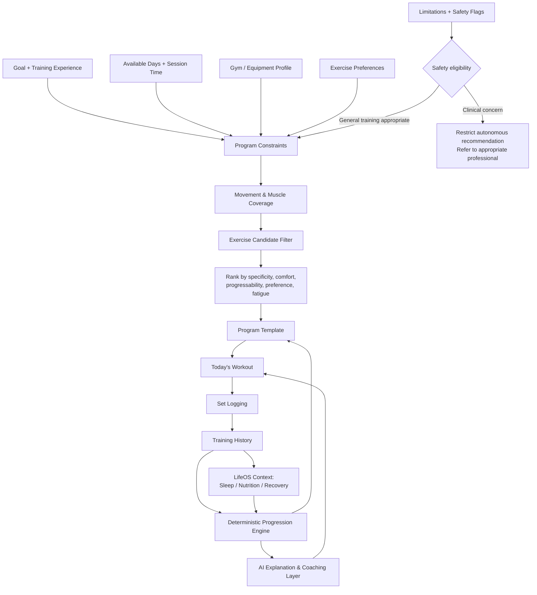
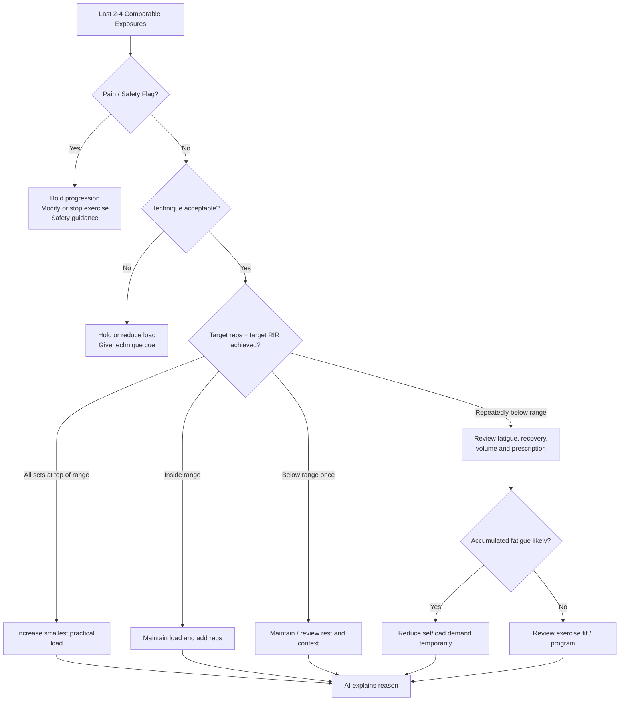

# LifeOS Gym & Exercises — Deep Research and Product Requirements Report

## Executive Summary

The Gym & Exercises capability should not become another exercise database or digital notebook. Its purpose inside LifeOS should be to close the loop between **what the user intends to train, what they actually perform, how performance changes, how they recover, and what should change next**. That is directly aligned with the LifeOS operating loop—**Observe → Understand → Plan → Act → Track → Review → Adapt**—and with the existing product split in which Android emphasizes execution, the web portal emphasizes planning/analysis, and the AI layer operates through explicit domain tools rather than bypassing business logic. fileciteturn0file0 The Health & Nutrition research brief also explicitly calls for exercise science, training, recovery, evidence quality, safety boundaries, competitor research, AI restraint, and product research before database/API design. fileciteturn0file1

The scientific foundation is unusually strong at the broad programming level. ACSM's April 2026 position stand synthesized **137 systematic reviews involving more than 30,000 participants**. Resistance training reliably improves strength, hypertrophy, power, muscular endurance, and physical function. For maximal strength, heavier loading—especially ≥80% of one-repetition maximum—full range of motion, multiple sets, earlier exercise placement, and training at least twice weekly are generally favorable. For hypertrophy, higher weekly set volumes can add benefit, while equipment type, routinely training to momentary failure, complicated set structures, time-under-tension manipulation, and periodization do **not** consistently determine outcomes. citeturn14search2turn14search8 WHO separately recommends muscle-strengthening activity involving all major muscle groups on at least two days per week for adults. citeturn14search0turn14search5

That evidence has an important product consequence: **LifeOS should optimize consistency and progressive training quality before trying to optimize exotic training variables.** It should not tell a novice that a special cable angle, tempo, drop set, or weekly "muscle recovery percentage" is the secret to progress. Large comparative analyses find that many sensible resistance-training prescriptions build muscle; heavier loading matters more for maximal-strength specificity, while multiple hard sets are particularly important for hypertrophy. citeturn14search12turn14search13

The recommended product model therefore has six layers:

| Layer                  | Product purpose                                                                                                                                              |
| ---------------------- | ------------------------------------------------------------------------------------------------------------------------------------------------------------ |
| **Exercise knowledge** | Explain movements, muscles, equipment, variations, setup, faults, cues, evidence, regressions and substitutions.                                             |
| **Program planning**   | Convert goals, schedule, experience, equipment and limitations into a coherent weekly structure.                                                             |
| **Workout execution**  | Extremely fast logging of sets, reps, load, effort, rest and unusual events such as pain or technique breakdown.                                             |
| **Progression engine** | Deterministically decide whether to add repetitions, add load, hold, reduce load/volume, or investigate a problem.                                           |
| **Review & analytics** | Show whether actual performance, strength, adherence and volume exposure are moving in the intended direction.                                               |
| **AI coaching**        | Explain and contextualize deterministic decisions; give concise cues; offer substitutions; detect patterns; never fabricate physiology or diagnose injuries. |

### Core product decisions

**Exercise selection should be evidence-informed, not presented as a scientifically proven ranking.** There is excellent evidence for resistance training generally but far less direct longitudinal research comparing every conceivable exercise. Even acute EMG differences do not necessarily predict long-term hypertrophy: in a squat-versus-hip-thrust trial, hip thrust produced greater acute glute EMG but the two exercises produced similar glute hypertrophy, while squats produced more quadriceps and adductor growth. citeturn15search3 LifeOS should therefore say **"recommended for this objective"**, not **"the best exercise."**

**Progressive overload should mean improving training demand or performance over time, not adding weight every workout regardless of readiness.** The engine should work from actual repetitions, load, target rep range, estimated effort, technique quality, pain, and recent history. Heavier loading has a particular advantage for maximal strength, whereas muscle growth occurs across a much wider range of reasonable loads when sets are sufficiently effortful. citeturn14search2turn14search13

**Routine failure training should not be the default.** The current ACSM synthesis does not find consistent benefit from momentary muscular failure, and the broader literature does not establish failure as necessary for hypertrophy. citeturn14search2 LifeOS should normally leave roughly **one to three repetitions in reserve on most working sets**, with closer-to-failure work used selectively, especially for safe isolation exercises or lighter loads. RIR remains a subjective estimate whose accuracy improves with experience, so it should be treated as a calibrated user signal rather than physiological ground truth.

**Volume is important, but LifeOS should not invent universal "optimal set" numbers.** ACSM reports greater hypertrophy with higher volume, with ≥10 sets per week emerging as a useful evidence-based reference point, but individual needs and diminishing returns vary. citeturn14search2 Beginners should begin below an advanced lifter's volume simply because a large stimulus can be generated with less work and because technique/adherence matter more initially.

**Frequency is mainly a way to distribute useful work.** WHO and ACSM support at least twice-weekly strengthening broadly, but when weekly volume is equated, hypertrophy does not appear meaningfully dependent on whether a muscle is trained more frequently. citeturn14search5turn16search4 Consequently, LifeOS should usually distribute muscle work across two or more weekly exposures when practical, while allowing one, two, or three-plus exposures according to schedule and volume.

**Rest intervals should protect performance, not satisfy an arbitrary timer.** Studies repeatedly find that longer rest preserves repetitions and volume better than one-minute rest, particularly for demanding compound lifts; two to three minutes is a defensible default, with longer rest available for heavy work and somewhat shorter rest for lower-fatigue isolation work. citeturn16search3turn16search11turn16search13

**Full range of motion should be the default for strength development when the user can perform it comfortably and under control.** ACSM identifies full ROM as favorable for strength. Emerging hypertrophy research around training at longer muscle lengths is promising, but it should become an advanced exercise-selection consideration rather than a universal rule that overrides joint comfort or control. citeturn14search2

**Tempo should primarily teach control.** ACSM found that time under tension does not consistently drive primary outcomes. citeturn14search2 LifeOS should say "lower under control; reverse deliberately; accelerate with intent" rather than prescribing a magical three-second eccentric to every user.

**The baseline population is currently unspecified.** This report therefore designs the default product for generally healthy adults aged 18+ who are capable of independent resistance training. Equipment availability, sex, body dimensions, goals, training history, disabilities, medical conditions and sport-specific needs are unspecified. Pregnancy, minors, frail older adults, cardiovascular disease, active musculoskeletal rehabilitation, neurological conditions and other clinical populations require separate evidence profiles and should not receive autonomous generic programming from this first version.

### Evidence-confidence model for the product

| Product statement                                                  |                                Evidence confidence | LifeOS treatment                                                                                                         |
| ------------------------------------------------------------------ | -------------------------------------------------: | ------------------------------------------------------------------------------------------------------------------------ |
| Progressive resistance training improves strength and muscle size  |                                           **High** | Core rule. citeturn14search2                                                                                          |
| Heavy loads are especially useful for maximal strength             |                                           **High** | Strength programming rule. citeturn14search2turn14search13                                                           |
| Multiple sets and sufficient weekly volume improve hypertrophy     |                                  **High–moderate** | Volume planner with individualized escalation. citeturn14search2                                                      |
| Training to failure is required                                    |                                    **Unsupported** | Do not use as default rule. citeturn14search2                                                                         |
| One equipment type is inherently superior                          |                          **Unsupported generally** | Choose by goal, stability, comfort, equipment and progression. citeturn14search2                                      |
| Long-muscle-length training may improve regional hypertrophy       |                              **Moderate/emerging** | Advanced optimization, not MVP dogma. citeturn15search2turn15search8                                                 |
| EMG can identify the "best" hypertrophy exercise                   |                 **Weak as a standalone inference** | Never rank solely from activation studies. citeturn15search3                                                          |
| Planned deload every fixed number of weeks is mandatory            |                                **Not established** | Support optional/response-driven deloading. ACSM does not find periodization consistently decisive. citeturn14search2 |
| A wearable can reliably tell how many RIR remain                   |                      **Not ready for general use** | Manual RIR remains primary.                                                                                              |
| A precise "73% recovered chest" score is scientifically observable | **Product-model estimate, not direct measurement** | Avoid false precision.                                                                                                   |

## Research Framing and Evidence-Based Training Model

A serious LifeOS exercise system needs to distinguish **evidence about training principles** from **exercise-specific evidence**. There are hundreds of common movements but relatively few long-term randomized trials comparing individual variations head to head. A curated exercise library should therefore combine the strongest general resistance-training evidence with anatomy, biomechanics, longitudinal studies where available, standard professional exercise descriptions, user constraints and product-level reasoning. ACE and NSCA resources are useful for movement instruction and biomechanics, while scientific outcome studies should be given greater weight whenever a specific hypertrophy or strength claim is made. citeturn11search9turn11search5turn11search7

### Exercise-selection framework

LifeOS should score candidate exercises across multiple dimensions rather than use one "effectiveness" number:

| Factor                     | Question                                                                                     |
| -------------------------- | -------------------------------------------------------------------------------------------- |
| **Target fit**             | Does this movement train the intended muscle or movement pattern meaningfully?               |
| **Goal specificity**       | Is the user pursuing hypertrophy, maximal strength, general health, sport transfer or skill? |
| **Progressability**        | Can resistance/repetitions/ROM be progressed and recorded consistently?                      |
| **Stability**              | Can the target musculature be challenged before balance/coordination becomes the limiter?    |
| **Range of motion**        | Can the user train a useful ROM comfortably and repeatably?                                  |
| **Lengthened loading**     | Does the movement meaningfully challenge the muscle at longer lengths where useful?          |
| **Skill cost**             | How much technique must be learned before productive loading is possible?                    |
| **Fatigue cost**           | Does the exercise create disproportionate systemic/axial fatigue for its purpose?            |
| **Joint comfort**          | Does this user's shoulder, elbow, spine, hip or knee tolerate the movement?                  |
| **Equipment availability** | Is it performable in the user's current gym/home setting?                                    |
| **Preference**             | Does the user enjoy it enough to keep doing it?                                              |
| **Measurement quality**    | Can LifeOS compare today's performance with previous exposures?                              |

The outcome of that model is important: a stable chest press machine may be an excellent hypertrophy exercise for one person even if it is less "functional" than a barbell; a barbell bench press may be preferable when bench strength itself matters; and a push-up may be best when equipment is unavailable. ACSM's synthesis finds no consistent general advantage for equipment type. citeturn14search2

### Default programming ranges

These should be treated as **starting policies**, not universal prescriptions:

| Objective                           | Typical practical loading                          | Effort                                        | Sets                             | Rest                                      | Frequency                                                           |
| ----------------------------------- | -------------------------------------------------- | --------------------------------------------- | -------------------------------- | ----------------------------------------- | ------------------------------------------------------------------- |
| General novice strength/hypertrophy | Mostly 6–15 reps                                   | Usually ~2–4 RIR initially, moving toward 1–3 | 1–3 work sets/exercise           | 2–3 min compounds; ~1–2+ min simpler work | Full body 2–3 days/week                                             |
| Hypertrophy                         | Broadly ~5–30 reps can work; practical center 6–20 | Usually 0–3 RIR; failure selective            | Usually 2–4 sets/exercise        | Enough to avoid large unintended rep loss | Each muscle volume distributed across ~2+ exposures when convenient |
| Maximal strength                    | Heavy sets, commonly 1–6 reps; ≥80% 1RM emphasized | Usually avoid repeated grinding/failure       | Often 2–5 quality work sets/lift | ~3–5 min where needed                     | Important lifts commonly ≥2 exposures/week                          |
| Local muscular endurance            | Higher reps/lighter resistance                     | Near enough to task-limiting fatigue          | Goal dependent                   | Shorter rest can be deliberately used     | Goal dependent                                                      |

The distinction between strength and hypertrophy matters. A network meta-analysis including 178 strength studies and 119 hypertrophy studies found all tested resistance-training prescriptions superior to no training; higher loads ranked particularly well for strength, whereas numerous prescriptions produced hypertrophy and multiple sets were a recurring characteristic of highly ranked hypertrophy programs. citeturn14search12turn14search13

### Progression logic

LifeOS should implement **double progression before complicated periodization**:

1. Give an exercise a target range, for example `3 × 6–10 @ 1–3 RIR`.
2. Keep the load stable while the user adds repetitions within the range.
3. When all relevant sets reach the upper end with acceptable RIR and technique on repeated exposures, raise load by the smallest practical increment.
4. Repetitions return toward the lower end.
5. If performance regresses, determine whether the cause is random variation, insufficient rest, technique, illness, sleep, nutrition, pain, schedule disruption or excessive accumulated workload before reflexively adding more work.

This is a **product rule derived from evidence on progressive RT**, not a claim that one particular double-progression algorithm has been proven superior. ACSM supports progressive resistance training but does not find elaborate periodization consistently superior for the primary outcomes. citeturn14search2

For machines/dumbbells with large jumps, adding repetitions before load is especially important. LifeOS therefore needs an `available_increment` attribute per gym/equipment profile.

### RIR/RPE handling

LifeOS should support either RIR or RPE but normalize internally:

| RIR | Approximate RPE interpretation |
| --: | -----------------------------: |
|   4 |                              6 |
|   3 |                              7 |
|   2 |                              8 |
|   1 |                              9 |
|   0 |                             10 |

That mapping is already used operationally by products such as Strong, although subjective effort estimation is inherently imperfect. citeturn18search11 The product should permit `unknown` and should not force effort input on every warm-up or every beginner set.

More importantly, the engine should **learn individual calibration**. A user who repeatedly records `3 RIR` and then unexpectedly performs eight additional reps on an optional calibration set is systematically underestimating effort. AI can explain that pattern, but the underlying calculation should remain deterministic.

## Evidence-Informed Exercise Library by Muscle Group

The following lists are **curated high-value exercise sets, not scientific league tables**. Every muscle group needs multiple modalities because exercise availability, comfort, skill, goals and anthropometry differ. The library deliberately mixes bodyweight, free-weight, machine and cable movements. General movement mappings and technique concepts draw on standard exercise/biomechanics resources, while specific longitudinal evidence is highlighted where available. citeturn11search9turn11search5

**Chest**

The pectoralis major is the principal target, with anterior deltoid and triceps contributing substantially to presses. A 10-week MRI study of bench-press training found hypertrophy of pectoralis major/minor, anterior deltoid and triceps, with the pectoralis major showing the largest growth among those measured. citeturn15search1

| Exercise             | Mode                | Primary → secondary                                                      | Useful variations                                | Common fault → corrective cue                                                                                              |
| -------------------- | ------------------- | ------------------------------------------------------------------------ | ------------------------------------------------ | -------------------------------------------------------------------------------------------------------------------------- |
| Barbell bench press  | Free weight         | Pectoralis major → triceps, anterior deltoid                             | Paused, close/moderate grip, Smith variation     | Bar bounces / shoulders lose position → **"Control the descent; keep upper back planted; press from a stable base."**      |
| Dumbbell bench press | Free weight         | Pecs → triceps, anterior deltoid                                         | Neutral grip, slight incline                     | Dumbbells drift excessively wide → **"Keep forearms stacked under the load."**                                             |
| Incline press        | Free/machine        | Pecs with greater clavicular-region involvement → anterior delt, triceps | DB, barbell, Smith, machine                      | Bench angle turns it into mostly shoulder press → **"Use the lowest comfortable incline that matches the intended path."** |
| Machine chest press  | Machine             | Pecs → triceps, anterior delt                                            | Converging, plate-loaded, selectorized           | Seat height misaligns handles → **"Set the machine so the pressing path feels natural through the shoulder."**             |
| Smith-machine press  | Machine/free hybrid | Pecs → triceps, anterior delt                                            | Flat/incline                                     | Body placed poorly under fixed bar path → **"Move the bench/body to fit the machine's path, not vice versa."**             |
| Cable chest press    | Cable               | Pecs → triceps, anterior delt                                            | Bilateral, alternating, split stance             | Torso rotates as fatigue rises → **"Brace; move the arms, not the rib cage."**                                             |
| Cable fly            | Cable               | Pecs → anterior shoulder stabilizers                                     | High/mid/low cable, one arm                      | Excessive load turns fly into press → **"Keep a soft elbow and move through the shoulder arc."**                           |
| Pec-deck fly         | Machine             | Pecs → anterior shoulder stabilizers                                     | Handle/pad versions                              | Forcing an uncomfortable deep stretch → **"Use the deepest controlled, pain-free range."**                                 |
| Push-up              | Bodyweight          | Pecs → triceps, anterior delt, serratus                                  | Incline, floor, feet elevated, weighted, deficit | Hips sag / head reaches forward → **"Move ribs and pelvis together as one unit."**                                         |
| Dip, chest-oriented  | Bodyweight/loadable | Pecs + triceps → anterior delt                                           | Assisted, weighted                               | Excessive depth despite shoulder discomfort → **"Descend only through a controlled, comfortable shoulder range."**         |

**Programming:** a beginner might need only 6–8 challenging chest sets/week spread over two or three sessions; an intermediate can commonly begin around 8–12; an advanced hypertrophy phase may justify roughly 10–16 or more depending on response. These are **LifeOS starting ranges**, not validated individual optimums; ACSM's strongest general anchor is that higher volume, including ≥10 sets/week, can enhance hypertrophy. citeturn14search2

**Progression priority:** keep one measurable press stable for several weeks, then add a second angle/pattern and a stable fly if more volume is required.

**Safety focus:** shoulder discomfort at the bottom of a press/fly, loss of control under heavy load, and benching near failure without safeties/spotting should trigger modification. Stability is useful when maximal force production is the goal; deliberately unstable bench conditions can reduce pressing performance and target-muscle activation compared with stable conditions, so instability should not be the default hypertrophy/strength prescription. citeturn6search14

**Legs**

"Legs" is not one muscle group. LifeOS must separately model **quadriceps, hamstrings, gluteals, adductors and calves**, because a program can have many "leg sets" while undertraining one function. Squat and hip-thrust training produced similar glute growth in one nine-week trial, but squats caused greater quadriceps and adductor hypertrophy. citeturn15search3 A 2025 trial found Nordic hamstring and stiff-leg-deadlift training both enlarged the hamstrings but with different regional responses, supporting inclusion of both a knee-flexion and hip-extension pattern when comprehensive hamstring development is desired. citeturn16search0turn16search10

| Exercise                    | Mode            | Primary → secondary                            | Variations                              | Fault → cue                                                                                               |
| --------------------------- | --------------- | ---------------------------------------------- | --------------------------------------- | --------------------------------------------------------------------------------------------------------- | ------------------------------------------------------------------------ |
| Back squat                  | Free weight     | Quadriceps, glutes, adductors → trunk/erectors | High-bar, low-bar, safety bar           | User forced into textbook stance → **"Choose a stance you can control; knees and hips track naturally."** |
| Front/goblet squat          | Free weight     | Quads, glutes → upper back/core                | Front barbell, DB/KB goblet             | Torso collapses → **"Keep the load over the mid-foot and maintain your brace."**                          |
| Hack squat                  | Machine         | Quadriceps, glutes                             | Foot-position variations                | Pelvis loses contact/control                                                                              | **"Use the deepest controlled range before the pelvis rolls."**          |
| Leg press                   | Machine         | Quads, glutes → adductors                      | Horizontal, 45°                         | Lower back/pelvis curls under heavy depth → **"Stop before your pelvis rolls off the pad."**              |
| Bulgarian split squat       | Free/bodyweight | Quads, glutes → adductors/core                 | DB, Smith, front-foot elevated          | Front foot too close / balance dominates → **"Set a stable stance before adding load."**                  |
| Reverse lunge / step-up     | Free/bodyweight | Quads, glutes → adductors                      | Walking lunge, forward/reverse, step-up | Pushes excessively from trailing leg → **"Let the working leg do the work."**                             |
| Leg extension               | Machine         | Quadriceps                                     | Unilateral/bilateral                    | Swinging/hips lifting                                                                                     | **"Control the knee through the intended arc; don't launch the stack."** |
| Romanian/stiff-leg deadlift | Free weight     | Hamstrings, glutes → erectors                  | DB, barbell, Smith                      | Turns into squat / lumbar rounding → **"Push hips back; keep load close; stop when position changes."**   |
| Seated/lying leg curl       | Machine         | Hamstrings                                     | Seated, prone, standing unilateral      | Hips move to manufacture reps → **"Keep the pelvis quiet and curl through the knee."**                    |
| Nordic hamstring curl       | Bodyweight      | Hamstrings, knee-flexion emphasis              | Assisted band, partial ROM              | Drops uncontrollably                                                                                      | **"Own the lowering range; use assistance before losing control."**      |
| Hip thrust                  | Free/machine    | Gluteus maximus → hamstrings/adductors         | Barbell, machine, single-leg            | Finishes through lumbar hyperextension → **"Finish with hip extension, not a rib flare."**                |
| Standing/seated calf raise  | Machine/free    | Gastrocnemius/soleus                           | Straight-knee, bent-knee                | Bouncing at the bottom                                                                                    | **"Pause into the available stretch, then rise without rebounding."**    |

A 2025 systematic review supports multiple hip-extension exercises—including squats, hip thrusts and leg-press-type movements—as viable glute hypertrophy tools rather than one universally superior exercise. citeturn15search10

**Programming:** LifeOS should count quadriceps, hamstring-knee-flexion, hamstring-hip-extension, glute and calf exposure separately. A novice lower-body session can contain one squat/press, one hip hinge, one knee curl and optional calf work. More advanced programming can add unilateral and isolation work.

**Safety focus:** current knee/back injury or persistent swelling should not be "fixed" by an AI exercise substitution. Deep knee/hip flexion, heavy hinges and Nordics must be scaled to current control, range and loading history. The product should distinguish ordinary exertion/DOMS from acute joint or neurological symptoms.

**Shoulders**

The shoulder feature should separate **anterior, lateral and posterior deltoid** from rotator-cuff/scapular-control exercises. Presses already give substantial anterior-deltoid work; hypertrophy programs frequently need more deliberate lateral and posterior work rather than simply adding more front raises. A 2025 experimental study found dumbbell and cable lateral raises similarly effective for lateral-deltoid growth, illustrating why LifeOS should give users equivalent options rather than insisting on one resistance profile. citeturn16search8

| Exercise                | Mode            | Primary → secondary                            | Variations                        | Fault → cue                                                                                                               |
| ----------------------- | --------------- | ---------------------------------------------- | --------------------------------- | ------------------------------------------------------------------------------------------------------------------------- | -------------------------------------------------------------- |
| Barbell overhead press  | Free weight     | Anterior/medial deltoid → triceps, upper chest | Standing/seated                   | Rib cage extends to finish rep → **"Brace ribs over pelvis; press overhead without turning it into a standing incline."** |
| Dumbbell shoulder press | Free weight     | Anterior/medial deltoid → triceps              | Neutral/pronated, seated/standing | DB path forced despite discomfort → **"Use the grip and elbow path your shoulder tolerates."**                            |
| Machine shoulder press  | Machine         | Anterior/medial deltoid → triceps              | Plate-loaded/selectorized         | Seat too low/high → **"Adjust handles to a comfortable starting position."**                                              |
| Landmine press          | Free/cable-like | Anterior delt, upper chest → triceps, serratus | Half-kneeling, standing, one-arm  | Torso rotates instead of shoulder moving → **"Keep the trunk quiet; reach through the pressing arm."**                    |
| Dumbbell lateral raise  | Free weight     | Lateral deltoid → upper trapezius              | Seated, leaning                   | Swinging and shrugging dominates → **"Lead with the arm; stop before momentum takes over."**                              |
| Cable lateral raise     | Cable           | Lateral deltoid → upper trap                   | Cross-body, behind-body           | Body leans/rotates every rep → **"Fix your torso and let the shoulder move."**                                            |
| Machine lateral raise   | Machine         | Lateral deltoid                                | Pad/handle versions               | Excessively heavy partials by accident → **"Use the intended ROM before adding load."**                                   |
| Reverse pec deck        | Machine         | Posterior delt → mid-back muscles              | Neutral/pronated grips            | Turns into large scapular row                                                                                             | **"Move the upper arm back without turning it into a shrug."** |
| Cable rear-delt fly     | Cable           | Posterior delt → scapular retractors           | One-arm, bilateral                | Elbow bends progressively                                                                                                 | **"Keep the arm shape consistent across reps."**               |
| Face pull               | Cable/band      | Posterior shoulder + scapular muscles          | Rope, band                        | Leaning back to move weight                                                                                               | **"Use a load you can pull without throwing your torso."**     |

NSCA resources also describe landmine pressing as a useful pressing variation that can be implemented for shoulder-related strength/stability objectives. citeturn11search15

**Programming:** direct anterior-delt volume should account for pressing exposure rather than blindly matching lateral/rear-delt direct sets. LifeOS should display `direct sets` and `secondary exposure` separately rather than pretending every compound set equals exactly 0.5 isolation sets; no scientifically validated universal fractional conversion exists.

**Safety focus:** pain during elevation, a history of instability/dislocation, loss of strength after injury, or neurological symptoms needs more than a cue. LifeOS should allow landmine/machine/neutral-grip substitutions for comfort but must not characterize them as medical treatment.

**Back**

"Back" needs at least two major pulling functions: **vertical pulling** and **horizontal rowing**, with optional direct spinal-extensor work. It encompasses latissimus dorsi, trapezius regions, rhomboids and spinal erectors, with posterior deltoids and elbow flexors assisting. Grip should normally be chosen for comfort and performance rather than because an app claims one grip uniquely "activates the lats"; a 2025 pulldown study found no meaningful lat-activation differences across tested grip variations. citeturn7search11

| Exercise               | Mode            | Primary → secondary                           | Variations                       | Fault → cue                              |
| ---------------------- | --------------- | --------------------------------------------- | -------------------------------- | ---------------------------------------- | ----------------------------------------------------------------------- |
| Pull-up/chin-up        | Bodyweight      | Lats/upper back → biceps, forearms            | Assisted, weighted, neutral grip | Kicking/short ROM                        | **"Start each rep under control; drive elbows toward your sides."**     |
| Lat pulldown           | Cable/machine   | Lats → biceps, upper-back muscles             | Neutral, pronated, underhand     | Pulls bar behind neck / excessive lean   | **"Bring the elbows down; keep the torso angle deliberate."**           |
| One-arm cable pulldown | Cable           | Lat → biceps                                  | Kneeling/seated                  | Rotates entire torso                     | **"Let the shoulder blade and arm move while ribs stay controlled."**   |
| Straight-arm pulldown  | Cable           | Lats → long-head triceps/shoulder stabilizers | Rope/bar                         | Converts into triceps press              | **"Keep elbow angle nearly fixed and move from the shoulder."**         |
| Chest-supported row    | Free/machine    | Mid-back/lats → rear delt, biceps             | DB, T-bar, machine               | Shrugs every repetition                  | **"Drive elbows back without pulling shoulders toward ears."**          |
| Seated cable row       | Cable           | Lats/rhomboids/traps → biceps, rear delt      | Neutral/wide/one-arm             | Large lumbar rocking                     | **"Make the row with your arms and scapulae, not a torso swing."**      |
| One-arm dumbbell row   | Free weight     | Lat/mid-back → biceps, rear delt              | Bench-supported, tripod          | Rotates to lift load                     | **"Keep rotation intentional, not a substitute for elbow travel."**     |
| Machine row            | Machine         | Mid-back/lats → biceps/rear delt              | Chest-supported, converging      | Poor seat/handle alignment               | **"Set the machine so the target path is comfortable and repeatable."** |
| Inverted row           | Bodyweight      | Mid-back/lats → biceps                        | Higher/lower bar, weighted       | Hips sag                                 | **"Keep body line rigid; bring chest toward the anchor."**              |
| Barbell row            | Free weight     | Lats/mid-back → biceps, rear delt, erectors   | Pendlay, conventional            | Fatigue turns it into uncontrolled hinge | **"Hold the chosen torso position; don't chase load with momentum."**   |
| Back extension         | Bodyweight/free | Spinal erectors/glutes → hamstrings           | 45°, horizontal, loaded          | Hyperextends lumbar spine at top         | **"Finish in a neutral stacked position."**                             |

**Programming:** a simple starting architecture is equal emphasis on one vertical pull and one row. Higher-level programming can bias lat-focused shoulder extension, scapular retraction, or spinal extensors according to goal.

**Safety focus:** unexplained radiating pain, numbness, weakness or significant acute spinal pain requires cessation/referral rather than "core activation" advice. Loaded free-weight rows are not mandatory; chest-supported/machine work may reduce non-target fatigue when hypertrophy is the primary objective.

**Biceps**

The elbow flexors include biceps brachii, brachialis and brachioradialis. Shoulder position and grip alter the mechanical conditions, and recent longitudinal research suggests that curl variations can produce somewhat different regional adaptations. A 2025 preacher-versus-incline-curl trial found regional growth differences and exercise-specific strength gains rather than one curl dominating every outcome. citeturn15search8

| Exercise            | Mode         | Primary → secondary                               | Variations               | Fault → cue                         |
| ------------------- | ------------ | ------------------------------------------------- | ------------------------ | ----------------------------------- | ------------------------------------------------------------ |
| Barbell/EZ-bar curl | Free weight  | Biceps/brachialis → forearms                      | Straight/EZ, narrow/wide | Hip drive starts reps               | **"Keep the body still; make the elbow flex the load."**     |
| Supinating DB curl  | Free weight  | Biceps → brachialis/forearm                       | Alternating, bilateral   | Wrist collapses                     | **"Keep wrist stacked and finish the curl with control."**   |
| Incline DB curl     | Free weight  | Biceps in shoulder-extended position → brachialis | Different bench angles   | Shoulder rolls forward at bottom    | **"Use the range your shoulder can hold without drifting."** |
| Preacher curl       | Free/machine | Biceps/brachialis                                 | EZ, DB, machine          | Drops uncontrolled into bottom      | **"Own the lower range; don't bounce out of extension."**    |
| Bayesian cable curl | Cable        | Biceps at shoulder-extended position              | Single-arm               | Shoulder travels forward throughout | **"Keep the upper arm in the intended position."**           |
| Standing cable curl | Cable        | Biceps/brachialis                                 | Bar/rope/one-arm         | Torso leans backward                | **"Stay tall; curl without moving your body."**              |
| Hammer curl         | Free/cable   | Brachialis/brachioradialis → biceps               | Rope, cross-body         | Shoulder swings                     | **"Move at the elbow; keep the shoulder quiet."**            |
| Reverse curl        | Free/cable   | Brachioradialis/brachialis → biceps               | EZ/cable                 | Wrist extends under load            | **"Keep knuckles and forearm aligned."**                     |
| Machine curl        | Machine      | Biceps/brachialis                                 | Unilateral/bilateral     | Seat misalignment                   | **"Line your elbow with the machine's intended pivot."**     |
| Chin-up             | Bodyweight   | Lats + elbow flexors                              | Assisted/weighted        | Turns into half-ROM arm pull        | **"Use a consistent full-body movement standard."**          |

**Programming:** novices generally need little direct biceps work when they already row and pull. About 4–6 direct sets/week can be a reasonable starting point; more experienced hypertrophy-focused users can progressively add volume if performance and recovery support it.

**Safety focus:** distal biceps/elbow pain should not be trained through simply because the muscle "feels tight." Preacher and long-length curl variations should be introduced with controlled loads rather than aggressive stretch loading.

**Triceps**

The triceps includes long, lateral and medial heads. Presses provide substantial triceps work, while direct elbow extension offers more targeted loading. The most useful exercise-specific evidence here is strong: a 12-week within-person study found substantially greater triceps hypertrophy from overhead cable elbow extensions than neutral-arm extensions, including greater long-head growth, under the tested conditions. citeturn15search2 This supports including an overhead extension, but does not make every other triceps movement obsolete.

| Exercise                        | Mode        | Primary → secondary                               | Variations               | Fault → cue                                       |
| ------------------------------- | ----------- | ------------------------------------------------- | ------------------------ | ------------------------------------------------- | ------------------------------------------------------------------ |
| Overhead cable extension        | Cable       | Triceps, especially long-head lengthened position | Rope, one-arm            | Rib flare/shoulder movement                       | **"Keep ribs down and upper arms stable."**                        |
| Overhead DB extension           | Free weight | Triceps → shoulder stabilizers                    | One/two-arm              | Elbows/torso move to escape load                  | **"Use a load that lets the elbow do the extension."**             |
| Rope pressdown                  | Cable       | Triceps                                           | Rope/dual handles        | Shoulders rock forward/back                       | **"Pin upper arms; extend the elbow."**                            |
| Straight-bar pressdown          | Cable       | Triceps                                           | Different bars/grips     | Bodyweight drives bar down                        | **"Stay stacked; don't turn it into a lat press."**                |
| Cross-body cable extension      | Cable       | Triceps                                           | Single-arm               | Shoulder rotation dominates                       | **"Fix upper arm and extend across the intended path."**           |
| Skull crusher / lying extension | Free weight | Triceps                                           | EZ, DB, behind-head path | Bar dropped rapidly toward forehead               | **"Use a controlled arc and stable upper arm."**                   |
| Close-grip bench press          | Free weight | Triceps + chest → anterior delt                   | Barbell/Smith            | Grip so narrow wrists/elbows become uncomfortable | **"Choose a moderate close grip you can stack over the forearm."** |
| Dip                             | Bodyweight  | Triceps + chest → anterior delt                   | Assisted/weighted        | Uncontrolled shoulder depth                       | **"Use only the range your shoulder controls comfortably."**       |
| Machine triceps extension       | Machine     | Triceps                                           | Various lever designs    | Poor axis alignment                               | **"Adjust seat/pad so elbow motion matches the machine."**         |

**Programming:** when pressing volume is already high, a novice may need only 4–6 direct triceps sets/week. An intermediate/advanced hypertrophy block can combine an overhead extension with a pressdown or pressing movement and add volume progressively.

**Safety focus:** elbow irritation often worsens when users abruptly combine high pressing volume with high direct extension volume. LifeOS should detect workload changes rather than treating every muscle in isolation.

## Programming, Warm-Up, Progression and Safety

### Muscle-specific progression matrix

These are practical LifeOS starting templates. Weekly-set values describe **challenging work sets**, not warm-ups. They are intentionally ranges rather than "optimal volumes" because response varies, while higher volume has diminishing practical returns. citeturn14search2

| Group     | Beginner micro-cycle                                           | Intermediate micro-cycle                                                      | Advanced micro-cycle                                                                             |
| --------- | -------------------------------------------------------------- | ----------------------------------------------------------------------------- | ------------------------------------------------------------------------------------------------ |
| Chest     | **6 weeks**, ~6–8 sets/wk: bench/machine press + push-up       | **8 weeks**, ~8–12: flat/incline press + cable/machine fly                    | **12 weeks**, ~10–16 initially; 2–3 exposures, strength press + hypertrophy press + fly          |
| Legs      | **6–8 weeks:** squat/leg press + RDL + curl; 2 lower exposures | **8 weeks:** squat/press, unilateral, hinge, curl, calves across 2 lower days | **12 weeks:** 2–3 lower exposures with separate quad/hamstring/glute targets                     |
| Shoulders | **6 weeks:** pressing + 4–6 direct lateral/rear-delt sets      | **8 weeks:** press + lateral + rear-delt 2×/wk                                | **12 weeks:** anterior volume moderated by chest pressing; lateral/rear specialization as needed |
| Back      | **6 weeks:** vertical pull + row, ~6–8 movement sets           | **8 weeks:** ~8–12 sets with lat + row emphasis                               | **12 weeks:** ~10–16 distributed across vertical, row and optional erector emphasis              |
| Biceps    | **6 weeks:** ~4 direct sets + compounds                        | **8 weeks:** ~6–10 direct sets using two curl positions                       | **12 weeks:** ~8–14 if needed, distributed across 2–3 exposures                                  |
| Triceps   | **6 weeks:** ~4 direct sets + presses                          | **8 weeks:** ~6–10 direct sets, including overhead work                       | **12 weeks:** ~8–14 if needed, balanced against pressing volume                                  |

The engine should escalate volume only when the user is **adherent, technically stable and not progressing adequately despite appropriate effort**, not merely because a new week began. ACSM's updated review argues strongly against over-focusing on program complexity. citeturn14search2

### Load progression state machine

For an exercise prescribed as `3 × 6–10 @ target 2 RIR`:

| Observation across recent exposures                | Next action                                                             |
| -------------------------------------------------- | ----------------------------------------------------------------------- |
| 10/10/10 reps, ~2 RIR, good technique              | Increase by smallest sensible load increment                            |
| 10/9/8, ~1–2 RIR                                   | Keep load; build reps                                                   |
| 8/8/7 and target range met                         | Keep load unless goal specifically favors heavier work                  |
| Reps rising while RIR stays similar                | Progress is occurring; do not change exercise                           |
| Same reps/load but lower RIR over several sessions | Possible stagnation; review recovery/volume                             |
| Repeated large rep drop between sets               | Increase rest before reducing prescription                              |
| Target missed once after poor sleep/travel         | Usually hold and re-evaluate; avoid knee-jerk change                    |
| Target missed repeatedly + high fatigue            | Reduce load/sets or use recovery week                                   |
| Pain/technique breakdown                           | Do not progress; modify/stop and assess                                 |
| User has not performed exercise for weeks/months   | Recalibrate conservatively rather than restoring old load automatically |

A major UX principle follows: **"No load increase" is sometimes the correct recommendation.** The app should explain why.

### Rest algorithm

Rather than one timer:

| Exercise context                  |               Default | Adaptive rule                                                        |
| --------------------------------- | --------------------: | -------------------------------------------------------------------- |
| Heavy squat/press/row/hinge       |                 3 min | Extend toward 4–5 min if strength output remains limited by recovery |
| Moderate compound hypertrophy     |               2–3 min | Extend if reps fall unexpectedly                                     |
| Isolation                         |             1.5–2 min | Extend when target muscle is not ready                               |
| Superset of non-competing muscles | 1–2 min after pairing | Useful when time is limited                                          |
| Strength testing                  |              3–5+ min | Prioritize performance                                               |

Research consistently shows that one-minute rest can reduce subsequent repetitions compared with roughly three minutes, and heavy bench work may require at least two minutes to preserve repetition performance. citeturn16search3turn16search13 LifeOS's timer should therefore be a **minimum readiness aid**, not an instruction to begin the next set at zero regardless of breathing or performance.

### Warm-up model

Warm-ups should prepare the user for the exact movement rather than become a 20-minute ritual. Dynamic/high-load-specific warm-ups can improve subsequent performance, while prolonged static stretching as the only warm-up can transiently reduce maximal performance; static stretching alone has not shown reliable reduction in overall injury incidence. citeturn20search0turn20search2turn20search4turn20search5

A default LifeOS warm-up:

| Phase    |                                            Duration | Example                                                                           |
| -------- | --------------------------------------------------: | --------------------------------------------------------------------------------- |
| Raise    |      3–5 min, optional if already physically active | Walk, cycle, row                                                                  |
| Mobilize |                                2–5 min where useful | Controlled shoulder circles, bodyweight squat, hip hinge, dynamic ankle/hip work  |
| Rehearse |                                      1–2 light sets | Same movement pattern with light resistance                                       |
| Ramp     | 2–4 progressively heavier sets for first major lift | Example heuristic: light × 8–10 → moderate × 5 → heavier × 3 → near-working × 1–2 |
| Work     |                    Begin when movement feels stable | First programmed set                                                              |

The exact ramp percentages are a **product heuristic**, not a clinical standard. Warm-up sets should be automatically excluded from weekly hard-set volume and PR calculations, as Strong already does with its warm-up-set semantics. citeturn18search7

**Group-specific prep recommendations:**

| Session emphasis       | Optional prep                                                                                    |
| ---------------------- | ------------------------------------------------------------------------------------------------ |
| Chest                  | Scapular movement, light push-up/press, increasing bench-specific ramp sets                      |
| Legs                   | Bodyweight squat/hinge, ankle/hip movement only if restricted, exercise-specific ramp            |
| Shoulders              | Controlled shoulder/scapular motion, light press/raise, rotator cuff work when personally useful |
| Back                   | Scapular pull/row rehearsal, light pulldown/row                                                  |
| Arms                   | Usually general upper-body warm-up plus one light curl/extension set                             |
| Heavy compound session | More ramp sets; fewer repetitions as load approaches working weight                              |

### Cool-down

A special cooldown is **not required for muscle growth or strength adaptation**. LifeOS can offer 3–5 minutes of easy movement, breathing and optional comfortable static stretching when the user values relaxation or flexibility, but should not claim that a cooldown "flushes lactic acid" or prevents DOMS. The stretching literature supports ROM changes much more clearly than broad injury prevention claims. citeturn20search0turn20search7

### Safety and contraindication model

Resistance training is broadly safe for healthy adults when appropriately performed, but injury is possible. An updated systematic review in weightlifting and powerlifting found injury incidences in the low single digits per 1,000 training hours, with lower back, shoulder and knee among commonly affected sites; these sports-specific values should not be misrepresented as universal gym-user incidence. citeturn20search16

LifeOS needs a **safety state**, not an injury-diagnosis model:

| User input/event                                                        | Product response                                                                                 |
| ----------------------------------------------------------------------- | ------------------------------------------------------------------------------------------------ |
| Normal muscular effort/burning                                          | Continue if technique remains controlled                                                         |
| Delayed muscle soreness                                                 | Record; potentially modify only if performance/function meaningfully affected                    |
| Mild non-worsening discomfort                                           | Offer conservative substitution/load/ROM reduction and monitor                                   |
| Sharp or sudden pain                                                    | Stop current exercise; do not auto-progress                                                      |
| Joint swelling, instability, acute loss of function                     | Recommend professional assessment                                                                |
| Numbness, tingling, radiating weakness                                  | Stop and recommend medical evaluation                                                            |
| Chest pressure/pain, unusual shortness of breath, dizziness or fainting | End exercise and seek appropriate medical care; urgent symptoms may require emergency evaluation |
| Known cardiac event/stroke history                                      | Require clinician-guided exercise constraints rather than generic programming                    |

The American Heart Association identifies exertional chest pain, shortness of breath, dizziness and fainting among potentially important cardiovascular symptoms, and advises people recovering from heart attack or stroke to discuss exercise with their healthcare team. citeturn21search0turn21search4

**LifeOS must never respond to "my shoulder hurts during bench press" with a diagnosis.** It may say, for example: "Stop the painful movement for now. I can reduce the load, shorten the range or substitute a pain-free pressing option, but persistent, worsening or acute pain should be assessed by an appropriate healthcare professional."

## Sample Programs, Weekly Templates and Outcome Tracking

The following programs are **reference templates for healthy adults**, not individualized medical or sport programs. Their purpose is also to establish default product templates that the personalization engine can transform according to available days, equipment, goals and exercise preferences. They follow the broad evidence that progressive multi-set resistance training is effective and that frequency can be organized primarily around useful weekly volume and recovery. citeturn14search2turn16search4

### Beginner reference program

**Duration: six weeks. Three full-body sessions per week, alternating A/B.**

**Weeks 1–2:** technique and calibration, mostly ~3–4 RIR.  
**Weeks 3–4:** add repetitions while maintaining form.  
**Weeks 5–6:** gradually add load when rep-range criteria are satisfied.

| Workout A                    | Prescription |
| ---------------------------- | ------------ |
| Squat or leg press           | 2 × 6–10     |
| Bench or machine chest press | 2 × 6–10     |
| Lat pulldown                 | 2 × 8–12     |
| Romanian deadlift            | 2 × 8–12     |
| Lateral raise                | 2 × 10–15    |
| Cable curl                   | 1–2 × 8–15   |
| Triceps pressdown            | 1–2 × 8–15   |

| Workout B                         | Prescription |
| --------------------------------- | ------------ |
| Goblet/front squat or split squat | 2 × 8–12     |
| Dumbbell/incline press            | 2 × 8–12     |
| Seated/chest-supported row        | 2 × 8–12     |
| Leg curl                          | 2 × 8–15     |
| Dumbbell/machine shoulder press   | 2 × 8–12     |
| Hammer/preacher curl              | 1–2 × 8–15   |
| Overhead triceps extension        | 1–2 × 8–15   |

Weekly sequence:

`Week 1: A / B / A`  
`Week 2: B / A / B`  
then continue alternating.

The beginner program deliberately avoids enormous exercise variety. Learning and measuring a small set of movements is more useful than seeing new AI-generated exercises every session.

### Intermediate reference program

**Duration: eight weeks. Four-day upper/lower structure.**

Weeks 1–3 progressively accumulate repetitions/load. Week 4 is a lower-volume pivot if fatigue is elevated. Weeks 5–7 resume progression. Week 8 benchmarks repeatable submaximal performance and reviews the next block. A pivot is an organizational strategy, not a claim that a scheduled deload is physiologically mandatory. ACSM does not find periodization consistently necessary for primary outcomes. citeturn14search2

| Upper A                    | Sets × reps |
| -------------------------- | ----------: |
| Bench press                |     3 × 5–8 |
| Chest-supported row        |    3 × 6–10 |
| Incline DB press           |    2 × 8–12 |
| Lat pulldown               |    3 × 8–12 |
| Lateral raise              |   3 × 10–20 |
| Curl                       |    2 × 8–15 |
| Triceps overhead extension |    2 × 8–15 |

| Lower A           | Sets × reps |
| ----------------- | ----------: |
| Squat             |     3 × 5–8 |
| Romanian deadlift |    3 × 6–10 |
| Leg press         |    2 × 8–12 |
| Leg curl          |  2–3 × 8–15 |
| Calf raise        |    3 × 8–15 |

| Upper B                       |              Sets × reps |
| ----------------------------- | -----------------------: |
| Shoulder press                |                 3 × 6–10 |
| Pull-up/pulldown              |                 3 × 6–10 |
| Machine chest press           |                 3 × 8–12 |
| Cable row                     |                 3 × 8–12 |
| Cable lateral/rear-delt raise | 3 × 10–20 each as needed |
| Preacher/incline curl         |               2–3 × 8–15 |
| Pressdown                     |               2–3 × 8–15 |

| Lower B          |   Sets × reps |
| ---------------- | ------------: |
| Hack/front squat |      3 × 6–10 |
| Hip thrust       |    2–3 × 6–12 |
| Split squat      | 2 × 8–12/side |
| Seated leg curl  |      3 × 8–15 |
| Leg extension    |     2 × 10–15 |
| Calf raise       |     3 × 10–20 |

### Advanced reference program

**Duration: twelve weeks. Five training days per week.**

The advanced program should not mean "more complexity everywhere." It means more individualized volume, better load management and clear exercise roles.

`Mon – Push`  
`Tue – Pull`  
`Wed – Legs`  
`Thu – Rest`  
`Fri – Upper`  
`Sat – Lower`  
`Sun – Rest`

| Day   | Core pattern                                                                           |
| ----- | -------------------------------------------------------------------------------------- |
| Push  | Heavy/moderate chest press, secondary press, lateral delt, overhead triceps, pressdown |
| Pull  | Vertical pull, chest-supported row, second row/pulldown, rear delt, two curl patterns  |
| Legs  | Squat/hack, RDL, leg press/split squat, curl, calves                                   |
| Upper | Second chest emphasis, second back emphasis, shoulder specialization, arms             |
| Lower | Alternate quad movement, hip thrust/hinge, unilateral leg, knee curl/extension, calves |

A reasonable block structure:

| Weeks | Goal                                                     |
| ----- | -------------------------------------------------------- |
| 1–3   | Establish tolerable volume, ~2–3 RIR                     |
| 4     | Hold or reduce volume if fatigue indicators warrant      |
| 5–7   | Progress load/reps, more sets selectively where needed   |
| 8     | Pivot based on actual recovery/performance               |
| 9–11  | Goal-specific emphasis, some safe sets closer to failure |
| 12    | Performance benchmark and lower-fatigue transition       |

This is a **LifeOS organizational template**, not evidence that 3+1 week periodization is superior to simpler progression. citeturn14search2

### Metrics LifeOS should measure

The central rule is **measure metrics that change a decision**.

| Level    | Metric                            | Why it matters                                    |
| -------- | --------------------------------- | ------------------------------------------------- |
| Set      | Load                              | External demand                                   |
| Set      | Completed reps                    | Performance                                       |
| Set      | RIR/RPE                           | Approximate effort                                |
| Set      | Set type                          | Distinguishes warm-up/work/drop/failure           |
| Set      | Rest duration                     | Explains performance drop-off                     |
| Set      | Technique flag                    | Prevents progression from rewarding ugly reps     |
| Set      | Pain/discomfort flag              | Safety and substitution                           |
| Exercise | Best load × reps                  | Direct progress                                   |
| Exercise | Estimated 1RM                     | Useful strength trend, not literal tested maximum |
| Exercise | Rep PR                            | Progress at submaximal loads                      |
| Exercise | Recent performance trend          | Better than isolated PR celebration               |
| Exercise | ROM/variation ID                  | Ensures like-for-like comparison                  |
| Muscle   | Direct hard sets/week             | Simple exposure measure                           |
| Muscle   | Training frequency                | Distribution of work                              |
| Muscle   | Secondary exposure                | Context, not exact fractional "effective sets"    |
| Session  | Planned vs completed sets         | Adherence                                         |
| Session  | Duration                          | Time efficiency                                   |
| Session  | Exercise substitutions/skips      | Program friction                                  |
| Session  | Session RPE/fatigue               | Context                                           |
| Recovery | Sleep duration/subjective quality | Cross-domain context                              |
| Recovery | Soreness/pain                     | Programming context                               |
| Body     | Body weight trend                 | Context for strength/body-composition goals       |
| Body     | Circumference/photo               | Optional hypertrophy proxy; inherently noisy      |
| Product  | Time required to log a set        | UX quality                                        |
| Product  | Progression accept/override rate  | Recommendation quality                            |

"Volume load" (`sets × reps × weight`) can be displayed, but it should not be a primary optimization target because increasing tonnage is not synonymous with increasing hypertrophic stimulus and is poorly comparable across different exercises.

### Primary outcome hierarchy

For a strength-oriented user:

**Repeated exercise performance → e1RM trend → rep PRs → program adherence**

For a hypertrophy-oriented user:

**Training progression + sufficiently challenging weekly volume + adherence → body-weight context → circumference/photo changes over longer periods**

For a general-health user:

**Consistent major-muscle strengthening ≥2 days/week → functional/strength improvements → sustainable adherence**, consistent with WHO's guideline. citeturn14search5

## LifeOS Product Design, Data Architecture and AI Coaching

The exercise feature should honor the LifeOS interface philosophy: **Android = gym execution; Web = program strategy and analysis; AI = contextual interface over deterministic LifeOS tools.** fileciteturn0file0 The Health & Nutrition master prompt likewise calls for deliberately separating AI tasks from deterministic calculations. fileciteturn0file1

### Recommended information architecture

```text
Health
└── Training
    ├── Today
    │   ├── Current Workout
    │   ├── Readiness / Limitations
    │   └── Recent Performance
    │
    ├── Programs
    │   ├── Current Program
    │   ├── Weekly Schedule
    │   ├── Program Templates
    │   └── History
    │
    ├── Exercises
    │   ├── Browse / Search
    │   ├── Muscle
    │   ├── Movement Pattern
    │   ├── Equipment
    │   ├── Variations
    │   └── Evidence / Technique
    │
    ├── Progress
    │   ├── Strength
    │   ├── Exercise Trends
    │   ├── Muscle Exposure
    │   ├── PRs
    │   └── Adherence
    │
    └── Recovery & Limitations
        ├── Soreness
        ├── Pain / Injury Notes
        ├── Sleep Context
        └── Exercise Restrictions
```

### Android workout experience

The default gym screen should minimize taps:

```text
┌──────────────────────────────────┐
│ Upper A                 42:18    │
│ 4 / 7 exercises                  │
├──────────────────────────────────┤
│ BENCH PRESS                      │
│ Target: 3 × 6–10 @ 2 RIR         │
│ Previous: 80 × 9, 8, 8           │
│                                  │
│ Set    kg     reps      RIR      │
│ ✓ 1    80      10        2       │
│ ✓ 2    80       9        2       │
│   3   [80]     [ ]      [ ]      │
│                                  │
│ Cue: “Control down; press stable”│
│                                  │
│ Rest  01:42 / 02:30              │
│                                  │
│ [ Complete Set ]                 │
│ [ Swap ] [ Pain ] [ More ]       │
├──────────────────────────────────┤
│ Why this exercise?               │
│ View history • Technique         │
└──────────────────────────────────┘
```

**Wireframe image suggestion:** create a grayscale/material-design mobile mockup in a Pixel-sized Android frame showing the layout above. The image should emphasize a large central "Complete Set" action, editable `kg / reps / RIR`, last-performance context, an unobtrusive rest timer, one concise coaching cue, and readily accessible **Swap** and **Pain** controls. "Why this exercise?" and scientific evidence should be one layer deeper so evidence is available without forcing the user to read a literature review between sets.

The web portal should do the opposite: show training-block timelines, exercise placement, weekly set exposure by muscle, e1RM trends, adherence, substitutions, pain events, sleep/recovery correlations and the rationale for each program modification.

### Exercise reference-data requirements

Each canonical exercise needs:

| Field family     | Data                                                                    |
| ---------------- | ----------------------------------------------------------------------- |
| Identity         | ID, canonical name, aliases                                             |
| Classification   | Compound/isolation, movement patterns                                   |
| Muscles          | Primary, secondary, region where justified                              |
| Equipment        | Barbell, DB, cable, machine, bodyweight, band, etc.                     |
| Mechanics        | Joint actions, unilateral/bilateral, open/closed-chain where meaningful |
| Setup            | Bench angle, seat setup, attachment, stance                             |
| Performance      | Load unit, rep/duration/distance model                                  |
| Technique        | Setup steps, execution, breathing/bracing cue                           |
| Coaching         | Top faults and corrective cues                                          |
| Variation graph  | Regression, progression, equivalent alternatives                        |
| Safety           | Known limitation flags and "stop" conditions                            |
| Media            | Images/video, angle/version, rights metadata                            |
| Evidence         | Citation, evidence type, confidence, reviewed date                      |
| Product metadata | Search terms, difficulty, required skill, logging defaults              |

Exercise variants should be a graph rather than strings. For example:

```text
Bench Press
├── Barbell Bench
│   ├── Paused
│   └── Smith
├── Dumbbell Bench
│   └── Neutral Grip
├── Machine Chest Press
└── Push-Up
    ├── Incline
    ├── Standard
    ├── Deficit
    └── Weighted
```

That lets LifeOS substitute by **training intent** rather than string similarity.

### User-profile inputs

Required for personalization:

| Category              | Inputs                                        |
| --------------------- | --------------------------------------------- |
| Goal                  | General fitness, hypertrophy, strength, mixed |
| Experience            | Training age plus exercise-level experience   |
| Availability          | Days/week, minutes/session                    |
| Equipment             | Per-gym equipment and smallest increments     |
| Preferences           | Like, neutral, dislike, never recommend       |
| Exercise restrictions | User-declared excluded movements              |
| Physical context      | Body mass, units, optional body measurements  |
| Current performance   | Recent sets or estimated strength             |
| Limitations           | Pain areas/injuries voluntarily declared      |
| Lifestyle context     | Sleep/recovery data only with consent         |
| Accessibility         | Movement/equipment/access needs               |

Age, sex, medical diagnoses and other sensitive attributes should only be collected where they affect a defined feature and with clear purpose. LifeOS's own research philosophy explicitly rejects data collection merely because data is available. fileciteturn0file0

### Workout transaction data

```text
Program
  ↓
ProgramWeek
  ↓
PlannedWorkout
  ↓
PlannedExercise
  ↓
PlannedSet
        ↕ actual-vs-target
Workout
  ↓
WorkoutExercise
  ↓
PerformedSet
```

A performed set should capture at minimum:

```text
exercise_variant_id
set_number
set_type
target_reps_min/max
actual_reps
target_load
actual_load
target_rir
actual_rir?
rest_seconds?
technique_quality?
pain_score?
pain_location?
started_at?
completed_at
source = manual | voice | wearable | imported
```

`actual_rir`, pain and technique should remain optional so logging does not become a questionnaire.

### Sensor and Health Connect strategy

Android Health Connect now supports planned-exercise sessions and recorded exercise sessions, and can associate exercise data with other records such as heart rate; its planned-exercise APIs include exercise blocks, steps, targets and completion linkage. citeturn20search1 That is strategically aligned with LifeOS and should become an integration layer rather than the internal source of truth.

Recommended priority:

| Signal               |               MVP? | Product use                                        |
| -------------------- | -----------------: | -------------------------------------------------- |
| Manual set/reps/load |            **Yes** | Authoritative strength log                         |
| Workout timestamps   |            **Yes** | Session duration                                   |
| Manual RIR/RPE       |  **Yes, optional** | Effort/progression                                 |
| Rest timer           |            **Yes** | Performance context                                |
| Sleep                |  Later integration | Recovery context                                   |
| Body weight          |  Later integration | Goal/strength context                              |
| Heart rate           |           Optional | Session context, not muscle-stimulus score         |
| HRV                  | Later/experimental | Context only; avoid deterministic readiness claims |
| Watch accelerometer  |       Experimental | Possible rep assistance                            |
| Bar velocity sensor  |           Advanced | Strength/VBT users                                 |
| Camera/form video    |            Not MVP | Requires separate validation/privacy program       |

The product **should not infer hypertrophy quality from heart rate**. Nor should it automatically treat smartwatch-detected repetitions as authoritative when confidence is low. Manual correction must always be possible.

### Personalization/program flow



The AI does **not** decide whether `80 kg × 10` exceeds `80 kg × 9`; normal software does. AI interprets why the trend may matter and communicates it conversationally.

### Progression-decision flow



### AI coaching architecture

LifeOS AI should use explicit tools such as:

```text
getTodayWorkout()
getExerciseTechnique(exerciseId)
getExerciseHistory(exerciseId)
getRecentMuscleExposure(muscleId)
getRecoveryContext()
getProgressionRecommendation(exerciseId)
getExerciseAlternatives(exerciseId, constraints)

logSet(...)
reportPain(...)
swapExercise(...)
completeWorkout(...)
```

This preserves the LifeOS architectural principle that AI invokes domain services/tools rather than directly manipulating persistent data. fileciteturn0file0

### AI prompt templates

**Pre-set verbal cue**

```text
SYSTEM
You are the LifeOS resistance-training cue layer.

Use only the approved cue library for the specified exercise.
Give ONE cue that addresses the highest-priority technique issue.
Maximum 12 words.
Do not diagnose injury.
Do not invent anatomical problems.
If pain_flag is true, do not encourage the user to push through pain.

INPUT
Exercise: {exercise}
Experience: {experience}
Last observed/reported fault: {fault}
Pain flag: {pain_flag}
Approved cues: {approved_cues}

OUTPUT
{single concise cue}
```

Example output:

> Brace your ribs; keep your forearms stacked as you press.

**Progression explanation**

```text
SYSTEM
Explain the deterministic LifeOS progression decision.
Do not alter the prescribed load, sets, or reps.
Do not invent recovery data.
Maximum two sentences.

INPUT
Recommendation: {maintain|add_reps|add_load|reduce_load|reduce_volume}
Current prescription: {prescription}
Relevant history: {structured_history}
Reason codes: {reason_codes}
```

Example:

> Keep 80 kg today. You reached 10 reps only on the first set, so build the remaining sets toward the top of the range before adding weight.

**Technique-trigger prompt**

Trigger when:

```text
technique_rating repeatedly low
OR user reports same technique issue twice
OR repetitions collapse despite sufficient rest
OR pain is reported
```

Template:

```text
The user reported {fault} during {exercise}.
Choose one approved corrective cue.
Then offer ONE regression or load adjustment if the issue persists.
Do not diagnose the cause.
```

**Exercise-substitution prompt**

```text
Find alternatives to {current_exercise}.

Hard constraints:
- target movement: {movement_pattern}
- target muscle intent: {target}
- available equipment: {equipment}
- avoid: {excluded_exercises}
- limitation flags: {limitations}
- required skill <= {skill_limit}

Rank deterministic candidate results by:
1. intent match
2. safety constraints
3. user's historical comfort
4. progress measurability
5. preference

Explain the top option in one sentence.
```

The actual candidate filtering/ranking should be performed in normal software; AI explains the result.

**Missed-workout motivational nudge**

Instead of:

> Don't break your streak! You failed yesterday. Get back on track!

Use:

```text
You missed {n} planned sessions.
Offer a non-judgmental reduced-friction option based on remaining time.
Do not moralize.
Preserve the highest-priority exercises before accessories.
```

Example:

> This week got crowded. A 35-minute version can keep your main squat, press and row and drop the optional accessories.

**Pain-response prompt**

```text
The user reported pain during {exercise} at {location}, severity {score}/10.

Do not diagnose.
Do not say the pain is harmless.
If sudden/severe, neurological, unstable, or associated with serious systemic symptoms:
recommend stopping exercise and appropriate medical assessment.

Otherwise:
1. recommend stopping the painful set,
2. offer lower load/range or a previously tolerated alternative,
3. advise evaluation if pain persists or worsens.
```

### AI-feedback triggers

AI should be event-driven, not constantly chatty:

| Trigger                                            | Useful intervention                            |
| -------------------------------------------------- | ---------------------------------------------- |
| User exceeds top rep range twice at target RIR     | Explain load progression                       |
| Repeated missed targets                            | Ask about rest/recovery/context                |
| Rest consistently too short + performance collapse | Suggest longer rest                            |
| Same exercise repeatedly swapped                   | Ask whether to demote/exclude it               |
| Two-week training gap                              | Recalibrate load                               |
| Repeated 0 RIR unintentionally                     | Remind user of effort target                   |
| Pain flag                                          | Safety workflow                                |
| Same cue requested repeatedly                      | Offer technique-learning mode                  |
| Session time running out                           | Prioritize compounds/high-value sets           |
| User misses sessions                               | Compress schedule rather than shame            |
| Strength plateau with low adherence                | Fix consistency before adding advanced methods |
| Strong adherence + plateau                         | Review volume/exercise/program variables       |

## Competitor Analysis, Gap Analysis and Product Requirements

Current strength apps already cover most basic logging mechanics. LifeOS therefore has little strategic value in merely reproducing a set counter.

### Competitor comparison

| Product               | Current strengths                                                                                                                | Personalization/progression                                                                                                      | Effort & technique                                        | Key gap LifeOS should learn from                                                                                                                                                                                     |
| --------------------- | -------------------------------------------------------------------------------------------------------------------------------- | -------------------------------------------------------------------------------------------------------------------------------- | --------------------------------------------------------- | -------------------------------------------------------------------------------------------------------------------------------------------------------------------------------------------------------------------- |
| **Strong**            | Fast logger, supersets, custom exercises, CSV export, warm-up calculator, RPE, charts, measurements, integrations                | Mostly user/program driven                                                                                                       | RPE, exercise instructions/video, history                 | Excellent baseline for frictionless logging; comparatively less positioned as an integrated life-context decision system. citeturn18search15turn18search20                                                       |
| **Hevy**              | 400+ exercises, routine builder, custom exercises, warm-up/drop/failure sets, timers, plate calculator, muscle analytics, social | User programmed                                                                                                                  | RPE, animations, instructions                             | Strong gym UX and social/community layer; LifeOS should copy logging quality, not necessarily social-feed incentives. citeturn19search2turn17search1                                                             |
| **Fitbod**            | Automated workout generation, exercise preferences, equipment-aware selection, offline generation/logging                        | Algorithm considers goals, history, equipment and a proprietary muscle-recovery model; 800+ exercises and large training dataset | RIR feedback; restrictions/limitations support            | Strong personalization benchmark, but a percentage "muscle recovery" estimate risks appearing more physiologically precise than the underlying inputs justify. citeturn17search0turn17search7turn19search8      |
| **Boostcamp**         | Large program marketplace, set-by-set logging, progression, e1RM/analytics, RPE, exercise demonstrations                         | Auto-progression and AI-assisted program creation                                                                                | RPE + form content                                        | Strong for structured programs; LifeOS should differentiate through explainability and cross-domain context rather than sheer program count. citeturn17search8                                                    |
| **Alpha Progression** | Equipment-aware multi-gym profiles, exercise scoring, RIR, charts, warm-ups, periodization/deloads                               | Generator and per-set recommendations                                                                                            | RIR; exercise ratings by criteria including stability/ROM | Very close to a science-oriented hypertrophy planner; LifeOS should avoid arbitrary single "exercise quality" scores and expose evidence/uncertainty. citeturn19search6turn19search10turn19search13             |
| **RP Hypertrophy**    | Hypertrophy-specific progression, mesocycle builder, technique videos                                                            | Adjusts weight/reps/sets using performance plus pump, soreness and workload feedback                                             | High coaching content                                     | Strong specialist hypertrophy product; LifeOS should be less dogmatic about fixed mesocycles and volume constructs unsupported as universal individual thresholds. citeturn19search0turn19search3turn19search14 |
| **JEFIT**             | 1,500+ exercises, templates, web/mobile/watch, logging, volume/PR/e1RM analytics, muscle maps                                    | User-built and template-led                                                                                                      | Instructions; detailed logging                            | Broad and mature feature set; reinforces that competing on library size alone has little differentiation. citeturn18search0turn18search1                                                                         |

Fitbod's 2026 algorithm documentation is especially relevant because it scores more than 800 exercises using goals, equipment, recent muscle use and other factors, based partly on hundreds of millions of logged workouts. citeturn19search8 This demonstrates that **"AI picks exercises" is already commodity positioning**. LifeOS needs a different advantage.

### LifeOS strategic gap

The strongest opportunity is not "an AI gym app." It is:

> **An explainable training system that connects gym performance with the rest of the user's actual life without pretending noisy signals are more precise than they are.**

That fits LifeOS better than competing on social features or exercise count. The canonical product explicitly aims to discover useful relationships such as sleep affecting training and nutrition affecting recovery, while avoiding isolated dashboards and meaningless data collection. fileciteturn0file0

The differentiating architecture should be:

```text
Most gym apps
Program → Workout → Log → Chart

LifeOS
Goal
 ↓
Program
 ↓
Today's real context
 ↓
Workout
 ↓
Performance + effort + pain
 ↓
Training history
 ↙         ↓          ↘
Sleep    Nutrition   Recovery
 ↘         ↓          ↙
Explainable adaptation
 ↓
Weekly review
 ↓
Next plan
```

LifeOS should be able to make statements such as:

> Your bench performance has been stable for three weeks, but this is not yet a clear plateau because two of the six planned sessions were missed.

or:

> Your last three lower-body workouts performed after less sleep showed lower repetition performance. That is an association in your data, not proof that sleep caused the decline.

That second sentence illustrates a critical LifeOS principle: **personal correlation should be labelled as correlation, not causation.**

### What LifeOS should intentionally not copy

**Do not build a public social feed in the MVP.** Hevy already executes that model; it does not address LifeOS's central decision-support objective. citeturn19search5

**Do not expose pseudo-precise per-muscle recovery percentages.** Fitbod currently uses 0–100% muscle recovery estimates derived from recent training. citeturn19search8 LifeOS can model recovery confidence/state but should explain its inputs rather than present a latent model as measured physiology.

**Do not treat MEV/MAV/MRV values as universal biological measurements.** They can be user/coach programming concepts, but the scientific literature does not establish precise personalized thresholds available to a consumer app. LifeOS should use observed performance/recovery to adjust training rather than claim it has measured someone's "maximum recoverable volume."

**Do not automatically generate new exercises every workout.** Fitbod itself introduced repeating "Focus Exercises" in 2026, with primary movements recurring weekly for several weeks to improve structure, technique and measurable progression. citeturn17search11turn17search15 Consistency creates measurement quality.

**Do not build computer-vision form scoring in MVP.** It adds substantial model-validation, privacy, camera-placement and false-confidence problems before the basic training loop is proven.

**Do not make automated rep counting authoritative.** Sensor inference can assist later, but a user must be able to correct recorded repetitions.

**Do not build rehab treatment protocols.** Health & Nutrition is explicitly a high-safety domain, and LifeOS's own specification requires boundaries between education, wellness guidance, diagnosis and treatment. fileciteturn0file1

### Product requirements document

**Problem statement**

Resistance-training users broadly face two opposite product problems: simple loggers record what happened but often leave programming decisions to the user, while adaptive systems can make recommendations whose internal rationale is difficult to inspect. Current products already provide rich libraries, RPE/RIR, auto-progression, program generators and workout analytics. citeturn18search15turn17search8turn19search8 The LifeOS opportunity is therefore to create a low-friction training execution system with **transparent evidence, deterministic progression and cross-domain personal context**.

**Primary jobs to be done**

| User job                                                      | Product response                            |
| ------------------------------------------------------------- | ------------------------------------------- |
| "Tell me what I am training today."                           | Today's workout                             |
| "Help me choose an exercise that fits my equipment and goal." | Constraint-aware exercise selector          |
| "Show me how to do it safely."                                | Technique, cues, variants, safety           |
| "Remember what I did last time."                              | Set history inline                          |
| "Tell me whether to add weight."                              | Deterministic progression engine            |
| "Replace this exercise without breaking my program."          | Intent-preserving substitute graph          |
| "Show me whether I am actually becoming stronger."            | Exercise/e1RM trends                        |
| "Tell me whether my program is being followed."               | Planned-vs-actual analysis                  |
| "Help when my week changes."                                  | Time-aware session compression              |
| "Explain why my training changed."                            | AI explanation over structured reason codes |
| "Connect training with recovery and nutrition."               | LifeOS cross-domain analysis                |

**MVP functional scope**

The MVP should include a high-quality curated exercise library covering major movement patterns and the six requested muscle groups; goal/schedule/equipment profile; reusable programs; workout execution; warm-up and working-set semantics; load/reps/RIR logging; rest timer; exercise history; substitutions; pain/limitation flagging; deterministic double progression; basic e1RM/PR and muscle-set analytics; evidence/technique cards; and an AI layer restricted to explanations, concise approved cues and low-risk navigation.

The number of exercises should **not** be a launch KPI. Hevy already has 400+, Fitbod reports 800+, and JEFIT reports 1,500+. citeturn19search2turn19search8turn18search0 LifeOS should launch with fewer high-quality canonical movements if necessary, with accurate variants, cues, substitutions and citations.

**Later capability layer**

Health Connect integration should follow once the core logger works. Google's current Health Connect supports planned exercise and completed exercise records and is therefore suitable for LifeOS's Android ecosystem. citeturn20search1 Recovery-aware recommendations can then incorporate sleep/body-weight/workout history with confidence labels.

Voice logging should follow the same tool model:

> "Bench: 80 kilos for nine, about two reps left."

becomes:

```text
logSet(
  exercise = bench_press,
  load = 80 kg,
  reps = 9,
  rir = 2
)
```

The user should see the interpreted structured record immediately.

**Advanced capability layer**

Only after longitudinal personal data accumulates should LifeOS attempt questions such as:

> Does reduced sleep consistently precede poorer lower-body performance for this user?

> Does this user progress better with eight versus twelve direct weekly chest sets?

> Which exercises are most often substituted or associated with discomfort?

> Does the user systematically overestimate RIR?

These analyses are far more aligned with LifeOS's long-term knowledge-graph concept than adding another generic AI program generator. fileciteturn0file0

### Success metrics

The primary metrics should measure whether LifeOS creates **better training behavior and decisions**, not merely screen engagement:

| Metric                                                              | Desired interpretation                        |
| ------------------------------------------------------------------- | --------------------------------------------- |
| First planned workout completed                                     | Activation                                    |
| Planned working sets actually logged                                | Execution reliability                         |
| Median taps/time per logged set                                     | Logging friction                              |
| Planned sessions completed over 4–8 weeks                           | Adherence                                     |
| Comparable key exercises with improving performance over 8–12 weeks | Outcome signal                                |
| Progression recommendations accepted vs manually reversed           | Recommendation quality                        |
| Exercise substitution rate                                          | Program fit                                   |
| Repeated substitution of same movement                              | Poor exercise fit signal                      |
| Time to find/select alternative                                     | Gym UX quality                                |
| Pain flags followed by inappropriate progression                    | **Must approach zero**                        |
| RIR completion rate                                                 | Whether effort tracking is worth its friction |
| AI recommendations unsupported by domain reason codes               | **Must be zero**                              |
| Workout abandonment after starting                                  | Execution/product friction                    |
| User-rated weekly decision usefulness                               | Whether analysis changes behavior             |

A raw count of workouts logged should not be the primary success metric because logging without better decisions would reproduce the exact tracker problem LifeOS is intended to transcend. fileciteturn0file0

### Weekly engineering roadmap

Consistent with LifeOS's **one meaningful usable capability per week** philosophy, the feature should be built vertically rather than attempting the entire training platform at once. fileciteturn0file0

| Week           | Deliverable                                     | Usable outcome                                                  |
| -------------- | ----------------------------------------------- | --------------------------------------------------------------- |
| Week A         | Curated exercise knowledge base + search/filter | User can find and understand exercises                          |
| Week B         | Program/routine templates + substitution graph  | User can construct a coherent workout                           |
| Week C         | Mobile workout execution + set logger + timers  | User can use LifeOS in a real gym                               |
| Week D         | Exercise history + double-progression engine    | LifeOS tells the user what to do next                           |
| Week E         | Strength/volume/adherence analytics             | User can tell whether training is progressing                   |
| Week F         | Pain/limitations + safety workflows             | Recommendations stop being naïvely performance-only             |
| Week G         | Web program builder + block/weekly review       | Strategy moves to the appropriate interface                     |
| Week H         | AI coaching/explanation tool layer              | Conversational support is added after deterministic foundations |
| Later          | Health Connect + recovery context               | Training becomes integrated with broader LifeOS Health data     |
| Later          | Voice/wearable assistance                       | Capture friction falls further                                  |
| Research phase | Validated form-video/IMU experiments            | Advanced sensor features only after validation                  |

### Final product recommendation

**Build Gym & Exercises as an evidence-aware training operating system, not an exercise encyclopedia and not an autonomous AI personal trainer.**

The first product loop should be extremely clear:

> **Choose a coherent program → execute it with minimal friction → record comparable performance → progress only when evidence from the user's training supports it → detect problems → review trends → adapt deliberately.**

The scientific evidence supports keeping that loop comparatively simple. Progressive resistance training works; multiple hard sets matter; heavy work is especially valuable when maximal strength is the objective; useful hypertrophy can be obtained through many exercises and loading schemes; routinely reaching failure is unnecessary; sufficient rest protects performance; and exact exercise/equipment/program complexity is far less decisive than fitness products often imply. citeturn14search2turn14search13turn16search3

The strategic LifeOS advantage starts **after** basic logging. Strong, Hevy, Fitbod, Boostcamp, Alpha Progression, RP and JEFIT already demonstrate that logging, large exercise libraries, workout generation, RIR/RPE and progressive overload are mature competitive capabilities. citeturn18search15turn19search2turn19search8turn17search8turn19search10turn19search0turn18search0 LifeOS can be meaningfully different by combining those fundamentals with transparent evidence, explainable decision rules, uncertainty rather than pseudo-precision, safety boundaries, user-controlled data, Android execution, web analysis, AI as an interface rather than an oracle, and eventually the ability to connect training with sleep, nutrition, recovery, schedule and other systems of the user's real life. That is precisely the broader product direction already established for LifeOS. fileciteturn0file0
