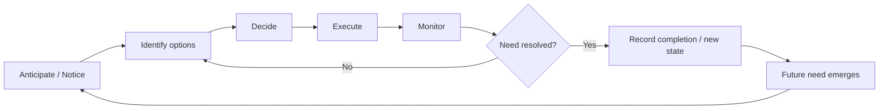
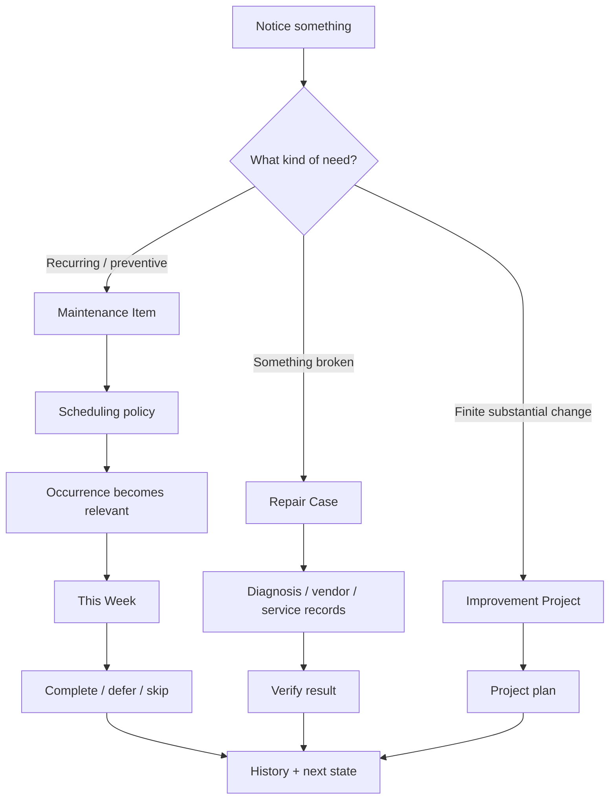
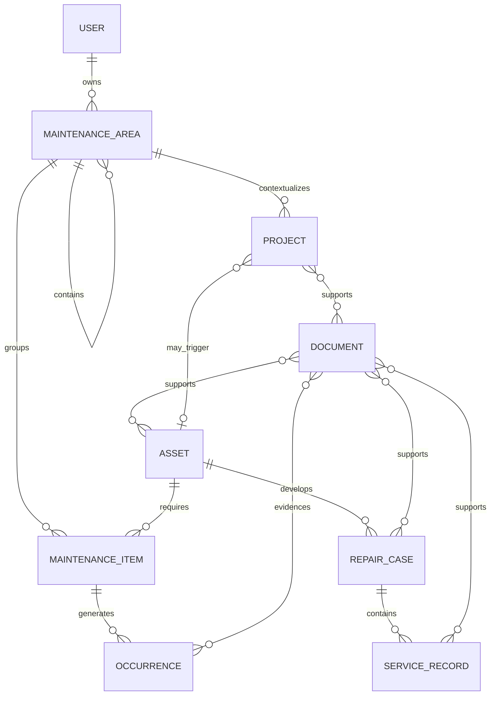
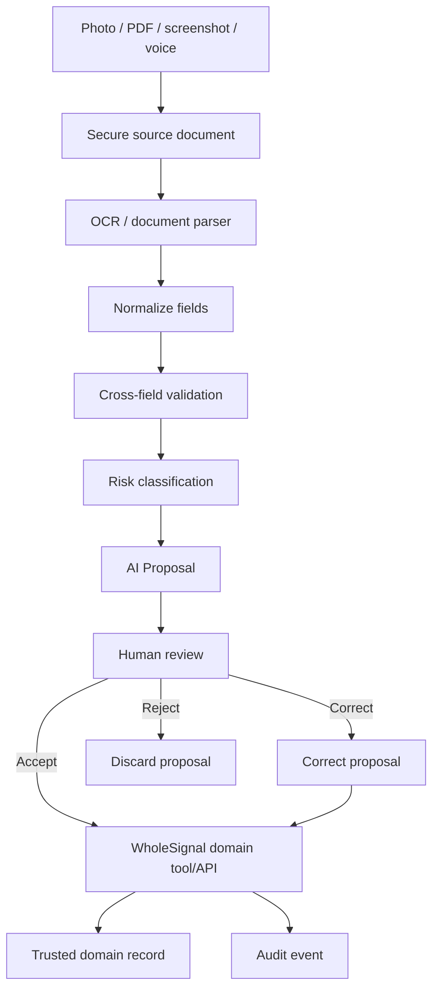
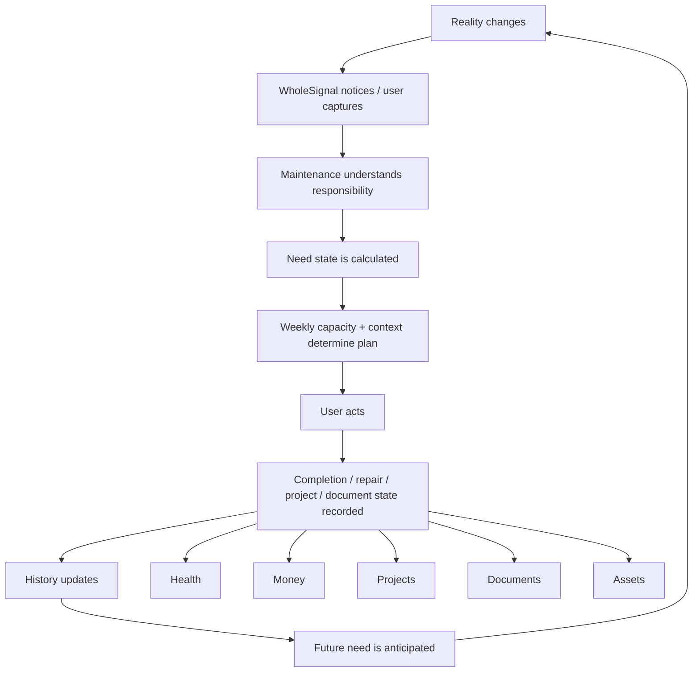

# WholeSignal Maintenance / Personal Operations — Deep Research, PRD, Mobile Blueprint, Web Portal Blueprint, and Coding-Agent Handoff

## Executive Summary

WholeSignal should treat **Maintenance** as a first-class life domain rather than as a specialized task list.

The underlying human problem is larger than “remember to clean the bathroom.” Research on household cognitive labor shows that much of the real work happens before and after the visible action: anticipating that something will need attention, identifying options, deciding what should happen, and monitoring whether it was actually handled. Allison Daminger's 2019 *American Sociological Review* study derived this four-part model from 70 interviews with members of 35 couples. citeturn18search0turn18search5

The newer CHI 2026 paper *The Domestic Operating System* reaches a product-relevant conclusion: existing digital tools often support visible activities such as chores and plans while leaving much of the surrounding hidden management work unsupported. Its survey of 50 participants is exploratory rather than definitive, but its findings align closely with the problem WholeSignal is trying to solve. citeturn18search9turn18search11turn18search16 Administrative household work is also measurable as both temporal and mental workload; a 2024 study surveyed 617 participants specifically about bureaucratic and administrative household labor. citeturn18search2

The product thesis is therefore:

> **Maintenance should represent continuing responsibilities that repeatedly generate needs, actions, decisions, documents, repairs, and projects—not merely recurring tasks.**

This preserves the broader WholeSignal/LifeOS philosophy of **Observe → Understand → Plan → Act → Track → Review → Adapt**, while following the existing interface distinction that mobile is primarily for capture and execution and the web portal for planning, configuration, analysis, and deep review. fileciteturn0file2 The proposed research-to-handoff structure also follows the existing LifeOS master-product process: research the human problem and domain first, then competitor behavior, requirements, IA, workflows, data, MVP, and engineering handoff. fileciteturn0file3

### Concise PRD summary

| Dimension | Product decision |
|---|---|
| User-facing domain | **Maintenance** |
| Internal conceptual domain | **Personal Operations** |
| Primary problem | Important recurring and episodic life responsibilities live in memory or fragmented task lists, so users must repeatedly notice, reconstruct, schedule, and monitor them. |
| Primary outcome | WholeSignal remembers the operational state of the user's life and surfaces the right responsibility at approximately the right time without manufacturing unnecessary urgency. |
| Primary user | Initially the individual WholeSignal user; household collaboration is deliberately deferred. |
| Core product unit | `MaintenanceItem`, not generic `Task`. |
| Execution unit | `Occurrence`. |
| Physical-object unit | `Asset`. |
| Broken-object workflow | `RepairCase → ServiceRecord(s) → Resolution`. |
| Larger finite improvement | `Project`, linked back to the responsible Maintenance area. |
| Top-level taxonomy | Home; Clothing & Laundry; Personal Care; Health Administration; Devices & Assets; Life Administration; Digital Maintenance; Errands. |
| Planning model | Fixed recurring, interval-from-completion, flexible window, condition-based, hard deadline, seasonal, repair, improvement project. |
| Critical architecture correction | Repair and improvement-project are **work types**, not actually recurrence algorithms. The UI may present eight planning types, but the data model should keep `schedulePolicy` separate from `workKind`. |
| Status philosophy | Flexible maintenance becomes **Can wait → Approaching → Due → Needs attention**, while only real deadlines become **Overdue**. |
| Mobile purpose | Capture, notice, complete, inspect current state, run errands, scan documents, update repair status. |
| Web purpose | Configure systems, triage backlog, conduct weekly review, plan capacity, analyze load/history, manage assets/documents/repairs. |
| AI philosophy | **Extract → propose → explain → human reviews → deterministic domain service commits.** AI never silently becomes the source of truth. |
| Privacy posture | Data minimization, explicit purpose, fine-grained retention, protected documents, auditable AI actions, export/delete, minimal notification leakage. |
| MVP | Deterministic Maintenance system first; AI, advanced automation, bank/AA integration, shared household and predictive recurrence come later. |
| North-star outcome | A growing proportion of important life-maintenance needs are handled in an appropriate window **without the user having to remember or recreate them manually**. |

There is strong competitive validation for individual pieces of this model. Tody's core “dueness” concept tracks elapsed time relative to each cleaning task's realistic interval instead of insisting that everything happen on a fixed weekday. citeturn15search1turn15search2 Sweepy combines task effort with how much work the user wants to perform on a given day and can generate a schedule from that capacity. citeturn17search0 HomeZada links maintenance with inventory, documents, receipts, projects, costs and repair history. citeturn16search4turn16search6turn16search13 Ohai demonstrates a useful AI pattern in which documents and screenshots become proposed calendar events, reminders or tasks and the user approves the action. citeturn16search9

The opportunity is not to copy any one of those applications. The inference from the reviewed products is that WholeSignal can occupy a broader layer:

```text
Cleaning
+ Clothing
+ Grooming
+ Health administration
+ Assets / repairs
+ Life bureaucracy
+ Digital housekeeping
+ Errands
+ Capacity planning
+ Documents
+ Cross-domain links
+ AI proposals

                    ↓

            PERSONAL OPERATIONS
```

That is consistent with WholeSignal's larger objective of connecting life domains rather than creating independent trackers. fileciteturn0file2

A major product constraint should be adopted immediately:

> **The application must never turn every responsibility into a red overdue task.**

Tody's interval-based behavior is an important precedent: its “dueness” reflects how far a task has progressed through its interval since the previous completion. citeturn15search2turn15search6 WholeSignal should generalize this principle beyond cleaning.

A second major constraint concerns AI:

> **OCR confidence is evidence for routing a field through a review workflow, not permission to silently alter important life records.**

AWS Textract and Google Document AI both expose field/entity confidence and document provenance, but those values are model outputs rather than universal guarantees of correctness. citeturn21search1turn21search8turn21search12 NIST's AI Risk Management Framework explicitly emphasizes lifecycle risk management and testing, evaluation, verification and validation rather than trust based on a single score. citeturn20search0turn20search3 Consequently, hard deadlines, health-related dates, government-document dates, warranty expiration, costs, serial numbers, and externally consequential actions should remain human-confirmed in early WholeSignal releases.

Finally, privacy is not a later “settings page.” India notified the **Digital Personal Data Protection Rules, 2025 on November 14, 2025**, bringing the DPDP Act framework fully into operation; the current product design should therefore assume that documents, receipts, health appointments, addresses, administrative records and device data require deliberate lifecycle controls. citeturn19search0turn19search9turn15search11

The resulting product should feel less like:

> “Here are your chores.”

and more like:

> “These are the few parts of your personal life that currently deserve attention; here is why; here is what can wait; and here is the evidence/history you will need to handle them.”

## Research and Product Thesis

The Maintenance domain exists because the visible action is only one stage of personal operations.

A useful conceptual translation of Daminger's cognitive-labor model is:



Daminger's empirical model contains anticipation, option identification, decision-making and monitoring; the explicit execution and recorded-state stages above are WholeSignal product additions. citeturn18search0

The CHI 2026 work strengthens the case that software should assist not only the physical task but also the surrounding management. Its authors describe hidden domestic management as insufficiently supported by existing technology and note that family-management work is collaborative even while tools frequently remain oriented around individual interactions. citeturn18search9turn18search16 Because WholeSignal is currently personal-first, this does **not** justify shipping household delegation in the MVP; it does justify ensuring the core data model does not make future collaborative ownership impossible.

The administrative-labor evidence also means “life bureaucracy” should not be buried under Finance. The 2024 study specifically evaluated bureaucratic and administrative household labor and found meaningful temporal and mental workload across its 617-person sample. citeturn18search2 That supports a dedicated **Life Administration** area containing renewals, forms, government paperwork, insurance administration and similar obligations.

### Evidence quality and limitations

| Evidence | What it supports | Strength for this PRD | Important limitation |
|---|---|---|---|
| Daminger, 2019 | Cognitive work has distinct anticipation, options, decision and monitoring phases. | Strong conceptual foundation. | Qualitative sample of 35 couples; not a software usability study. citeturn18search0 |
| Frampton, Gould & Cox, CHI 2026 | Existing domestic technologies support visible work better than hidden management work. | Highly relevant HCI evidence. | Survey N=50; recent exploratory work, not proof of product-market fit. citeturn18search11turn18search16 |
| Dethier et al., 2024 | Administrative household labor has measurable time and mental burden. | Supports Life Administration taxonomy. | Survey evidence does not identify the ideal software intervention. citeturn18search2 |
| Tody | Need/interval-based scheduling can replace rigid calendar recurrence for cleaning. | Strong product precedent. | Cleaning-centric and vendor-authored product information. citeturn15search1turn15search2 |
| Sweepy | Effort + available capacity can drive generated schedules. | Strong precedent for weekly-capacity design. | Cleaning-centric; gamification choices need not generalize. citeturn17search0 |
| HomeZada | Assets, documents, maintenance, repairs, projects and cost history can be linked. | Strong precedent for connected records. | Property/home-centric and broader than personal operations. citeturn16search4turn16search6 |
| Ohai | Documents can generate proposed calendar/task actions subject to approval. | Strong precedent for AI proposal UX. | Family-logistics orientation rather than deep maintenance ontology. citeturn16search9 |
| Centriq | Product-label capture can connect physical assets with manuals and maintenance information. | Useful historical design precedent. | Best treated as a historical competitor rather than a current active benchmark; surviving primary material documents its older capabilities, while current third-party sources report that the consumer service is discontinued. citeturn16search3turn16search0 |

### Competitive landscape

| Product | Best idea to learn from | What WholeSignal should not copy | WholeSignal opportunity |
|---|---|---|---|
| **Tody** | Per-task realistic intervals, last completion, need/dueness, room structure and seasonality. citeturn15search1turn15search2 | Cleaning-only ontology and “dirt” framing outside cleaning. | Generalize elapsed need to grooming, devices, documents, digital work and preventive care. |
| **Sweepy** | Smart Schedule considers availability and effort; users can choose lower-effort work when capacity is low. citeturn17search0 | Leaderboards, coins or competitive gamification as the fundamental motivation system. | Build maintenance-capacity planning without converting ordinary adulthood into a game. |
| **HomeZada** | Connect inventory, routine maintenance, repair records, documents, receipts, projects and financial history. citeturn16search4turn16search6turn16search13 | Property-only world model and feature density on everyday mobile execution. | Use the same linked-record principle across every important personal asset and life responsibility. |
| **Centriq** | Identify a product from its label and retrieve related manuals/maintenance information; allow receipts/warranties/service information around it. citeturn16search3 | Dependence on a product-information lookup experience as the entire domain. | Make asset intelligence one subsystem inside Personal Operations. |
| **Ohai** | Convert PDFs, images and screenshots into proposed dates/tasks and require approval. citeturn16search9 | Generic assistant-generated task sprawl. | AI proposes structured MaintenanceItem, Asset, Warranty, RepairCase or Calendar links with provenance. |
| **HomeZada AI** | Receipt photo can seed purchase date, amount, brand/model and related asset information. citeturn16search8 | “AI found it, therefore it is truth.” | Keep extraction confidence, source region and correction history. |

The resulting differentiation is an inference from those reviewed systems rather than a claim that no other software exists:

> WholeSignal's strongest defensible product idea is **not** better chores. It is a common operational model spanning physical environment, personal care, bureaucracy, possessions, digital life and errands, connected to Finance, Health, Projects, Documents and AI.

### Maintenance taxonomy

The top level should remain deliberately stable so analytics do not fragment into hundreds of user-created classifications. Users may create nested spaces/subareas below it.

| Area | Scope | Representative items | Important links |
|---|---|---|---|
| **Home** | Functional and hygienic living environment. | Bathroom clean, bedsheets, kitchen deep-clean, fan cleaning, AC filter, decluttering. | Asset, Supply, Project, Expense. |
| **Clothing & Laundry** | Clothing lifecycle rather than one “laundry” task. | Wash, dry, iron, fold, dry-clean, shoe care, alterations, seasonal rotation. | Errand, Supply, Expense. |
| **Personal Care** | Routine non-medical grooming and hygiene. | Haircut, beard trim, nails, toothbrush replacement, grooming supplies. | Expense, Supply. |
| **Health Administration** | Operational work surrounding health rather than clinical interpretation. | Dental appointment, blood test booking, routine screening, prescription collection, follow-up reminder. | **Health record**, Calendar, Expense, Document. |
| **Devices & Assets** | Physical possessions requiring care, records or repair. | Laptop clean, backup reminder, AC service, phone repair, warranty claim, monitor service. | Asset, RepairCase, Document, Finance. |
| **Life Administration** | Personal bureaucracy and contractual administration. | KYC, passport renewal, licence, insurance renewal, tax paperwork, rent paperwork. | Document, Calendar, Money. |
| **Digital Maintenance** | Operational maintenance of digital life. | Backups, storage cleanup, password/recovery review, software maintenance, photo/file organization. | Device, Integration. |
| **Errands** | Context- or location-dependent physical actions. | Tailor, pharmacy pickup, courier, bank visit, service centre, collect documents. | Any originating item/case/project. |

Health Administration must remain operational rather than diagnostic. The clinical result belongs in Health; the Maintenance occurrence records that the test was scheduled/completed. This mirrors the existing WholeSignal/LifeOS goal of cross-domain linkage instead of duplicated records. fileciteturn0file2

The existing Money thinking provides another important linkage: a receipt can describe money movement while also identifying something the user owns, which can then become an Asset with warranty and maintenance history. fileciteturn0file1 The Maintenance system should therefore link to financial entities rather than copy transaction amounts into an independent, unreconciled cost table.

### Scheduling and planning model

The user's eight requested types should remain visible conceptually, but the implementation should **not** encode all eight into one `recurrence_type` enum.

Six are temporal/state scheduling policies. Two are workflow escalations.

```text
workKind
├── ROUTINE
├── REPAIR
└── IMPROVEMENT_PROJECT

schedulePolicy
├── FIXED
├── INTERVAL_FROM_COMPLETION
├── FLEXIBLE_WINDOW
├── CONDITION
├── HARD_DEADLINE
├── SEASONAL
└── NONE
```

That distinction prevents a RepairCase from being forced through recurring-task semantics.

| User-facing type | Internal model | Example | Due behavior | Completion behavior |
|---|---|---|---|---|
| **Fixed recurring** | `SchedulePolicy.FIXED` | Change bedsheets every Sunday. | Anchored to calendar recurrence. | Completion does **not** move future calendar anchors unless configured. |
| **Interval from completion** | `INTERVAL_FROM_COMPLETION` | Haircut roughly every 30 days. | Next target derives from actual completion. | `nextTarget = completedAt + interval`. |
| **Flexible window** | `FLEXIBLE_WINDOW` | Bathroom deep clean every 10–14 days. | Window starts at minimum and closes at maximum interval. | Recalculates the next window from actual completion. |
| **Condition based** | `CONDITION` | Detergent low; storage <15%; laundry basket full. | Triggered when an observable signal crosses configured threshold. | Completion resets/updates the signal, not necessarily time. |
| **Hard deadline** | `HARD_DEADLINE` | Insurance renewal or KYC deadline. | May legitimately become `OVERDUE`. | Completion closes obligation; recurrence only if separately configured. |
| **Seasonal / long interval** | `SEASONAL` | AC service before summer; annual document review. | Activates inside relevant seasonal/date window. | Recalculates next season/year. |
| **Repair** | `workKind=REPAIR` | Monitor broken. | Case lifecycle, target dates and follow-ups rather than recurrence. | Resolution requires outcome/verification, optionally service records. |
| **Improvement project** | `workKind=IMPROVEMENT_PROJECT` | Redesign room. | Project milestones and plan. | Project closes when finite outcome is reached; routine maintenance remains separate. |

Tody's need-based interval approach supports the first architectural distinction—elapsed need does not have to equal fixed recurrence—while Sweepy's capacity-based generation supports separating “what deserves attention” from “what actually fits this week.” citeturn15search2turn17search0

For a flexible window:

```text
lastCompleted = 20 Aug
minInterval   = 10 days
maxInterval   = 14 days

30 Aug         3 Sep
  │─────────────│
windowStart   windowEnd
```

Recommended status semantics:

```text
before windowStart       → CAN_WAIT
near windowStart         → APPROACHING
inside window            → DUE
after windowEnd          → NEEDS_ATTENTION
```

Do **not** display `OVERDUE` unless the underlying obligation truly has a deadline or safety-critical schedule.

For interval-based items, a normalized internal need score may be useful:

```text
needRatio = elapsedSinceCompletion / typicalInterval
```

but a “Home 83% healthy” score should not appear in the MVP. It creates false precision and encourages gaming a derived number rather than making appropriate decisions.

### Core user journeys



The Weekly Review becomes the explicit “monitor and decide” workspace that ordinary task lists generally lack:


The design principle is simple:

> **The system owns remembering; the user owns judgment.**

## Product Requirements and Architecture

WholeSignal's existing architecture separates Android/mobile daily capture from portal-level strategy, and its AI architecture requires the model to act through domain tools rather than directly against the database. fileciteturn0file2 Maintenance should preserve both principles.

### Information architecture

```text
WHOLESIGNAL
│
├── Today
│
├── Maintenance
│   ├── Home
│   ├── This Week
│   ├── Areas
│   ├── Backlog
│   ├── Assets
│   ├── Repairs
│   └── Weekly Review
│
├── Health
├── Money
├── Projects
└── Reviews
```

The web portal can expose deeper second-level navigation:

```text
Maintenance
├── Overview
├── Planner
├── Inventory
├── Areas
├── Backlog
├── Assets
├── Repairs
├── Supplies
├── Errands
├── Reviews
├── Analytics
└── Settings
```

The application should **not** duplicate every portal page on mobile. Mobile is allowed to view detailed records when needed, but it should optimize for “notice → capture → act → complete.” Web optimizes for “inspect → configure → compare → plan → review.”

### Conceptual data model



| Entity | Purpose | Important fields / constraints |
|---|---|---|
| `MaintenanceArea` | Stable responsibility taxonomy and nested subareas. | `id`, `systemCode`, `parentId`, `name`, `hidden`, `sortOrder`. Eight root `systemCode`s remain stable; nested custom areas allowed. |
| `MaintenanceItem` | Ongoing operational responsibility. | `title`, `areaId`, `workKind`, `schedulePolicy`, `estimatedDuration`, `effort`, `priority`, `assetId?`, `instructions?`, `riskLevel`, `status`, `archivedAt`, `version`. |
| `Occurrence` | One actionable manifestation of an item. | `itemId`, `windowStart`, `windowEnd`, `hardDueAt?`, `status`, `scheduledAt?`, `completedAt?`, `durationActual?`, `cost?`, `notes`, `scheduleVersion`. |
| `Asset` | Important owned physical/digital object. | `name`, `category`, `brand`, `model`, `serial`, `purchaseDate?`, `purchaseCost?`, `financialTransactionId?`, `warranty`, `condition`, `locationAreaId?`. |
| `RepairCase` | Multi-stage issue-resolution process. | `assetId?`, `areaId`, `issue`, `severity`, `status`, `openedAt`, `targetDate?`, `vendorId?`, `resolution`, `verifiedAt?`. |
| `ServiceRecord` | One service interaction inside a repair or preventive service. | `repairCaseId?`, `assetId`, `vendor`, `submittedAt`, `returnedAt`, `jobSheet`, `cost`, `outcome`, `warrantyUsed`. |
| `Project` | Finite improvement associated with an area/asset. | Existing WholeSignal project entity should be linked, not duplicated. |
| `Document` | Shared document capability. | File metadata, hash, storage locator, MIME, source, OCR state, retention class. Documents are linked, never copied per domain. |
| `SupplyItem` | Optional cross-cutting replenishment state. | Name, quantity state, threshold, unit, related MaintenanceItems, preferred purchase context. |
| `AIProposal` | Staging record between AI extraction and trusted domain data. | Source, candidate fields, confidence, page provenance, validation results, proposed action, reviewer decision. |

A representative MaintenanceItem contract:

```json
{
  "id": "mi_bathroom_deep_clean",
  "areaId": "area_home_bathroom",
  "title": "Bathroom deep clean",
  "workKind": "ROUTINE",
  "schedulePolicy": {
    "type": "FLEXIBLE_WINDOW",
    "anchor": "LAST_COMPLETION",
    "minimumDays": 10,
    "maximumDays": 14
  },
  "estimatedDurationMinutes": 30,
  "effortLevel": 2,
  "priority": "NORMAL",
  "riskLevel": "LOW",
  "currentState": {
    "status": "DUE",
    "windowStart": "2026-09-02",
    "windowEnd": "2026-09-06"
  },
  "version": 7
}
```

The occurrence contract should preserve **planned state at the time of occurrence generation**. Otherwise later schedule edits can corrupt historical interpretation.

```json
{
  "id": "occ_7831",
  "maintenanceItemId": "mi_bathroom_deep_clean",
  "scheduleVersion": 7,
  "windowStart": "2026-09-02",
  "windowEnd": "2026-09-06",
  "hardDueAt": null,
  "status": "DUE",
  "completedAt": null,
  "completion": null
}
```

### Scheduling-engine invariants

These rules should be treated as backend/domain acceptance criteria rather than UI behavior:

| Rule | Required behavior |
|---|---|
| Interval completion | Completing late causes the next interval to begin from the actual completion timestamp. |
| Fixed recurrence | Completing late does not silently shift the underlying recurrence rule. |
| Flexible window | Next min/max window derives from actual completion unless user selects another anchor. |
| Snooze | Changes presentation/planning date, not underlying recurrence, unless user explicitly chooses “change schedule.” |
| Skip | Marks the occurrence skipped and records reason; does not masquerade as completion. |
| Hard deadline | Snooze cannot alter the legal/real deadline; only notification timing changes. |
| Schedule edit | Future occurrences use new schedule version; completed historical occurrences retain their original schedule context. |
| Duplicate completion | Idempotent completion endpoint returns the existing completion rather than producing two history records. |
| Archive | Stops future occurrence generation but preserves history. |
| Restore | Requires recalculation from a defined anchor and displays the resulting next state before confirmation. |
| Timezone | Scheduling is computed in the user's configured home timezone; history retains original timestamp offset. |
| DST/time change | Date-only maintenance remains date-only; exact appointments follow zoned timestamps. |

### Shared API surface

The exact transport is technology-neutral; the contracts below express domain boundaries rather than prescribing framework choice.

```text
GET    /maintenance/dashboard
GET    /maintenance/week
GET    /maintenance/items
POST   /maintenance/items
GET    /maintenance/items/{id}
PATCH  /maintenance/items/{id}
POST   /maintenance/items/{id}/archive

GET    /maintenance/occurrences
POST   /maintenance/occurrences/{id}/complete
POST   /maintenance/occurrences/{id}/skip
POST   /maintenance/occurrences/{id}/defer

GET    /maintenance/areas
POST   /maintenance/areas/{id}/children

GET    /maintenance/reviews/current
POST   /maintenance/reviews/current/commit
GET    /maintenance/reviews

GET    /assets
POST   /assets
GET    /assets/{id}
PATCH  /assets/{id}
POST   /assets/{id}/documents

GET    /repair-cases
POST   /repair-cases
GET    /repair-cases/{id}
PATCH  /repair-cases/{id}
POST   /repair-cases/{id}/service-records

GET    /supplies
POST   /supplies
POST   /errand-trips

POST   /documents
POST   /documents/{id}/extract
GET    /ai-proposals/{id}
POST   /ai-proposals/{id}/accept
POST   /ai-proposals/{id}/reject

GET    /maintenance/analytics/load
GET    /maintenance/analytics/timing
```

All modifying operations should support an idempotency key where duplication is plausible, return a monotonically increasing `version`, and reject stale destructive updates with a conflict response. Mobile offline writes should preserve the original operation ID so network retries cannot create duplicate completions.

### Global API error contract

```json
{
  "error": {
    "code": "VERSION_CONFLICT",
    "message": "This maintenance item changed on another client.",
    "retryable": false,
    "entityId": "mi_123",
    "serverVersion": 11,
    "details": {
      "conflictingFields": ["schedulePolicy"]
    }
  }
}
```

Required cross-client states are:

```text
LOADING
SUCCESS
EMPTY
STALE
OFFLINE_READABLE
OFFLINE_PENDING_WRITE
VALIDATION_ERROR
AUTH_REQUIRED
PERMISSION_DENIED
VERSION_CONFLICT
SERVER_ERROR
```

### Core functional requirements

| Requirement | Implementation requirement |
|---|---|
| Need-aware scheduling | The scheduler must produce user-facing states without generating fake deadlines. |
| History | User can answer “When did I last do this?” from every MaintenanceItem. |
| Quick completion | Ordinary low-risk item completion must require no more than one primary confirmation gesture from Item Detail. |
| Capture inbox | Unstructured notices can exist without immediately forcing schedule configuration. |
| Weekly review | User can process inbox, inspect due items, set capacity, place items in This Week/Next/Later and commit. |
| Assets | Maintenance and repairs can attach to a durable Asset record. |
| Repairs | Case survives across diagnosis, service-center handoff, waiting, collection and verification. |
| Documents | Same underlying document may be linked to Finance, Asset and Repair without file duplication. |
| Projects | Maintenance can escalate to an existing WholeSignal project entity. |
| Costs | Maintenance may reference Money/transaction IDs; it must not create an independent financial source of truth. |
| Safety | Hazardous repair guidance must gate DIY instructions and recommend qualified help where appropriate. |
| Auditability | AI-created or AI-edited structured data must retain source/proposal/reviewer provenance. |

### Non-functional requirements

The Maintenance domain should support offline capture because the user's most likely time to notice a need is often away from the portal. Mobile should queue writes and reconcile them later without losing the original capture timestamp. The backend remains authoritative, consistent with the existing WholeSignal/LifeOS cloud-source-of-truth principle. fileciteturn0file2

All list endpoints require pagination, stable sorting and server-side filters. Document storage must remain separate from ordinary database fields, with files delivered through expiring authenticated access rather than public URLs. Analytics events must never include receipt text, medical content, government identifiers, exact serial numbers or document OCR text.

## Mobile App Blueprint

The mobile product is the **execution surface**. A healthy session is frequently only a few seconds: notice something, capture it; see what's relevant, complete it; photograph a document, review extracted fields; arrive at a service center, update the RepairCase.

Android accessibility guidance currently recommends at least **48 × 48 dp** touch targets, and Compose guidance recommends using semantic higher-level controls and exposing alternatives for gesture-only interactions. citeturn14search0turn14search2turn14search5 Those requirements should become automated/manual acceptance tests for the mobile implementation.

### Mobile screen inventory

Baseline for every screen: loading, offline/stale, server error and authorization behavior are mandatory even when the row calls out only screen-specific states.

| ID | Logical route | Purpose | Required data | Page-level acceptance criterion |
|---|---|---|---|---|
| M00 | `/launch` | Restore session and synchronize pending Maintenance operations. | Session, sync queue, migration state. | App never duplicates queued writes and exposes recoverable sync failure. |
| M01 | `/maintenance/onboarding` | Explain Maintenance versus ordinary tasks/projects. | Onboarding state. | User can understand “ongoing responsibility” and skip setup. |
| M02 | `/maintenance/onboarding/areas` | Select relevant Maintenance areas. | Root areas, hidden areas. | Selected areas persist; no area selection is mandatory. |
| M03 | `/maintenance/onboarding/planning` | Configure default planning style/capacity assumptions. | Preferences. | Defaults may be changed later; no fake schedule is created silently. |
| M04 | `/maintenance/onboarding/notifications` | Explain optional reminder behavior. | Notification permission/state. | OS permission is requested only after explanatory screen. |
| M05 | `/maintenance` | Current operational overview. | Dashboard summary, critical deadlines, due items, open repairs. | Hard deadlines and flexible maintenance are visually/semantically distinct. |
| M06 | `/maintenance/week` | Execute committed weekly plan. | Weekly plan, occurrences, capacity. | User can complete/defer without editing underlying schedule accidentally. |
| M07 | `/maintenance/capture` | Capture a noticed responsibility in seconds. | Areas, recent assets/context. | User may save to Inbox with title only. |
| M08 | `/maintenance/capture/review/{proposalId}` | Review AI-classified capture. | AIProposal, source transcript/image. | Nothing is committed until explicit approval. |
| M09 | `/maintenance/items/new` | Create a structured MaintenanceItem. | Areas, scheduling policy schema, assets. | Validation matches schedule type; optional fields remain optional. |
| M10 | `/maintenance/items/{id}` | Understand current state and act. | Item, next occurrence, history summary, links. | Completion and schedule edit are distinct actions. |
| M11 | `/maintenance/items/{id}/schedule` | Configure schedule policy. | Current policy, completion history. | Preview shows how next state changes before save. |
| M12 | `/maintenance/occurrences/{id}/complete` | Record completion details. | Occurrence, item, optional cost/doc links. | Duplicate submission is idempotent. |
| M13 | `/maintenance/items/{id}/history` | Inspect previous completions/skips. | Paginated occurrence history. | Historical entries retain schedule version/context. |
| M14 | `/maintenance/areas` | Browse eight areas and nested subareas. | Area summaries. | Hidden areas do not delete underlying data. |
| M15 | `/maintenance/areas/home` | Home operational view. | Home subareas/items/assets. | Rooms/subareas show relevant state without fake health percentage. |
| M16 | `/maintenance/areas/{areaId}` | Inspect one room/subarea. | Area, items, assets, backlog. | User can quick-add an item already linked to this area. |
| M17 | `/maintenance/areas/clothing` | Clothing/laundry lifecycle. | Clothing items, laundry occurrences/errands. | Supports more than one generic “laundry” item. |
| M18 | `/maintenance/areas/personal-care` | Grooming/personal-care maintenance. | Items/history. | Flexible intervals are first-class. |
| M19 | `/maintenance/areas/health-admin` | Manage health operational obligations. | Health-admin items, linked appointments/Health records. | Clinical result is linked to Health rather than duplicated here. |
| M20 | `/maintenance/areas/devices` | Device and asset maintenance. | Assets, device items, repairs. | Asset state and repair state both visible. |
| M21 | `/maintenance/areas/life-admin` | Manage bureaucracy/deadlines. | Admin items/docs/deadlines. | Hard deadlines are distinguishable from flexible work. |
| M22 | `/maintenance/areas/digital` | Digital housekeeping. | Digital items/device links. | Sensitive account secrets are never requested as task metadata. |
| M23 | `/maintenance/errands` | View context/location-dependent actions. | Open errands, trips, source links. | Each errand retains originating item/repair/project. |
| M24 | `/maintenance/backlog` | Hold useful non-urgent work. | Backlog items. | Backlog items do not become overdue solely because they are old. |
| M25 | `/maintenance/review` | Start Weekly Maintenance Review. | Review draft, week summary. | Review can be abandoned/resumed without losing prior state. |
| M26 | `/maintenance/review/changes` | Surface newly due/changed responsibilities. | Changed items, new repairs/deadlines. | System explains why each item appears. |
| M27 | `/maintenance/review/completed` | Review previous week's completion. | Occurrence history. | Completion history can be corrected with audit trail. |
| M28 | `/maintenance/review/inbox` | Classify noticed items. | Capture inbox. | Every capture can become item, repair, project, backlog or be discarded. |
| M29 | `/maintenance/review/capacity` | Set realistic available maintenance time. | Calendar availability if granted, prior estimates. | User can override inferred capacity. |
| M30 | `/maintenance/review/build` | Build This Week / Next / Later. | Candidates, capacity, dependencies. | Over-capacity plan produces warning, not forced rejection. |
| M31 | `/maintenance/review/commit` | Review and save weekly plan. | Review draft. | Commit is atomic and idempotent. |
| M32 | `/maintenance/assets` | Search/browse owned assets. | Asset summaries. | User can find asset by name, brand, model or tag. |
| M33 | `/maintenance/assets/new` | Add asset manually or from document/photo. | Asset schema, area/context. | Asset can be saved with only name/category. |
| M34 | `/maintenance/assets/{id}` | Asset operational record. | Asset, docs, maintenance, repair history. | Same asset provides one timeline across maintenance and repairs. |
| M35 | `/maintenance/assets/{id}/documents` | Find warranties/invoices/manuals. | Linked documents. | Opening document requires authorization; file is not public. |
| M36 | `/maintenance/assets/{id}/warranty` | Inspect/edit warranty information. | Warranty fields/source docs. | Inferred expiry requires review before becoming trusted. |
| M37 | `/maintenance/repairs/new` | Start a repair issue. | Assets, area, risk classification. | Asset is optional; issue description alone can create draft. |
| M38 | `/maintenance/repairs/{id}` | Operate a repair through lifecycle. | RepairCase, service records, docs. | Valid state transitions only; unsafe workflow shows safety gate. |
| M39 | `/maintenance/repairs/{id}/service-records/new` | Record a vendor/service interaction. | RepairCase, vendor data. | Job sheet/cost/doc can be captured without closing case. |
| M40 | `/maintenance/supplies` | Track replenishment signals. | Supply states, linked maintenance items. | Low-state signal can generate proposal without silent purchase. |
| M41 | `/maintenance/supplies/{id}` | Inspect/update one supply. | Supply history/threshold. | Threshold changes do not rewrite historical signals. |
| M42 | `/maintenance/errand-trips/new` | Batch compatible errands. | Errands, locations, time estimates. | Trip may be manually arranged; optimizer is optional. |
| M43 | `/maintenance/errand-trips/{id}` | Execute an errand trip. | Trip stops, source obligations. | Completing stop updates linked source occurrence/case only after confirmation. |
| M44 | `/maintenance/assistant` | Ask Maintenance-aware questions. | Read tools, proposals, contextual data. | Assistant cannot perform sensitive writes without confirmation. |
| M45 | `/maintenance/documents/capture` | Camera/upload entry for receipt/invoice/warranty/admin doc. | Camera/files, upload session. | Original is preserved and upload state visible. |
| M46 | `/maintenance/documents/{id}/extraction` | Human-review OCR/extracted values. | Extraction fields, confidence, provenance. | Low-confidence/critical fields cannot silently commit. |
| M47 | `/maintenance/search` | Search across items/assets/repairs/docs. | Search index/results. | Result displays entity type and safe context. |
| M48 | `/maintenance/load` | Lightweight maintenance-time history. | Completion durations/area totals. | Estimates and actual durations are clearly separated. |
| M49 | `/maintenance/reviews/history` | Inspect earlier weekly decisions. | Review history. | User can see what was planned versus actually completed. |
| M50 | `/maintenance/notifications` | Maintenance notification inbox. | Notification records. | Sensitive content obeys privacy preference. |
| M51 | `/maintenance/settings` | Configure scheduling/default behavior. | Preferences. | Changing default affects future/new items unless user explicitly migrates existing ones. |
| M52 | `/maintenance/integrations` | Manage calendar/Health/Money/document integrations. | Connection states/scopes. | Scope and last sync are visible; revoke supported. |
| M53 | `/maintenance/privacy` | Control Maintenance data handling. | Retention/export/delete/AI settings. | User can see what document/AI processing is enabled. |
| M54 | `/maintenance/data-health` | Resolve sync conflicts, duplicates and incomplete linked records. | Conflict/duplicate/completeness issues. | System never chooses destructive merge silently. |

### Mobile page-by-page coding specification

**Shared mobile contract:** every route logs `screen_viewed`; error events contain error code but never OCR text or sensitive entity content. Every modifying request carries `clientOperationId`; every editable entity uses `version` for optimistic concurrency.

| ID | Layout wireframe / principal components | Specific states | APIs/data contract | Analytics |
|---|---|---|---|---|
| M00 | Brand/splash → sync status → retry/recovery CTA only if needed. | `restoring`, `syncing`, `offline`, `migration_required`, `conflict`. | `GET /session`; `POST /sync/batch`. | `app_sync_started`, `app_sync_failed`, `app_sync_recovered`. |
| M01 | Illustration/statement → three examples → `Set up Maintenance` / `Skip`. | First use, returning setup. | Local onboarding preference. | `maintenance_onboarding_viewed`, `onboarding_skipped`. |
| M02 | Eight selectable area cards → continue. | All selected, partial, none. | `GET /maintenance/areas`; `PATCH /preferences/maintenance-areas`. | `maintenance_area_selected`. |
| M03 | Planning explanation → default flexible/weekly capacity controls → continue. | Defaults, custom. | `GET/PATCH /maintenance/preferences`. | `planning_preference_set`. |
| M04 | Example notification → privacy choice → OS permission CTA. | Permission unknown/granted/denied. | OS permission + preferences API. | `notification_permission_prompted`, `notification_permission_result`. |
| M05 | Top bar → hard-deadline alert → `This Week` cards → open repairs → coming up → FAB. | Nothing due, critical deadline, open repair. | `GET /maintenance/dashboard`. | `maintenance_home_viewed`, `maintenance_home_item_opened`. |
| M06 | Week header/capacity → Must/Should/Can Wait groups → quick-complete. | Over capacity, all complete, offline completions pending. | `GET /maintenance/week`; occurrence actions. | `week_viewed`, `week_item_completed`, `week_item_deferred`. |
| M07 | Text/voice/photo capture → area optional → `Save to Inbox` / structure now. | Voice failure, offline draft, attachment pending. | `POST /maintenance/captures`. | `capture_started`, `capture_saved`, `capture_mode_used`. |
| M08 | Source preview → AI interpretation cards → editable fields → proposed destination → approve. | Low confidence, contradictory fields, extraction failed. | `GET /ai-proposals/{id}`; accept/reject. | `ai_proposal_reviewed`, `ai_proposal_corrected`, `ai_proposal_accepted`. |
| M09 | Title → area → type → scheduling dynamic form → effort/duration → optional asset/instructions → save. | Policy-specific validation. | `POST /maintenance/items`. | `maintenance_item_created`, `schedule_type_selected`. |
| M10 | State header → “why now” → primary action → schedule → instructions → history → links. | Can wait/approaching/due/needs attention/deadline. | `GET /maintenance/items/{id}`. | `item_viewed`, `item_action_selected`. |
| M11 | Schedule-type selector → policy editor → “Next expected state” preview → save. | Invalid window, impossible date, no history. | `PATCH /maintenance/items/{id}` with version. | `schedule_editor_opened`, `schedule_changed`. |
| M12 | Completion timestamp → duration → notes → cost/link/document optional → complete. | Partial detail, upload pending. | `POST /maintenance/occurrences/{id}/complete`. | `occurrence_completed`, `completion_details_added`. |
| M13 | Reverse chronological timeline → filters → correction menu. | No history. | `GET /maintenance/items/{id}/occurrences`. | `history_viewed`, `history_entry_corrected`. |
| M14 | Area grid/list → due count + open issues without percentages. | Hidden areas. | `GET /maintenance/areas?includeSummary=true`. | `areas_viewed`. |
| M15 | Home header → rooms/subareas → due items → assets → backlog. | No rooms configured. | `GET /maintenance/areas/home/summary`. | `home_area_viewed`. |
| M16 | Area title → current items → assets → backlog → quick add. | Empty room. | `GET /maintenance/areas/{id}`. | `subarea_viewed`, `subarea_item_added`. |
| M17 | Laundry/current load → care/repair/dry-clean groups → history. | Nothing active. | Area-filtered item/occurrence APIs. | `clothing_area_viewed`. |
| M18 | Upcoming grooming windows → supplies → history. | Flexible windows primarily. | Area-filtered APIs. | `personal_care_viewed`. |
| M19 | Hard appointments/deadlines → routine preventive admin → linked Health records. | Missing Health permission/link. | Maintenance + Health linking API. | `health_admin_viewed`, `health_link_opened`. |
| M20 | Asset issues → routine device work → open repairs. | No assets. | Asset and item summary APIs. | `device_area_viewed`. |
| M21 | Deadline timeline → paperwork → backlog. | Urgent hard deadline. | Area filtered + document links. | `life_admin_viewed`. |
| M22 | Backup/security/storage groups → device context. | Integration unavailable. | Area-filtered items/signals. | `digital_maintenance_viewed`. |
| M23 | Unplanned errands → grouped by context/location → trip CTA. | Location disabled. | `GET /maintenance/errands`. | `errands_viewed`, `errand_selected`. |
| M24 | Search/filter → Can do anytime / Suggested this week / deferred. | Large backlog. | `GET /maintenance/items?bucket=BACKLOG`. | `backlog_viewed`, `backlog_promoted`. |
| M25 | Week summary → unresolved count → estimated review length → start/resume. | Existing draft. | `GET /maintenance/reviews/current`. | `weekly_review_started`, `weekly_review_resumed`. |
| M26 | Swipe-free cards: reason → This Week / Next / Later / inspect. | No changes. | Review draft patch endpoint. | `review_change_classified`. |
| M27 | Completed/skipped list → anomalies → continue. | No completions. | Review completion summary. | `review_completions_viewed`. |
| M28 | Inbox capture → choose Maintenance/Repair/Project/Backlog/Delete → minimal editor. | Unclear AI proposal. | Capture classification endpoint. | `review_inbox_processed`, `capture_classified`. |
| M29 | Day rows + available minutes → calendar availability optional → total. | Calendar unavailable. | `GET /calendar/availability?`; review capacity patch. | `review_capacity_set`. |
| M30 | Must/Should/Can Wait candidates + running capacity bar → drag **and accessible move actions**. | Over capacity. | Review plan patch. | `review_week_built`, `review_overcapacity_seen`. |
| M31 | Final week summary → important deadlines → commit. | Commit conflict. | `POST /maintenance/reviews/current/commit`. | `weekly_review_completed`. |
| M32 | Search → category filters → asset cards with condition/open-case marker. | No assets. | `GET /assets`. | `asset_library_viewed`. |
| M33 | Photo/scan/manual tabs → name/category → model/serial/purchase optional. | Duplicate suspected. | `POST /assets`; duplicate search. | `asset_created`, `asset_duplicate_warning`. |
| M34 | Identity → current issue/maintenance → warranty → documents → timeline. | Repair active, warranty expiring. | `GET /assets/{id}` aggregate. | `asset_viewed`, `asset_maintenance_opened`. |
| M35 | Document type chips → cards → add. | Scan processing, unavailable doc. | `GET /assets/{id}/documents`. | `asset_documents_viewed`, `document_opened`. |
| M36 | Coverage state → source → purchase/coverage terms → reminder → edit. | Unknown expiry/ambiguous warranty. | Warranty subresource + proposal provenance. | `warranty_viewed`, `warranty_confirmed`. |
| M37 | Issue → asset optional → severity → photos → “Do you need professional help?” safety classification. | Hazard warning. | `POST /repair-cases`. | `repair_case_created`, `repair_safety_gate_shown`. |
| M38 | Issue/status banner → next action → service timeline → docs → resolve. | Waiting/in service/ready to collect/verify. | `GET/PATCH /repair-cases/{id}`. | `repair_viewed`, `repair_status_changed`, `repair_resolved`. |
| M39 | Vendor → date/status → job sheet/photo → estimated/actual cost → notes. | Unknown cost, attachment pending. | `POST /repair-cases/{id}/service-records`. | `service_record_created`. |
| M40 | Low/OK supply groups → add → proposed errands. | No low supplies. | `GET /supplies`; condition signal API. | `supplies_viewed`, `supply_low_marked`. |
| M41 | Current state → threshold → usage history → related work. | Unknown state. | `GET/PATCH /supplies/{id}`. | `supply_viewed`, `supply_threshold_changed`. |
| M42 | Select errands → context/location/time → reorder → save. | Incompatible/unknown locations. | `POST /errand-trips`. | `errand_trip_created`. |
| M43 | Stop list → navigate externally → complete/skip each → trip finish. | Interrupted trip/offline. | `GET/PATCH /errand-trips/{id}`. | `errand_trip_started`, `errand_stop_completed`, `errand_trip_finished`. |
| M44 | Conversation → contextual response cards → proposed actions drawer. | Tool unavailable, sensitive action confirmation. | Agent tool gateway only. | `maintenance_assistant_message`, `assistant_proposal_created/accepted/rejected`. |
| M45 | Camera frame/import → document type optional → upload/progress. | Blur/glare warning, offline queued upload. | `POST /documents`; `POST /documents/{id}/extract`. | `document_capture_started`, `document_uploaded`. |
| M46 | Document preview → extracted field list → source-highlight action → validation warnings → accept. | High/review/low confidence. | `GET /ai-proposals/{id}`; accept corrections. | `extraction_review_opened`, `extraction_field_corrected`, `extraction_committed`. |
| M47 | Search box → grouped entities → recent searches. | No results/offline index. | `/search?q=&domains=maintenance,...`. | `maintenance_search`, `search_result_opened`. |
| M48 | Month selector → total actual time → area distribution → estimate accuracy. | Sparse history. | `GET /maintenance/analytics/load`. | `maintenance_load_viewed`. |
| M49 | Review cards → planned/completed/deferred → open. | No history. | `GET /maintenance/reviews`. | `review_history_viewed`. |
| M50 | Notification list → source entity → mute/adjust. | Nothing unread. | `GET /notifications?domain=maintenance`. | `notification_opened`, `notification_muted`. |
| M51 | Defaults → week start → capacity → status sensitivity → templates. | Reset confirmation. | `GET/PATCH /maintenance/preferences`. | `maintenance_settings_changed`. |
| M52 | Connection cards → scopes → last sync → disconnect. | Error/re-auth required. | Integration service contracts. | `integration_connected`, `integration_revoked`. |
| M53 | AI processing toggle → document retention → export → delete → notification privacy. | Export preparing, deletion challenge. | Privacy/export/delete APIs. | `privacy_setting_changed`, `maintenance_export_requested`. |
| M54 | Conflicts → suspected duplicates → missing links → merge/keep both. | No issues. | Data-health/conflict APIs. | `data_health_viewed`, `conflict_resolved`, `duplicate_merged`. |

### Supporting mobile sheets and dialogs

These are implementation surfaces and should be tracked by the coding agent even though they are not routes.

| Component | Required behavior |
|---|---|
| `ScheduleTypePicker` | Describes the practical meaning of all planning choices without technical vocabulary. |
| `AreaPicker` | Search + nested areas + recently used. |
| `EffortDurationSheet` | Duration and perceived effort are independent fields. |
| `FlexibleWindowPicker` | Minimum must be ≤ maximum; preview plain-language next window. |
| `SnoozeSheet` | Explicitly says “This changes when WholeSignal reminds you; it does not change the underlying deadline/schedule.” |
| `SkipReasonSheet` | Optional reason; never records skip as completion. |
| `CompletionCostSheet` | Prefer linking an existing Money transaction over creating duplicate financial truth. |
| `CrossDomainLinker` | Links Health/Finance/Project/Document entities through scoped search. |
| `DocumentViewer` | Expiring authorization; zoom; source-region overlay for AI values. |
| `SafetyGate` | Blocks hazardous DIY guidance and offers “contact qualified professional / record appointment / dismiss guidance.” |
| `ArchiveConfirm` | Explains future occurrence behavior and history retention. |
| `DeleteConfirm` | Shows affected links and follows privacy/deletion policy. |
| `DuplicateAssetResolver` | Side-by-side identifiers and links; never auto-merges conflicting serial numbers. |
| `SyncConflictResolver` | Local/server version diff with explicit keep/merge actions. |
| `AIProvenanceSheet` | Shows original text/region, extraction model/version, confidence band and user edits. |

### Representative mobile wireframes

**Maintenance Home**

```text
┌─────────────────────────────────────┐
│ Maintenance                    🔍   │
│ Friday · 4 Sep                       │
├─────────────────────────────────────┤
│ IMPORTANT DEADLINE                   │
│ Bank KYC                             │
│ 12 days remaining                    │
│ [View]                               │
├─────────────────────────────────────┤
│ THIS WEEK                      4/7   │
│                                     │
│ ● Bathroom deep clean       Due      │
│   ~30 min                            │
│                                     │
│ ● Laptop backup             Due      │
│   ~15 min                            │
│                                     │
│ ○ Haircut                   Soon     │
│   ~45 min                            │
│                                     │
│ [See this week]                      │
├─────────────────────────────────────┤
│ OPEN REPAIR                          │
│ Monitor · At service centre          │
│ Next: check status Friday            │
├─────────────────────────────────────┤
│ COMING UP                            │
│ Dental check             38 days     │
│ Insurance renewal        61 days     │
└─────────────────────────────────────┘
                             [ + ]
```

**Quick Capture**

```text
┌─────────────────────────────────────┐
│ ← Notice something                   │
├─────────────────────────────────────┤
│ What's on your mind?                 │
│ ┌─────────────────────────────────┐ │
│ │ Chair is becoming loose         │ │
│ └─────────────────────────────────┘ │
│                                     │
│ 🎤 Voice     📷 Photo      📄 File   │
│                                     │
│ Optional                            │
│ Area            Home › Workspace    │
│                                     │
│ [Save to Maintenance Inbox]         │
│                                     │
│        Structure it now             │
└─────────────────────────────────────┘
```

This screen intentionally does **not** demand recurrence, priority, due date or asset configuration at capture time. The product should capture anticipation/noticing before requiring decision work, which follows the structure identified in cognitive-labor research rather than forcing all thinking into the moment of capture. citeturn18search0

**Weekly Review — capacity**

```text
┌─────────────────────────────────────┐
│ Weekly Maintenance Review       5/7 │
│ How much room do you actually have? │
├─────────────────────────────────────┤
│ Mon       15 min                     │
│ Tue       20 min                     │
│ Wed        0 min                     │
│ Thu       20 min                     │
│ Fri        0 min                     │
│ Sat      120 min                     │
│ Sun       60 min                     │
├─────────────────────────────────────┤
│ Total available            3h 55m    │
│ Already committed          1h 20m    │
│ Remaining                  2h 35m    │
├─────────────────────────────────────┤
│ Calendar availability connected ✓   │
│ This is a suggestion. Edit freely.  │
│                                     │
│ [Continue]                           │
└─────────────────────────────────────┘
```

This borrows the useful capacity idea from Sweepy but replaces “cleaning points” with real or approximate duration plus optional effort. Sweepy currently lets users configure how much they want to clean and generates tasks based on that capacity. citeturn17search0

## Web Portal Blueprint

The portal is not “the mobile app stretched onto a desktop.” Its job is to make the system understandable and configurable.

Web accessibility should target **WCAG 2.2 AA**. WCAG 2.2 added requirements including focus-not-obscured, non-drag alternatives and minimum pointer target guidance; W3C recommends WCAG 2.2 as the current conformance target. citeturn13search0turn13search1

The portal should support keyboard-complete operation, visible focus, semantic tables, non-color-only due states, accessible charts with equivalent textual summaries, and alternatives to drag/drop planning.

### Portal page inventory

| ID | Route | Purpose | Required data | Page-level acceptance criterion |
|---|---|---|---|---|
| P01 | `/maintenance` | Strategic overview of current operational state. | Dashboard aggregates. | Shows actionability without compressing life into one score. |
| P02 | `/maintenance/planner` | Build/adjust This Week. | Occurrences, capacity, calendar. | Drag/drop always has keyboard/menu equivalent. |
| P03 | `/maintenance/timeline` | Calendar/timeline of deadlines/windows/seasons. | Scheduled obligations. | Flexible windows render as ranges, not fake date points. |
| P04 | `/maintenance/inventory` | Master MaintenanceItem library. | Filtered paginated items. | User can find/filter every active/archived item. |
| P05 | `/maintenance/inventory/{id}` | Deep MaintenanceItem record. | Item/history/links. | Current versus historical schedule clearly separated. |
| P06 | `/maintenance/inventory/{id}/edit` | Configure item and scheduling. | Item/policies. | Preview calculated next state before commit. |
| P07 | `/maintenance/areas` | Cross-area responsibility overview. | Area summaries. | Stable eight-area taxonomy visible. |
| P08 | `/maintenance/areas/home` | Configure home spaces and maintenance. | Home hierarchy. | Nested areas configurable without changing root taxonomy. |
| P09 | `/maintenance/areas/{id}` | Detailed area workspace. | Area/items/assets/history. | Context persists across linked records. |
| P10 | `/maintenance/areas/clothing` | Clothing/laundry planning. | Relevant items/history. | Care/repair/errand work supported separately. |
| P11 | `/maintenance/areas/personal-care` | Grooming/personal-care planning. | Items/history. | Flexible-interval planning is easy to configure. |
| P12 | `/maintenance/areas/health-admin` | Preventive/appointment administration. | Items/links/docs. | No clinical result duplicated from Health. |
| P13 | `/maintenance/areas/devices` | Device maintenance and problems. | Assets/repairs/items. | Asset/repair cross-links work. |
| P14 | `/maintenance/areas/life-admin` | Administrative obligations. | Deadlines/docs/items. | Hard deadlines receive stronger semantics. |
| P15 | `/maintenance/areas/digital` | Digital housekeeping planning. | Items/signals/devices. | Secret/password values are not stored as task notes by design. |
| P16 | `/maintenance/errands` | Master errand queue. | Errands/contexts. | Each errand is traceable to origin. |
| P17 | `/maintenance/backlog` | Non-urgent improvement/maintenance queue. | Backlog. | Age alone does not mark work overdue. |
| P18 | `/maintenance/reviews/current` | Full Weekly Review workspace. | Review draft and all candidates. | Review draft autosaves and is resumable. |
| P19 | `/maintenance/reviews` | Historical weekly reviews. | Review snapshots. | Planned vs actual can be compared. |
| P20 | `/maintenance/capacity` | Maintain weekly capacity model. | Time estimates/calendar. | User can override every inferred availability value. |
| P21 | `/maintenance/analytics/load` | Analyze time/cost/effort by area. | Occurrence facts. | Estimated and actual values cannot be mixed silently. |
| P22 | `/maintenance/analytics/timing` | Analyze lateness/window fit and schedule calibration. | History + schedule snapshots. | Suggests schedule tuning without silently changing it. |
| P23 | `/maintenance/assets` | Asset library. | Assets. | Filters/search scale to large collections. |
| P24 | `/maintenance/assets/new` | Add/edit richer asset record. | Asset schema/docs. | Duplicate detection occurs before save. |
| P25 | `/maintenance/assets/{id}` | Complete asset record. | Asset + timeline. | One asset timeline covers purchase, maintenance, repairs and documents. |
| P26 | `/maintenance/assets/{id}/documents` | Asset document workspace. | Documents/OCR. | Source and extraction state visible. |
| P27 | `/maintenance/warranties` | Warranty expiration/coverage workspace. | Asset warranties. | Unknown/inferred/confirmed dates are distinguishable. |
| P28 | `/maintenance/repairs` | All open/closed repair cases. | Repair cases. | Status/age/severity filters work independently. |
| P29 | `/maintenance/repairs/{id}` | Repair case workspace. | Case/service/docs. | Case cannot resolve without explicit outcome/verification choice. |
| P30 | `/maintenance/service-history` | Cross-asset service history. | Service records. | Search by asset/vendor/date. |
| P31 | `/maintenance/vendors` | Personal service-provider directory. | Vendor/contact/service history. | No public rating/marketplace required. |
| P32 | `/maintenance/supplies` | Replenishment/condition management. | Supplies/signals. | Condition signals remain distinct from purchases. |
| P33 | `/maintenance/errand-trips` | Build efficient trips. | Errands/locations/capacity. | Manual plan remains available if location optimization unavailable. |
| P34 | `/maintenance/templates` | Reusable starter systems. | Template library. | Applying template creates editable drafts, not hidden obligations. |
| P35 | `/maintenance/projects` | Maintenance-originated improvement projects. | Linked projects. | Existing Projects domain remains source of project truth. |
| P36 | `/maintenance/links` | Audit cross-domain connections. | Link graph. | Broken links can be repaired without deleting entities. |
| P37 | `/maintenance/ai-inbox` | Queue AI proposals and uncertain captures. | AIProposal[] | No proposal auto-commits critical fields. |
| P38 | `/maintenance/ai-inbox/{id}` | Detailed extraction/action review. | Proposal/source/provenance. | Field source location and corrections visible. |
| P39 | `/maintenance/documents` | Search Maintenance-related documents. | Document index. | Raw docs follow scoped authorization and retention. |
| P40 | `/maintenance/import` | Import CSV/records/doc batches. | Import mapping/session. | Dry-run validates before commit. |
| P41 | `/maintenance/export` | Export Maintenance data. | Export options. | Export describes included/excluded documents. |
| P42 | `/maintenance/notifications` | Configure notification rules. | Rules/preferences. | Hard deadlines and flexible maintenance have different defaults. |
| P43 | `/maintenance/integrations` | Configure external connections. | Connections/scopes/sync. | Scope, last sync, errors and revoke are visible. |
| P44 | `/maintenance/privacy-audit` | Privacy, AI processing and audit trail. | Processing prefs/audit events. | User can trace AI-originated changes and export/delete data. |
| P45 | `/maintenance/settings` | Domain-wide configuration. | Preferences. | Defaults do not retroactively mutate active items without preview. |

### Portal page-by-page coding specification

| ID | Desktop layout / components | Specific states | API/data contract | Analytics |
|---|---|---|---|---|
| P01 | KPI-free state header → hard deadlines → week plan → repairs → coming-up timeline → area cards → backlog sample. | No active items, critical deadline, stale data. | `GET /maintenance/dashboard?detail=portal`. | `portal_maintenance_overview_viewed`. |
| P02 | Left candidate filters / center weekly columns / right capacity-inspector. | Overcapacity, unscheduled must-do. | Week + occurrence + review APIs. | `planner_viewed`, `planner_item_moved`. |
| P03 | Month/week/list toggle; visual range bars for flexible windows; deadline markers. | Dense overlaps. | `GET /maintenance/occurrences?from=&to=`. | `maintenance_timeline_viewed`. |
| P04 | Filter rail + table: item, area, schedule type, last done, current state, next window. | Large/empty filtered result. | `GET /maintenance/items` paginated. | `maintenance_inventory_filtered`. |
| P05 | Header/state → policy → history chart/timeline → instructions → links → audit sidebar. | Archived/deactivated. | Item aggregate endpoint. | `portal_item_viewed`. |
| P06 | Two-column editor; left form, right live schedule preview/history impact. | Conflict/invalid policy. | `PATCH /maintenance/items/{id}`. | `portal_item_updated`. |
| P07 | Eight stable area rows/cards with attention counts, not synthetic “health.” | Hidden areas. | Area summary endpoint. | `portal_areas_viewed`. |
| P08 | Hierarchical space tree + selected-space item/assets pane. | No custom spaces. | Area hierarchy CRUD. | `home_structure_changed`. |
| P09 | Area header + current work + assets + history + backlog. | Empty. | Area aggregate. | `portal_area_viewed`. |
| P10 | Care categories / laundry history / alterations/errands. | None active. | Filtered items/occurrences. | `portal_clothing_viewed`. |
| P11 | Routine windows + history distribution + supply links. | Sparse history. | Filtered area analytics. | `portal_personal_care_viewed`. |
| P12 | Deadline list + preventive events + Health/document link panels. | Health integration unavailable. | Maintenance + cross-domain links. | `portal_health_admin_viewed`. |
| P13 | Devices/assets matrix + maintenance + open issue column. | Unowned/retired assets. | Asset + repair aggregates. | `portal_devices_viewed`. |
| P14 | Deadline timeline + organization/category filter + docs. | Missing source doc. | Admin items/doc links. | `portal_life_admin_viewed`. |
| P15 | Device/account contexts + backups/security/storage items. | Condition source disconnected. | Items/signals. | `portal_digital_viewed`. |
| P16 | Errand table + map optional + context filters. | Location permission absent. | Errands API. | `portal_errands_viewed`. |
| P17 | Backlog table with age, effort, reason, area, “promote” action. | Very old backlog. | Backlog query/actions. | `backlog_item_promoted`. |
| P18 | Multi-panel review: changes / inbox / deadlines / capacity / plan / commit. | Draft/resume/conflict. | Review draft endpoints. | `portal_weekly_review_started/completed`. |
| P19 | Review list → selected review comparison: planned vs actual. | No reviews. | Review history. | `portal_review_history_opened`. |
| P20 | Week pattern grid + calendar overlays + maintenance budget. | Calendar unavailable. | Calendar + capacity preferences. | `capacity_model_changed`. |
| P21 | Date filters → total actual hours → area/time trend → cost trend → estimate accuracy table. | Sparse data. | Analytics load endpoint. | `maintenance_load_analysis_viewed`. |
| P22 | Schedule calibration table: planned policy, observed interval, early/within/late distribution → suggestion. | Insufficient samples. | Timing analytics. | `schedule_tuning_suggestion_viewed/accepted`. |
| P23 | Asset table/cards + search/category/condition/repair/warranty filters. | No assets. | `GET /assets`. | `portal_asset_library_viewed`. |
| P24 | Rich asset form + document/import panel + duplicate candidates. | Duplicate/conflicting ID. | Asset create/update/dedupe API. | `portal_asset_saved`. |
| P25 | Asset identity + purchase/warranty + current state + maintenance schedule + repair/service timeline + docs. | Retired/disposed. | Asset aggregate. | `portal_asset_viewed`. |
| P26 | Document table + preview split pane + extraction metadata. | OCR pending/failure. | Document/proposal APIs. | `portal_asset_document_reviewed`. |
| P27 | Warranty table: confirmed/inferred/unknown → expiration timeline. | Ambiguous coverage. | Warranty query. | `warranty_tracker_viewed`. |
| P28 | Kanban/list toggle for repair states + filters. | No repairs. | `GET /repair-cases`. | `repair_cases_viewed`. |
| P29 | Case header/state machine + issue evidence + service records + next action + costs/docs. | Hazard/escalation/waiting. | Repair aggregate/patch. | `portal_repair_status_changed`. |
| P30 | Service-record table across assets/vendors. | None. | `GET /service-records`. | `service_history_viewed`. |
| P31 | Personal vendor directory + services/cases/cost history. | Duplicate vendor. | Vendor CRUD. | `vendor_record_saved`. |
| P32 | Supply table + threshold/current state + related items + proposed errands. | Unknown quantities. | Supplies/signals API. | `portal_supplies_viewed`. |
| P33 | Candidate errands + route/order canvas + duration estimate + save trip. | Mapping unavailable. | Errand trip API. | `portal_errand_trip_planned`. |
| P34 | Template categories → preview exact items/policies → apply as drafts. | Template conflict/duplicates. | Template API. | `maintenance_template_applied`. |
| P35 | Linked-project table + originating area/need/status/budget link. | Project deleted/archived. | Cross-domain project API. | `maintenance_project_link_opened`. |
| P36 | Relationship table/graph: source → link type → destination → status. | Orphan link. | Link API. | `cross_domain_link_repaired`. |
| P37 | AI proposal queue grouped by risk/uncertainty/type. | Extraction failed, critical review pending. | `GET /ai-proposals`. | `ai_inbox_viewed`. |
| P38 | Three-pane source document / extracted fields / proposed actions. | Conflicting values, unreadable page. | Proposal review API. | `ai_field_corrected`, `ai_proposal_committed`. |
| P39 | Full-text metadata search + type/date/asset filters + preview. | Restricted/expired file token. | Document search. | `maintenance_document_searched`. |
| P40 | Upload → field mapping → validation → duplicate preview → dry run → commit. | Invalid/partial rows. | Import-session endpoints. | `maintenance_import_started/completed`. |
| P41 | Entity/time range/docs toggles → estimate → export. | Export queued/failed. | Export job API. | `maintenance_export_created`. |
| P42 | Rule rows by state/type/channel/time + preview. | Permission unavailable. | Notification preference API. | `notification_rule_changed`. |
| P43 | Integration cards → scopes/details → mappings → last sync/errors. | Expired auth/scope revoked. | Integration APIs. | `portal_integration_connected/revoked`. |
| P44 | Processing purpose cards + AI vendor setting + retention + audit event table + export/delete controls. | Delete pending/export pending. | Privacy/audit APIs. | `privacy_audit_viewed`, `ai_processing_setting_changed`. |
| P45 | Defaults, week start, scheduling behavior, units, archive policy, advanced debug identifiers. | Reset/migration preview. | Maintenance preference API. | `portal_maintenance_setting_changed`. |

### Representative portal wireframe

```text
┌──────────────────────────────────────────────────────────────────────────────┐
│ WholeSignal / Maintenance                         Search      Review week    │
├───────────────┬──────────────────────────────────────────────────────────────┤
│ Overview      │ MAINTENANCE · SEP 4                                           │
│ Planner       │                                                              │
│ Inventory     │ What deserves attention                                      │
│ Areas         │ ┌───────────────────┐ ┌──────────────────┐                   │
│ Backlog       │ │ Hard deadlines  2 │ │ Open repairs   1 │                   │
│ Assets        │ └───────────────────┘ └──────────────────┘                   │
│ Repairs       │                                                              │
│ Reviews       │ THIS WEEK                           Capacity 3h 55m / 4h 30m │
│ Analytics     │ ┌──────────────────────────────────────────────────────────┐ │
│               │ │ Must                                                   │ │
│               │ │ Bank KYC                  30m       Sep 16              │ │
│               │ │ Monitor service followup   15m       Today              │ │
│               │ │                                                        │ │
│               │ │ Should                                                 │ │
│               │ │ Bathroom deep-clean        30m       Due                │ │
│               │ │ Laptop backup              20m       Due                │ │
│               │ └──────────────────────────────────────────────────────────┘ │
│               │                                                              │
│               │ AREAS                      COMING UP                          │
│               │ Home        3 relevant     Dental check       Oct 12         │
│               │ Devices     2 relevant     Insurance          Nov 03         │
│               │ Admin       1 relevant                                         │
└───────────────┴──────────────────────────────────────────────────────────────┘
```

No percentage says “your home is 76% healthy.” The page instead communicates observable facts: what needs attention, what is safely deferrable, and how the workload fits available capacity.

## AI, Privacy, Safety and Integrations

AI has legitimate value in Maintenance because much of the input arrives in messy forms: receipts, warranties, service-center job sheets, appointment letters, product labels, screenshots and natural-language observations.

AWS Textract's expense-analysis interface can return summary fields and line-item groups from invoices/receipts, while Google Document AI's Invoice Parser exposes structured entities such as invoice number, supplier, amounts, tax, dates and due dates. Both ecosystems expose confidence information; Google also exposes page anchors/provenance and normalized values. citeturn20search10turn20search16turn21search1

This makes extraction technically realistic, but does not justify autonomous writes.

### AI architecture



This follows the existing WholeSignal/LifeOS principle that AI acts through explicit domain APIs rather than direct database access. fileciteturn0file2 It also mirrors Ohai's current document-processing pattern: documents can yield proposed tasks/events/reminders, but the user approves the action. citeturn16search9

NIST's AI RMF is useful here not as a legal requirement but as an engineering discipline: govern the use case, map risks, measure model behavior and manage failures across the lifecycle. citeturn20search0turn20search6

### Confidence policy

AWS represents some Textract confidence values on a 0–100 scale; Google Document AI represents entity confidence on a 0–1 range. citeturn21search8turn21search1 WholeSignal should normalize those scores internally but **never display them as “97% guaranteed correct.”**

Recommended initial workflow thresholds are product hypotheses to calibrate against a WholeSignal benchmark set:

| Normalized confidence | Default UX | Commit policy |
|---|---|---|
| `>= 0.95` | Pre-fill normally and show source on demand. | May be accepted as part of the overall review; still no autonomous commit of critical fields. |
| `0.80–0.949` | Highlight as **Review**. | User must inspect/edit or explicitly accept. |
| `< 0.80` | Mark **Uncertain** and show source region prominently. | Do not use to generate trusted structured field without explicit confirmation. |
| Missing/unreadable | Leave blank. | Never invent value. |
| Any confidence + critical field | Mark **Confirmation required**. | Explicit human confirmation always required in V1. |

**Critical fields** include hard deadlines, appointment dates/times, warranty expiry, government-document dates, purchase totals used for Finance links, serial/model identifiers used for warranty claims, service costs, medical/health-administration actions and any proposed external action.

Confidence thresholds must later be calibrated separately by document type and field. “Vendor name” and “serial number” have different error distributions, so a single global confidence cutoff should not become permanent policy.

### Sample extraction

**Monitor invoice**

```json
{
  "proposalId": "aip_2047",
  "sourceDocumentId": "doc_778",
  "documentType": {
    "value": "INVOICE",
    "confidence": 0.99
  },
  "fields": [
    {
      "field": "vendor",
      "value": "ABC Electronics",
      "confidence": 0.98,
      "review": "PREFILLED"
    },
    {
      "field": "purchaseDate",
      "value": "2026-08-29",
      "confidence": 0.96,
      "review": "PREFILLED"
    },
    {
      "field": "total",
      "value": {
        "amount": 6499,
        "currency": "INR"
      },
      "confidence": 0.995,
      "review": "CONFIRM_REQUIRED",
      "reason": "FINANCIAL_FIELD"
    },
    {
      "field": "productName",
      "value": "Zebronics Monitor",
      "confidence": 0.91,
      "review": "REVIEW"
    },
    {
      "field": "model",
      "value": "ZEB-M27",
      "confidence": 0.84,
      "review": "REVIEW"
    },
    {
      "field": "serialNumber",
      "value": "2E8B...",
      "confidence": 0.62,
      "review": "UNCERTAIN"
    }
  ],
  "proposedActions": [
    {
      "type": "CREATE_ASSET_DRAFT"
    },
    {
      "type": "LINK_FINANCIAL_TRANSACTION",
      "requiresConfirmation": true
    }
  ]
}
```

The serial number should not be silently inferred from a noisy invoice. The UI should suggest photographing the device label instead.

**Warranty document**

```json
{
  "documentType": "WARRANTY",
  "fields": {
    "duration": {
      "value": "3 years",
      "confidence": 0.94
    },
    "coverageStart": {
      "value": "2026-08-29",
      "confidence": 0.96
    },
    "coverageEndCalculated": {
      "value": "2029-08-28",
      "source": "DERIVED",
      "confidence": null
    }
  },
  "requiredReview": [
    "Confirm whether warranty wording makes purchase date the coverage start.",
    "Confirm calculated expiry before reminders are enabled."
  ]
}
```

The derived date must be labeled **calculated**, not OCR-extracted.

**Administrative letter**

```json
{
  "documentType": "ADMIN_NOTICE",
  "fields": {
    "organization": {
      "value": "Example Bank",
      "confidence": 0.98
    },
    "action": {
      "value": "Complete KYC update",
      "confidence": 0.91
    },
    "deadline": {
      "value": "2026-09-16",
      "confidence": 0.97,
      "critical": true
    }
  },
  "proposal": {
    "entity": "MaintenanceItem",
    "schedulePolicy": "HARD_DEADLINE",
    "commit": "REQUIRES_EXPLICIT_CONFIRMATION"
  }
}
```

### AI acceptance criteria

An AI extraction capability is **not done** merely because a model returns JSON.

Release acceptance requires:

| Dimension | Acceptance criterion |
|---|---|
| Field accuracy | Benchmark per document type and field; report precision/recall or exact-match where applicable. |
| Confidence calibration | Measure correctness by confidence bands; do not assume vendor confidence is calibrated probability. |
| Provenance | Every extracted value retains source document, page and bounding region when the provider exposes it. Google Document AI explicitly supports page anchors/provenance. citeturn21search1turn21search2 |
| Corrections | User changes are stored separately from raw extraction. |
| Critical action safety | No hard deadline, health action, financial link or external write is committed without explicit confirmation. |
| Hallucination | Missing fields remain missing; LLM enrichment cannot fabricate unseen serial numbers, warranty terms or dates. |
| Idempotency | Re-accepting a proposal does not create duplicate Asset/Item/Document links. |
| Audit | Store model/parser version, proposal result and reviewer decision. |
| Failure UX | Unreadable document still remains a usable stored document; OCR failure does not lose the upload. |
| Privacy | AI provider receives only the minimum source material necessary for configured processing. |

### Privacy and India DPDP posture

As of September 4, 2026, India's DPDP Rules, 2025 have been notified; the Government stated that they were notified on **November 14, 2025** and make the DPDP Act framework fully operational. citeturn19search0turn19search9 WholeSignal should therefore treat privacy lifecycle requirements as release requirements rather than deferred legal polish.

This is a product/engineering interpretation, not a substitute for formal legal review.

Maintenance can contain unexpectedly sensitive combinations:

```text
Home address/location
+ health appointment
+ bank KYC deadline
+ Aadhaar/PAN-related administration
+ product serial numbers
+ receipts/purchase history
+ travel/errand pattern
+ service-provider contacts
+ device-security maintenance
```

Accordingly:

| Data class | Product handling |
|---|---|
| Ordinary MaintenanceItem | Standard authenticated encrypted application data. |
| Health-administration metadata | Store only what Maintenance needs; clinical content belongs in Health. |
| Government ID administration | Prefer storing status/deadline/reference metadata rather than raw ID images unless genuinely necessary. |
| Receipts/invoices | Protected document storage; OCR optional; extracted fields retain provenance. |
| Asset serial numbers | Do not include in analytics or lock-screen notifications. |
| Home address/location | Location processing opt-in; errands remain usable without precise location. |
| AI source documents | Clear processing disclosure; configurable AI processing; minimize third-party payload/retention. |
| Deleted documents | Delete file object, derived OCR/proposals and search index entries according to documented lifecycle, unless another retained legal/product basis applies. |
| Logs | IDs/error codes allowed; OCR text, document contents, exact health/admin details and financial amounts excluded by default. |
| Export | Structured JSON/CSV plus optional document archive; explain exactly what is included. |

Privacy acceptance includes protected-at-rest files, transport encryption, expiring document-access tokens, malware/file-type controls, least-privilege service access, no sensitive document content in application logs, auditable AI actions, explicit integration scopes, user export and deletion workflow, and safe lock-screen notification defaults.

### Safety

Maintenance contains several classes where an ordinary productivity product could accidentally cause real-world harm.

The software should classify guidance into:

```text
LOW_RISK
NORMAL_CAUTION
PROFESSIONAL_RECOMMENDED
DO_NOT_GUIDE_DIY
```

Typical `DO_NOT_GUIDE_DIY` or professional-escalation cases include gas leaks, mains electrical faults, major structural concerns, suspected dangerous materials, fire-safety system faults, serious water/electrical interactions, vehicle safety-critical repairs and any situation presenting immediate risk to people.

The product may help the user:

```text
record the problem
find warranty/document
remember questions
schedule professional service
record service history
record cost
verify resolution
```

without pretending to be a substitute for a qualified professional.

Health Administration has the same boundary. Maintenance can say:

> “Dental follow-up is scheduled for October 12.”

It should not turn a lab report into a diagnosis. Medical reasoning belongs under the separately safeguarded Health domain.

### Accessibility

For Android, all interactive touch targets should meet the platform's recommended minimum 48 dp target, custom controls need proper semantics/content descriptions, and gesture operations need accessible alternatives. citeturn14search0turn14search5

For web, target WCAG 2.2 AA: keyboard operation, logical focus, visible focus, no focus hidden by sticky panels, proper form errors/labels, adequate target sizing/spacing, no color-only status coding and alternatives for dragging. W3C's WCAG 2.2 specifically adds criteria around focus not being obscured, dragging movements and minimum target sizing. citeturn13search0turn13search2

Maintenance-specific accessibility requirements should include:

| Interaction | Requirement |
|---|---|
| This Week reorder | “Move to Monday / Move up / Move down / Move to Next” buttons alongside drag behavior. |
| Due state | Text label + semantic icon; never green/red alone. |
| Charts | Textual equivalent containing the same actionable conclusion. |
| Document extraction | Extracted field list must be operable without selecting visual bounding boxes. |
| Camera OCR | File upload/manual entry alternative. |
| Voice capture | Always editable transcript; voice never required. |
| Complex review | Save/resume; no timeout that destroys work. |
| Repair state machine | State text labels readable by assistive technologies. |

### Integrations

**Calendar.** The Calendar integration should initially be selective rather than dumping every due item onto the user's calendar. Only appointments, hard deadlines or user-committed time blocks should normally become calendar events. Google Calendar's API supports creating, retrieving, updating and watching events, so a scoped synchronization adapter is technically straightforward; the product problem is deciding *what deserves calendaring*. citeturn13search3turn13search5

Recommended behavior:

```text
Maintenance state             Calendar default

Flexible "Bathroom due"       NO
Haircut approaching           NO
Bank KYC hard deadline        Optional deadline/reminder
Dental appointment            YES
Service-centre appointment    YES
Saturday 10–11 Maintenance
time block chosen by user     YES
```

**Money/receipts.** Maintenance should link to Money transactions rather than duplicate them. A monitor receipt can produce an Asset proposal and link the authoritative Money transaction. This builds on the already-defined WholeSignal financial architecture where purchases, invoices and assets are cross-domain rather than independent records. fileciteturn0file1

**Health.** Health Administration owns the operational obligation; Health owns clinical results and health interpretation.

**Projects.** “Redesign bedroom” becomes a linked Project, while “keep bedroom clean” remains Maintenance.

**Account Aggregator / bank data.** This is explicitly **not** a Maintenance MVP integration. RBI's Account Aggregator directions define a Financial Information User as an entity registered with and regulated by a financial-sector regulator, require explicit consent, and place specific restrictions on AA data handling. citeturn15search0 RBI also describes AA as a consent-driven way to share financial information without the AA seeing/storing that information itself. citeturn15search5

Therefore:

```text
Maintenance
    ↓
links to
Money
    ↓
future regulated/eligible financial integration
    ↓
AA ecosystem
```

Maintenance itself should **not** independently consume bank data merely to infer “you bought detergent” or “monitor repaired.”

### Future predictive intelligence

The existing WholeSignal/LifeOS ML direction correctly distinguishes deterministic projections from prediction and recommends gathering reliable timestamped historical events before building personalized models. fileciteturn0file0 Maintenance should start collecting:

```text
item created
schedule configured
occurrence became due
occurrence deferred
occurrence completed
actual duration
skip reason
repair opened
repair status changed
repair resolved
```

Only after enough personal history exists should WholeSignal experiment with:

```text
Likely next haircut window
Typical laundry interval
Expected repair follow-up duration
Likely maintenance load next month
Schedule calibration suggestion
```

Even then, prediction should **suggest a window**, not silently mutate the user's schedule.

## Delivery Roadmap and Engineering Handoff

The product should resist the temptation to implement the whole vision at once.

The deterministic model—Areas, MaintenanceItems, schedule semantics, occurrences, completion history and weekly planning—is what makes this a coherent product. AI document extraction is useful, but an AI scanner on top of a weak underlying domain model would merely generate sophisticated clutter.

### Prioritized feature set

| Capability | MVP | Phase Two | Phase Three |
|---|:---:|:---:|:---:|
| Eight root areas + nested subareas | ✓ |  |  |
| MaintenanceItem / Occurrence | ✓ |  |  |
| Fixed recurrence | ✓ |  |  |
| Interval from completion | ✓ |  |  |
| Flexible windows | ✓ |  |  |
| Hard deadlines | ✓ |  |  |
| Seasonal scheduling | ✓ |  |  |
| Manual condition-state triggers | ✓ |  |  |
| Automated condition integrations |  | ✓ | ✓ |
| Can Wait / Approaching / Due / Needs Attention semantics | ✓ |  |  |
| Quick capture + Inbox | ✓ |  |  |
| Completion/history | ✓ |  |  |
| This Week / Next / Later | ✓ |  |  |
| Weekly Review | ✓ |  |  |
| Capacity planning | ✓ |  |  |
| Maintenance Backlog | ✓ |  |  |
| Assets | ✓ basic | ✓ advanced |  |
| Document attachment | ✓ |  |  |
| Warranty tracking | ✓ basic | ✓ AI assistance |  |
| RepairCase + ServiceRecord | ✓ | ✓ richer vendor flow |  |
| Improvement-project link | ✓ |  |  |
| Mobile offline capture | ✓ |  |  |
| Portal inventory/planner | ✓ |  |  |
| Load/timing analytics | Basic | ✓ | ✓ |
| Supplies |  | ✓ |  |
| Errand trip batching |  | ✓ | ✓ optimization |
| OCR/invoice extraction |  | ✓ | ✓ improved models |
| AI proposal inbox |  | ✓ |  |
| AI maintenance assistant |  | ✓ read/propose | ✓ broader agent |
| Calendar integration | Basic | ✓ two-way robustness |  |
| Finance/receipt linking | Basic manual | ✓ | ✓ |
| Household collaboration |  |  | ✓ |
| Sensor/device condition triggers |  |  | ✓ |
| Personalized recurrence prediction |  |  | ✓ |
| Bank/AA-driven intelligence |  |  | ✓ only through appropriate regulated/partner architecture |
| Vendor marketplace/booking |  |  | Consider separately |
| Gamified cleanliness score | **No** | **No** | **No by default** |

### Explicitly rejected MVP behavior

The MVP should not contain:

```text
❌ red "overdue" labels on every old chore
❌ one artificial Maintenance-health percentage
❌ social comparison / household leaderboard
❌ autonomous AI deadline creation
❌ AI-created warranty facts without provenance
❌ direct banking/AA integration
❌ public service-provider marketplace
❌ medical interpretation
❌ automatic purchasing of supplies
❌ storing passwords/credentials for Digital Maintenance
❌ full predictive ML
❌ family-surveillance / contribution scoring
```

Tody and Sweepy demonstrate that game mechanics and household contribution systems can be part of cleaning products, but WholeSignal's existing product philosophy explicitly warns against excessive gamification and surveillance-like behavior. citeturn15search1turn17search0 fileciteturn0file2

### Engineering acceptance criteria

A coding agent should receive a global Definition of Done in addition to the page-specific acceptance criteria.

**Every screen/page is complete only when all of the following are true:**

| Category | Definition of Done |
|---|---|
| Route | Route/deep link resolves directly with authorized state. |
| Data | Uses documented domain contract; no UI-only duplicate source of truth. |
| Loading | Skeleton/progress state exists without destructive layout jump. |
| Empty | Deliberate empty-state copy and primary next action exist. |
| Error | Recoverable server/network failure state exists. |
| Offline | Read/capture behavior follows documented offline contract. |
| Validation | Client validation mirrors domain constraints, but server remains authoritative. |
| Concurrency | Stale updates surface a conflict rather than silently overwriting. |
| Idempotency | Complete/create/import operations vulnerable to retries support idempotent behavior. |
| Accessibility | Keyboard/TalkBack/focus/labels/touch targets checked as appropriate. |
| Analytics | Required event emitted with allowed non-sensitive properties. |
| Privacy | Sensitive text is absent from analytics/logs. |
| Security | Authorization checked server-side for every entity/document. |
| AI | AI-derived values show source/review state; critical actions confirmed. |
| Audit | Meaningful corrections/destructive actions retain audit metadata. |
| Testing | Unit/domain + API integration + principal UI happy/error/empty paths. |
| Documentation | Page ID, API contract and acceptance test reference appear in implementation PR/agent log. |

### Domain-engine acceptance tests

These are particularly important because visual QA will not catch scheduling corruption.

```text
Given:
Haircut = interval 30 days
Last completion = 04 Aug 2026

When:
Occurrence is actually completed on 10 Sep 2026

Then:
Next target derives from 10 Sep,
not from the old expected date.
```

```text
Given:
Bedsheets = every Sunday

When:
The 30 Aug occurrence is completed on 02 Sep

Then:
The next calendar anchor remains Sunday 06 Sep
unless the policy explicitly uses completion anchoring.
```

```text
Given:
Bathroom clean = flexible 10–14 days
Completed = 20 Aug

Then:
windowStart = 30 Aug
windowEnd   = 03 Sep

And:
02 Sep is DUE
04 Sep is NEEDS_ATTENTION
but is not semantically labelled a hard DEADLINE_OVERDUE.
```

```text
Given:
Bank KYC deadline = 16 Sep

When:
User snoozes reminder until 12 Sep

Then:
hardDueAt remains 16 Sep.
```

```text
Given:
Occurrence completion POST is retried
with identical clientOperationId

Then:
Only one completion record exists.
```

```text
Given:
Schedule version 7 generated a completed occurrence

When:
Item schedule becomes version 8

Then:
Historical occurrence retains scheduleVersion=7.
```

```text
Given:
AI extracts warranty expiry with confidence 0.99

Then:
Field may be prefilled,
but status remains UNCONFIRMED until user accepts
because warranty expiry is a critical field.
```

### Edge-case catalogue

| Edge case | Required behavior |
|---|---|
| User completes item twice accidentally | Idempotent completion or explicit “add another completion,” never silent duplicate. |
| User changes a 30-day interval to 45 days | Preview next expected target before applying. |
| No prior completion exists | Use configured start/anchor date or `unscheduled`; do not fabricate last-done date. |
| Historical completion entered late | Recompute next state only after telling user what will change. |
| Fixed recurring item missed for three cycles | Do not generate three meaningless overdue instances unless each occurrence independently matters. |
| User goes on vacation | Pause/range-defer flexible work without rewriting original recurrence. |
| Seasonal task crosses year boundary | Store recurring season semantics, not an arbitrary single date. |
| Timezone changes while travelling | Routine date-only home maintenance remains anchored to home timezone. |
| Asset sold/disposed | Retire Asset; preserve historical repairs/docs; stop future active maintenance after confirmation. |
| Duplicate asset extracted from second receipt | Propose merge/link; do not silently merge identifiers. |
| Warranty document conflicts with invoice | Display both sources and require selection/correction. |
| Repair has no asset | Allow free-standing RepairCase, later link Asset. |
| Repair becomes major renovation | Convert/link to Project while retaining RepairCase history. |
| User decides not to repair | Resolve with outcome `NOT_REPAIRED`, optional replacement Project/Asset action. |
| Maintenance cost later refunded | Cost should follow linked Money transaction/refund rather than manual duplication. |
| Health test completed but result unavailable | Maintenance occurrence can complete; Health result remains independently pending. |
| Calendar event deleted externally | Integration shows unlink/deleted state; it does not delete the MaintenanceItem. |
| OCR fails | Document still saves and can be manually linked. |
| AI returns contradictory totals | Validation marks proposal `REVIEW_REQUIRED`; never pick one invisibly. |
| Notification permission denied | Product remains fully functional through in-app state. |
| Location permission denied | Manual errand contexts/trip ordering remain available. |
| Offline completion conflicts with server schedule edit | Preserve completion fact; request review of schedule semantics if materially affected. |
| Hundreds of backlog items | Pagination/filtering; no notification avalanche. |
| Long-inactive item | Ask whether still relevant before increasing urgency indefinitely. |
| Hard deadline already passed when imported | Mark “past deadline—verify current status,” not “failure.” |
| User deletes document linked to three domains | Explain all links; remove shared document according to explicit confirmation rather than one-page context. |
| Accessibility user cannot drag planner card | All move/reorder actions available from keyboard/action menu. |

### Success metrics

The system should measure whether it reduces operational cognitive burden rather than merely whether people tap screens.

Initial targets below are **product hypotheses**, not research-established benchmarks.

| Metric | Definition | Initial target / interpretation |
|---|---|---|
| **Maintenance activation** | User creates or adopts ≥5 MaintenanceItems across ≥2 areas and completes ≥1 occurrence. | Evaluate within first 7 days. |
| **Capture friction** | Median time from opening Quick Capture to saved Inbox item. | Aim `<20 seconds` for text capture. |
| **Simple completion friction** | Median time from relevant list to completion for an ordinary item with no extra details. | Aim `<8 seconds`. |
| **Trusted coverage** | Active recurring/deadline responsibilities with valid schedule/state configuration. | Internal quality metric; do not present as “life score.” |
| **Manual recreation rate** | Percentage of recurring maintenance the user repeatedly creates as new ad-hoc tasks instead of relying on an existing item. | Should decrease. |
| **Schedule correction rate** | How frequently user changes suggested/flexible timing because WholeSignal surfaced it too early/late. | Used to improve defaults. |
| **Fake-urgency signal** | Dismiss/defer rate for items presented as urgent. | High rate indicates status model is too aggressive. |
| **Weekly Review completion** | Started reviews that reach commit. | Optimize after observing personal usage. |
| **Capacity realism** | Planned maintenance duration versus actual completed duration and carry-over. | Carry-over should not systematically remain high. |
| **Backlog usefulness** | Backlog items promoted and completed when capacity becomes available. | Measures whether backlog is useful rather than a graveyard. |
| **Repair resolution quality** | Cases resolved with outcome/verification and required records. | Favor completeness over speed alone. |
| **Document retrieval success** | Search/open workflow that reaches intended document without repeated queries. | Instrument search reformulation. |
| **AI field correction rate** | Accepted extracted fields that user modifies, by document type/field/confidence band. | Primary extraction-quality metric. |
| **AI proposal acceptance rate** | Accepted/rejected proposals by action type. | Low rate means AI is proposing unnecessary work. |
| **Cognitive-load pulse** | Periodic self-report: “How often did you have to remember maintenance outside WholeSignal this week?” | Trend downward over personal dogfooding period. |

A useful north-star formulation is:

> **Appropriate-window handling rate:** percentage of meaningful Maintenance occurrences that are completed, intentionally deferred, skipped with reason, or escalated to Repair/Project inside a sensible decision window—without manual reconstruction of the responsibility.

This is better than raw completion rate because deciding that something can wait is sometimes the correct outcome.

### Twelve-week engineering program

The roadmap follows the existing WholeSignal principle that each week should leave behind a meaningful, usable capability rather than attempting to “finish Maintenance” in one sprint. fileciteturn0file2

| Week | Capability | User-visible outcome | Engineering focus / exit criterion |
|---|---|---|---|
| **Week 1** | Domain foundation | User can browse eight areas, create/edit/archive MaintenanceItems and nested subareas. | Entity contracts, migrations/storage, authorization, events, M09/M10/P04/P05 basic; CRUD tests complete. |
| **Week 2** | Scheduling engine | Fixed, interval, flexible-window, hard-deadline and seasonal items calculate trustworthy states. | Versioned policy engine, deterministic clock tests, timezone tests, M11/P06. |
| **Week 3** | Occurrences + execution | Maintenance Home, This Week, completion, skip/defer and history work end-to-end. | M05/M06/M12/M13; idempotent completions; offline operation IDs. |
| **Week 4** | Capture + onboarding | User can capture a thought immediately and process it later. | M01–M08 except advanced AI; Inbox classification; offline drafts. |
| **Week 5** | Weekly Review + capacity | Sunday review can convert open state into a realistic This Week/Next/Later plan. | M25–M31; P02/P18/P20; autosave/resume/atomic commit. |
| **Week 6** | Assets + documents | Monitor/laptop/etc. become durable Asset records with invoices/warranties/manual documents. | M32–M36; P23–P27; protected file service; duplicate detection. |
| **Week 7** | Repairs + service history | Broken asset can progress through service-center lifecycle. | M37–M39; P28–P31; transition tests; safety gate. |
| **Week 8** | Areas/backlog/cross-domain links | Home, clothing, personal care, health admin, devices, life admin, digital and backlog are operational. | M14–M24; cross-domain link API; project/Health/Money integration contracts. |
| **Week 9** | Portal planning/inventory | Web becomes a real planning workspace rather than mobile duplication. | P01–P17; keyboard-complete planner; WCAG review. |
| **Week 10** | Analytics + data quality | User can inspect load, schedule calibration, review history and conflicts. | M48/M49/M54; P19/P21/P22/P36; history snapshots and data-health tooling. |
| **Week 11** | AI documents/proposal layer | Receipt/invoice/warranty/admin document can generate a reviewable structured proposal. | M45/M46; P37–P40; OCR adapter, provenance, confidence routing, benchmark suite. |
| **Week 12** | Hardening + privacy + integrations | Calendar/basic Finance links, notification rules, export/delete, accessibility and launch-quality recovery behavior. | M50–M53; P41–P45; DPDP-oriented lifecycle review, WCAG/Android accessibility QA, offline/conflict soak tests, security review. |

For a smaller team, Weeks 11–12 should **not** be allowed to destabilize the deterministic system. AI can move into Phase Two while Weeks 1–10 still form a coherent Maintenance V1.

### Coding-agent execution protocol

The coding agent should work against stable page IDs, not vague prompts such as “build the maintenance dashboard.”

A good implementation instruction is:

```text
Implement M10 — Maintenance Item Detail.

Source of truth:
- M10 inventory acceptance criterion
- M10 page specification
- shared API/state/error contracts
- scheduling invariants
- global Definition of Done

Required:
1. implement route/deep-link handling;
2. implement success/loading/empty/error/offline states;
3. implement current state + "why now";
4. implement completion action;
5. keep schedule editing as a distinct navigation action;
6. display next window/deadline semantics correctly;
7. show history summary and linked Asset/Project/Health/Money entities;
8. emit documented analytics events without sensitive values;
9. implement accessibility semantics;
10. add unit/UI/API contract tests.

Do not invent:
- a Maintenance health percentage;
- a generic "overdue" label for flexible work;
- automatic schedule mutation after snooze;
- AI-generated fields that bypass proposal review.

Completion gate:
All M10 acceptance criteria and global Definition of Done pass.
```

For the portal:

```text
Implement P18 — Weekly Maintenance Review Workspace.

The route must support:
Changes
→ Completed
→ Inbox
→ Deadlines
→ Capacity
→ Build Week
→ Commit

Constraints:
- draft autosaves;
- refresh/navigation does not lose review progress;
- drag/drop has keyboard and menu alternatives;
- capacity warning is advisory, not coercive;
- hard deadlines retain their underlying deadline when moved;
- committing the review is atomic and idempotent;
- This Week / Next / Later decisions are auditable;
- no sensitive item text appears in analytics payloads.
```

### Suggested visual-design artifacts before coding

No specific visual style should be locked yet, but the design team/coding agent should receive a minimal implementation asset pack:

| Artifact | Required content |
|---|---|
| **Maintenance state tokens** | `CAN_WAIT`, `APPROACHING`, `DUE`, `NEEDS_ATTENTION`, `HARD_DEADLINE`, `OPEN_REPAIR` with text/icon semantics independent of color. |
| **Area iconography** | Eight root-area icons with accessible labels; subareas use generic context icons. |
| **Schedule illustrations** | Tiny diagrams explaining fixed date, interval and flexible window. |
| **Repair-state visual** | Accessible linear state sequence, not only colored dots. |
| **Document-provenance treatment** | Source page preview + selectable highlighted region corresponding to extracted field. |
| **Asset identity card** | Photo optional; brand/model/serial hierarchy; status and open issue. |
| **Planner cards** | Duration, state, originating area, source link, explicit non-drag move menu. |
| **Analytics chart specs** | Every chart paired with an equivalent textual summary/table. |
| **Empty states** | At minimum Maintenance Home, Assets, Repairs, Backlog, Reviews and AI Inbox. |
| **Offline/conflict patterns** | Pending sync indicator, non-blocking stale state, side-by-side conflict resolution. |

The conceptual visual language should communicate **calm operational awareness**, not alarm.

A successful Maintenance system should allow a user to open WholeSignal on Sunday and see:

```text
Needs attention
────────────────────────
Monitor service follow-up      Today
Bank KYC                       12 days

Worth doing this week
────────────────────────
Bathroom deep clean            ~30m
Laptop backup                  ~20m
Haircut                        ~45m

Can wait
────────────────────────
Wardrobe organization          ~2h
Cable management               ~1h

Available maintenance capacity
────────────────────────
3h 55m
```

rather than:

```text
17 OVERDUE TASKS
████████████████████
HOME HEALTH: 61%
```

That is the central product distinction.

Research on cognitive household work suggests that the actual burden is not merely performing tasks but continuously **noticing, planning and monitoring** them. citeturn18search0turn18search9 Tody demonstrates the value of need-relative timing; Sweepy demonstrates capacity-aware scheduling; HomeZada and historical Centriq demonstrate the usefulness of durable asset/document context; Ohai demonstrates document-to-proposal AI with user approval. citeturn15search2turn17search0turn16search4turn16search3turn16search9

WholeSignal should combine those lessons without inheriting their domain limitations:



That implements the larger WholeSignal objective faithfully: **not another chore tracker, but an operational memory and decision layer for the ongoing work required to keep a person's life functioning.** fileciteturn0file2