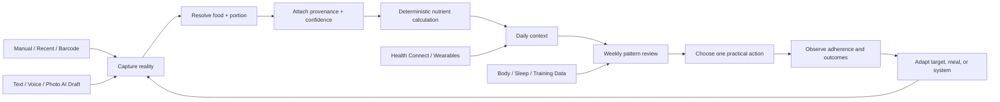
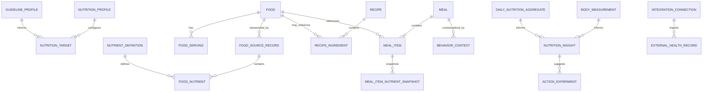
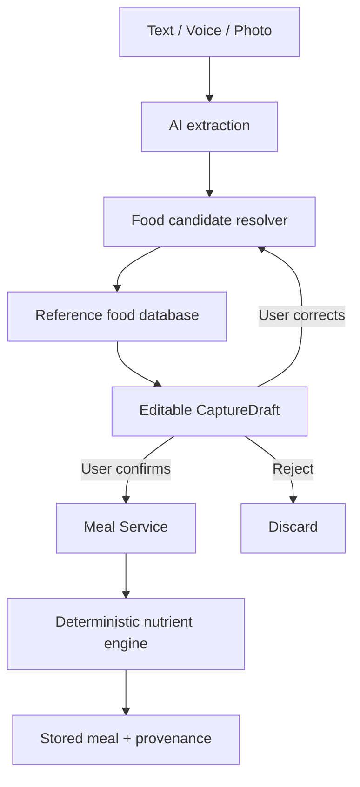

# LifeOS Health & Nutrition — Deep Research and Product Requirements

## Executive Summary

**Research position as of August 12, 2026:** LifeOS should **not** begin by building a larger calorie tracker. It should build a **low-friction, evidence-aware nutrition decision system** whose first job is to answer four questions:

1. **What did I actually eat, with what level of confidence?**
2. **Across days and weeks, what nutritional patterns are consistently good or weak?**
3. **What is the smallest practical change worth making next?**
4. **Does that change appear to improve body, training, recovery, energy, or adherence over time?**

That direction follows LifeOS's canonical loop—**Observe → Understand → Plan → Act → Track → Review → Adapt**—and its requirement that data collection exist to improve decisions rather than to create disconnected dashboards. LifeOS is personal-only; Android is primarily for capture/execution, Web for analysis/configuration, and AI should operate through explicit domain tools rather than directly manipulating the database. fileciteturn0file0 The Health & Nutrition research brief also explicitly requires research-first development, attention to real-world adherence, strong medical-safety boundaries, and rejection of features that add complexity without proportional value. fileciteturn0file1

The scientific basis for the product should be deliberately conservative. WHO's January 2026 healthy-diet guidance emphasizes adequacy, balance, moderation and diversity, with minimally processed foods forming the foundation; for people older than 10 it recommends at least 400 g/day of fruit and vegetables and at least 25 g/day of naturally occurring dietary fiber, while limiting free sugars, saturated fat, trans fat and sodium. citeturn0search1turn0search13 National guidance differs in implementation, which argues for **versioned guideline profiles**, not one universal LifeOS diet. The current U.S. Dietary Guidelines are the 2025–2030 edition, while India's ICMR-NIN publishes its 2024 Dietary Guidelines for Indians and 2020 RDA/EAR reference framework. citeturn0search15turn21search0turn21search10

Self-monitoring can help, but the effect is generally modest and engagement falls over time. Meta-analyses find improvements in weight and some dietary outcomes from digital self-monitoring, yet sustained adherence is a recurring limitation; one analysis found fewer than half of participants still tracking after approximately week 10. Feedback, goal-setting, self-regulation and personalization are useful behavioral components, but adding more app features by itself does not reliably produce better outcomes. citeturn1search0turn1search6turn1search9turn1search12turn18search1 **Therefore LifeOS should optimize “useful information per second of logging,” not completeness.**

Food records are inherently uncertain. A validation meta-analysis found dietary apps underestimated energy intake by about 202 kcal/day on average against reference methods, with substantial between-study heterogeneity. citeturn19search0turn19search4 AI does not remove this uncertainty: image-based food recognition can identify food reasonably well in favorable conditions, but mixed dishes and portion estimation remain difficult, with large error ranges across studies. citeturn19search10turn3search1turn3search8 LifeOS should consequently make **provenance, data quality and confidence first-class concepts**. An AI photograph or spoken description should create an editable *draft*, never masquerade as a measured meal.

Continuous glucose monitoring should **not** be an MVP feature for healthy users. A 2026 systematic review found context-dependent benefits, with useful glycemic effects in prediabetes but no appreciable glycemic improvement in healthy normoglycemic populations; evidence for durable behavior or weight effects remains limited. citeturn2search10turn2search2 CGM can become a future opt-in integration for people already using one, especially where clinician-guided metabolic care is involved, but LifeOS should not create a glucose-maximization or “flatten every spike” ideology.

The best competitive patterns are split across products. Cronometer demonstrates deep nutrient tracking; MacroFactor demonstrates adaptive, completeness-aware nutrition logic; MyFitnessPal and Lose It! emphasize capture convenience; Oura increasingly uses low-burden meal-quality and timing context; WHOOP demonstrates longitudinal N-of-1 behavior analysis; Samsung Health and Google Health show the value of a broad health-data aggregation layer. citeturn4search0turn5search0turn4search10turn7search3turn8search4turn11search5turn8search3turn10search9 LifeOS's differentiation should be **the combination**, but without copying the feature volume of any one competitor.

### Product decision

The recommended product hierarchy is:

| Priority | LifeOS should become | LifeOS should not become |
|---|---|---|
| First | Fast, trustworthy meal record + meaningful weekly nutrition review | A giant food-entry database UI |
| First | Pattern- and consistency-oriented | A daily perfection/streak game |
| First | Transparent about missing/estimated data | A source of false nutritional precision |
| First | Configurable to the user's actual goal | A universal prescriptive diet |
| Next | A bridge between nutrition, body trend, training, sleep and behavior | Another isolated nutrition dashboard |
| Next | AI-assisted capture and explanation | AI-calculated nutrition without deterministic verification |
| Later | Personal N-of-1 hypothesis testing | Automatic causal claims from correlations |
| Later | Optional sensor/Health Connect ecosystem | A reason to buy more sensors |
| Never | Wellness tracking that knows when to defer to professionals | Diagnosis, treatment or medication/supplement prescribing |

The **MVP should stop at reliable food/meal capture, deterministic nutrition calculation, configurable targets, repeated-meal shortcuts and weekly trend review**. Barcode logging, body-weight tracking and minimal Health Connect support are reasonable late-MVP/early expansion capabilities. AI natural-language logging should follow once the underlying deterministic food model is trustworthy. Photo estimation, supplements, meal planning, CGM, clinical records and sophisticated cross-domain prediction should come later.

A high-level LifeOS nutrition loop should be:



This is much closer to the LifeOS philosophy than “log calories → see progress ring.” fileciteturn0file0


## Human Problems, Users, and Product Principles

**The fundamental human problem is not lack of nutrition information.** Nutrition information is abundant. The recurring product problems are deciding what matters, translating an imperfect meal into usable data, sustaining the capture habit, separating signal from day-to-day noise, and connecting observations to actions that remain realistic in the user's environment. Lifestyle-intervention research repeatedly identifies time, overwhelm, social/environmental circumstances, self-regulatory skills, personalization and meaningful goals as adherence determinants. citeturn18search2turn18search9

### Problems LifeOS should solve

| Human problem | Present failure mode | LifeOS product response |
|---|---|---|
| “I do not know what my normal diet actually looks like.” | Memory and occasional “healthy/unhealthy” impressions are unreliable. | Make capture quick enough to establish a representative baseline before optimizing anything. |
| “Logging takes too much effort.” | Search → choose food → choose serving → adjust amount, repeated multiple times per meal. Engagement commonly decays over time. citeturn1search12turn1search9 | Prioritize recent foods, repeated meals, templates, copy-from-yesterday and one-tap portion adjustments before exotic AI. |
| “I don't know whether this entry is accurate.” | Database entries, restaurant meals and visual portions appear equally precise. Dietary-record apps show material measurement error. citeturn19search0turn19search1 | Show source and uncertainty: measured/reference, label, user-entered, estimated, AI-estimated. |
| “The app shows dozens of numbers but I don't know what to change.” | Dashboards substitute information for decisions. | Rank only persistent, actionable patterns and propose one or two changes. |
| “I miss a day and the week feels ruined.” | Streaks and rigid targets encourage all-or-nothing thinking. | Treat missing data as missing—not as zero, failure, or automatic non-adherence. |
| “My actual meals repeat.” | Traditional logging repeatedly asks for the same work. | Learn repetition aggressively; the fastest path should be “eat this again.” |
| “My plan doesn't survive busy days, restaurants or travel.” | Nutrition targets exist independently of convenience and environment. | Record optional context and identify when the *system* fails rather than blaming motivation. |
| “I care about health, muscle, performance or weight—not nutrients for their own sake.” | Nutrient numbers are disconnected from outcomes. | Connect nutrition to body trend, training, recovery and subjective energy when evidence/data support it. |
| “I need to know whether I am improving over time.” | Daily red/green scoring overreacts to noise. | Make the primary analytical unit the week and rolling trend. |
| “I may have a health condition.” | Consumer apps can blur wellness and treatment. | Explicitly defer medical nutrition therapy, diagnosis and treatment decisions to appropriate professionals. |

### Personas should be treated as usage modes

Because LifeOS is **personal-only**, conventional market personas would create false precision. The owner's age, sex, medical history, pregnancy status, dietary pattern, goals and current body-composition objective have not been specified. The product should therefore model **modes the same person may enter over time**, rather than pretend there are ten target customer segments. That is consistent with the personal-system definition in the canonical context. fileciteturn0file0

| Usage mode | Core job to be done | Required capability | What should remain optional |
|---|---|---|---|
| **Health maintainer** | “Help me notice whether my normal eating pattern is broadly healthy without making food a full-time project.” | Low-burden meals, fiber/fruit-vegetable/diet-quality patterns, weekly review | Calories, detailed macros |
| **Body-composition goal** | “Help me understand whether intake is consistent with gaining, losing or maintaining weight.” | Energy target, protein, weight trend, completeness awareness | Micronutrient deep dives |
| **Strength/performance mode** | “Help me consistently eat enough protein and fuel training.” | Protein target, meal distribution/context, eventual training link | Generic weight-loss coaching |
| **Dietary-constraint mode** | “Help me eat well within vegetarian/vegan, allergy, cultural, budget or other constraints.” | Preferences/exclusions, culturally appropriate foods, templates | One branded diet ideology |
| **Clinical-adjacent mode** | “Let me organize data I am already tracking for my clinician.” | Export, provenance, optional health-data integrations | LifeOS-generated diagnosis/treatment |

The final mode has a strict boundary: it is a **recording and organization mode**, not a clinical decision engine.

### Jobs to be done

The strongest jobs are temporal rather than feature-oriented:

**At a meal:** “Record enough about what I ate that future-me can use it, without interrupting the meal.”

**At the end of a day:** “Tell me whether anything requires attention; otherwise leave me alone.”

**While shopping or preparing food:** “Help me make the next few meals easier to execute.”

**When progress stalls:** “Help me distinguish a plan problem, an adherence problem, missing data and normal variation.”

**During weekly review:** “Show me the few patterns worth acting on next week.”

**After several months:** “Show whether nutrition changes are associated with body, training, sleep, recovery or energy outcomes, and how confident that conclusion should be.”

### Product principles

**Low friction beats theoretical completeness.** Digital dietary self-monitoring has evidence of modest benefit, but adherence commonly decreases; higher complexity is therefore a product liability unless it changes a decision. citeturn1search5turn1search9turn1search12

**Patterns before precision.** WHO recommendations are fundamentally dietary-pattern recommendations, and digital dietary assessment contains significant measurement error. LifeOS should compute precisely from the data it has while remaining honest that the inputs themselves may be approximate. citeturn0search1turn19search0

**No universal “nutrition score.”** A single score collapses adequacy, moderation, personal goals and uncertainty into one apparently objective number. Oura's move toward coarse meal characteristics demonstrates one possible low-friction alternative, but even that should remain interpretable rather than become a moral grade. citeturn8search4

**Food-first; nutrients when useful.** The interface should prioritize meals and dietary patterns, while preserving deep nutrient data underneath. This is compatible with WHO's focus on varied minimally processed foods and current national dietary guidance. citeturn0search1turn21search0

**Targets are context, not commandments.** Nutrient reference values differ by age, sex and physiological state, and national reference frameworks distinguish concepts such as EAR, RDA/AI and upper limits. citeturn20search0turn21search0 A “100% target reached” interface can therefore be scientifically misleading when it implies a sharp personal threshold.

**The application must understand missing data.** MacroFactor's explicit handling of partial logging is an especially good competitor pattern: it does not blindly treat an incomplete day as a valid low-intake day for expenditure calculations. citeturn4search11turn5search12 LifeOS should generalize this concept across nutrition analytics.

**No shame architecture.** Research finds associations between diet/fitness tracking-app use and disordered-eating symptoms/body-image concerns, although much of that literature is cross-sectional and therefore cannot establish that apps cause the problems. citeturn18search4 This is enough to justify avoiding streak punishment, celebratory starvation, “bad food” language and increasingly restrictive automated targets.

**AI proposes; deterministic services calculate.** Image and language models are useful for reducing capture friction, but current image-based dietary assessment remains too uncertain for unsupervised nutritional truth. citeturn19search10turn3search1turn3search8 That also follows LifeOS's architectural principle that AI goes through explicit domain services/tools. fileciteturn0file0


## Scientific and Behavioral Evidence

### Evidence hierarchy for product decisions

| Evidence area | What the evidence supports | Confidence | Product implication |
|---|---|---:|---|
| Healthy dietary pattern | Variety, adequacy, minimally processed foods, fruit/vegetables, fiber, predominantly unsaturated fats, and limits on free sugar/sodium/trans fat are central current public-health recommendations. citeturn0search1turn0search11 | **Strong guideline consensus** | Encode guideline profiles and pattern-oriented review. |
| Fruit/vegetable + fiber | WHO recommends ≥400 g fruit/vegetables and ≥25 g naturally occurring fiber daily for people >10 years. citeturn0search1 | **Strong guideline consensus** | Fiber and plant-food consistency deserve early UI prominence. |
| Sodium | WHO recommends <2,000 mg sodium/day for adults; WHO's 2026 sodium update estimates global adult mean intake well above that level. citeturn0search13 | **Strong** | Track sodium when food data quality permits, but emphasize weekly pattern. |
| Micronutrient targets | Requirements vary by life stage and nutrient; DRI frameworks contain RDAs/AIs/EARs and upper limits rather than a single universal daily number. citeturn20search0turn20search1 | **Strong framework** | Store guideline source, version, demographic applicability and target type. |
| Digital self-monitoring | Apps/self-monitoring can produce modest improvements in weight and diet outcomes. citeturn1search0turn1search6turn18search0 | **Moderate–strong** | Tracking is justified when it feeds decisions. |
| Tracking adherence | Engagement often falls substantially over time. citeturn1search9turn1search12 | **Strong product concern** | Optimize speed, repeated foods and graceful incompleteness. |
| Feedback/personalization | Personalized feedback, self-regulation and goal planning can improve adherence/outcomes, but effect sizes are generally modest and certainty varies. citeturn18search1turn18search3turn18search9 | **Moderate** | Weekly actionable feedback, not endless notifications. |
| Implementation intentions | 2026 meta-analysis of 12 comparisons found “if-then” plans increased fruit/vegetable intake by about 0.29 servings/day, although outcomes were self-reported. citeturn18search6turn18search11 | **Moderate** | Support plans such as “If lunch is from office cafeteria, add one vegetable side.” |
| Protein + resistance training | Meta-analysis found diminishing additional lean-mass benefit above roughly 1.62 g/kg/day protein during resistance training. citeturn12search6 | **Moderate–strong for trained adults** | Performance-mode protein targets can be configurable; do not force this target on everyone. |
| Protein during weight loss | 2024 systematic review found higher-protein diets were associated with better muscle preservation during weight loss; >1.3 g/kg/day was associated with more preservation in included studies. citeturn12search14 | **Moderate** | Relevant only when body-composition goals warrant it. |
| Ultra-processed diets | NIH inpatient crossover trial found participants ate ~508 kcal/day more and gained ~0.9 kg over two weeks on an ultra-processed diet despite matched presented macros and several nutrients; later controlled evidence also found higher intake during ultra-processed conditions. citeturn13search0turn13search4 | **Causal evidence, small controlled samples** | Diet quality matters beyond macro totals, but do not turn NOVA category into a moralized universal score. |
| Mediterranean-style pattern | Reanalyzed PREDIMED evidence supports cardiovascular benefit in high-risk adults, though the trial had important randomization irregularities that prompted retraction/republication. citeturn12search4turn12search1 | **Useful but contextual** | Do not hard-code one named diet as “the best diet.” |
| CGM in healthy users | 2026 review found little appreciable glycemic benefit for healthy normoglycemic users, with stronger rationale in prediabetes/diabetes contexts. citeturn2search10turn2search0 | **Emerging/context-specific** | Not MVP; future data import, not consumer glucose optimization. |
| AI meal imagery | Systematic reviews find wide error ranges and poorer performance for mixed/complex foods and portions. citeturn19search10turn3search1 | **Emerging** | Draft + confirmation only. |
| Food-log numerical accuracy | Validation literature shows meaningful under/over-estimation and between-app variability. citeturn19search0turn19search11 | **Strong warning against false precision** | Store confidence/provenance; display trends rather than implying laboratory measurement. |

### What current dietary science means for the product

LifeOS should separate **reference guidance** from **personal goals**.

A guideline profile could contain WHO recommendations plus a country-specific profile. For India-oriented use, ICMR-NIN's current public material includes the 2024 Dietary Guidelines for Indians and its 2020 RDA/EAR framework; NIN describes the 2024 guidelines as 17 recommendations emphasizing disease prevention and health promotion across life stages. citeturn21search0turn21search10 For U.S.-oriented use, the current federal guideline is 2025–2030. citeturn0search15 The architecture should therefore support:

`guideline = WHO-2026 + locale_profile + personal_goal_overrides`

—not:

`healthy_person = 2000 kcal + fixed macros + fixed vitamins`.

WHO's current healthy-diet guidance provides a useful global baseline: carbohydrates should primarily come from whole grains, vegetables, fruits and pulses; free sugars should stay below 10% of energy, ideally lower; saturated fat below 10%; trans fat below 1%; and sodium below 2 g/day for adults. citeturn0search1turn0search11 These values belong in **evidence metadata and target logic**, not as hard-coded frontend constants.

Micronutrients should be available but not dominate the daily mobile experience. Reference-intake frameworks vary by age, sex and life stage, and food-database completeness varies by source. citeturn20search0turn14search9 A seven-day or multiweek “frequently low / generally sufficient / insufficient data” interpretation is consequently more defensible as a product layer than turning every single micronutrient red on one imperfect day. This is a product inference from the reference-value framework and known dietary-record uncertainty. citeturn19search0turn20search0

### Behavioral design model

A sensible LifeOS behavior loop is:

**Observe:** Capture what happened with minimal friction.

**Understand:** Detect recurring patterns, not isolated misses.

**Plan:** Pick one practical change and anticipate the barrier.

**Act:** Make the next meal/environment easier.

**Review:** Compare intended and actual behavior.

**Adapt:** Change the meal system or target when reality repeatedly disagrees.

This directly operationalizes the canonical LifeOS loop. fileciteturn0file0

Research on lifestyle-intervention adherence finds that self-regulation, meaningful goals, social/environmental circumstances and intervention design all influence adherence. citeturn18search2turn18search9 The product should therefore capture **failure context selectively**, for example:

> “Planned protein-rich dinner but ordered takeaway because meeting ended at 9:15 PM.”

The system can later infer that the intervention should be **a backup meal**, not another motivational reminder.

Implementation-intention evidence supports very small “if–then” plans. The 2026 meta-analysis found approximately 0.29 additional fruit/vegetable servings/day in intervention groups, while appropriately noting reliance on self-reported outcomes. citeturn18search6turn18search11 LifeOS could operationalize this as:

> **Situation:** Office lunch  
> **Plan:** If lunch lacks vegetables, add salad/vegetable side.  
> **Review:** Did this happen on eligible days?

This is far more LifeOS-like than awarding an “8-day vegetable streak.”

### Explicit evidence limits

LifeOS should label these as **hypotheses, not facts** unless evidence becomes stronger:

“Eating at 8 PM is bad for you.”

“This glucose spike is unhealthy.”

“This food caused poor sleep.”

“You perform better on 220 g carbohydrate.”

“This supplement improves your recovery.”

“Your micronutrient deficiency is X.”

The system may eventually say:

> “On the 14 sufficiently logged training days in this period, higher pre-training carbohydrate intake was associated with higher session volume. This is an observational personal pattern and may be confounded by training type, sleep or total intake.”

That language is intentionally less exciting and substantially more scientifically responsible.


## Competitive Landscape, Data Sources, and Integrations

### Competitor comparison

The table distinguishes **what competitors currently expose** from **what LifeOS should copy**. Monetization categories are more strategically useful here than rapidly changing exact prices.

| Product | Features / inputs | Personalization | Integrations | Monetization | Privacy signal from reviewed sources | LifeOS lesson |
|---|---|---|---|---|---|---|
| **MyFitnessPal** | Large food-logging workflow; barcode, Meal Scan/photo capabilities and voice logging; barcode has been Premium-gated. citeturn4search10turn4search13 | Calorie/macro goals and goal-oriented tracking. citeturn4search10 | Advertises 40+ compatible apps/devices, including Health Connect, Samsung and Garmin. citeturn4search10 | Freemium + Premium | Privacy was not a differentiating claim in the feature material reviewed; a dedicated legal-policy audit would be required before copying any data practice. | Capture breadth is valuable; do **not** make a basic high-frequency capture mechanism unnecessarily painful. |
| **Cronometer** | Calories plus up to ~95 nutrients/compounds; barcode, recipes/custom meals, and photo/voice/text-assisted logging across mobile/web. citeturn4search0turn4search9 | Detailed nutrient targets and analysis. | Health Connect, Garmin, Fitbit, Oura, WHOOP, Withings and others. citeturn4search2 | Free + paid Gold tier | States it does not sell personal data and supports export/deletion; publishes privacy/security commitments. citeturn4search1 | Best benchmark for nutrient depth and provenance; LifeOS should hide that complexity until needed. |
| **MacroFactor** | Food database, barcode, label/recipe import, voice and AI-assisted photo/description capture; strong expenditure/weight-trend logic. citeturn5search0 | Dynamically adjusts energy/macros from observed intake/weight; explicitly handles partial logging. citeturn4search11turn5search12 | Health Connect, Apple Health and Fitbit with source-priority logic. citeturn5search10 | Subscription; trial | Positions itself as ad-free/privacy-first. citeturn5search0 | **Most important logic benchmark:** completeness-aware analytics and adaptive targets. |
| **Lose It!** | Calorie/weight tracking with voice, photo/Snap It, barcode and broader health metrics in paid tiers. citeturn7search3 | Weight-loss plans and meal/macro goals. | Apple Health; Google Fit was retired in favor of Health Connect pathways. citeturn7search14turn7search1 | Freemium + Premium | Apple privacy disclosures indicate multiple categories linked to the user and some tracking-related data practices. citeturn7search12 | Good capture ergonomics; avoid ad-tech incentives around sensitive health behavior. |
| **Lifesum** | Photo, voice, typed, barcode and quick tracking; meal plans, recipes and diet-oriented features. citeturn8search16turn8search17 | Diet plans, macro guidance and Life/weekly scoring. | Apple Health, Samsung Health, Fitbit, Withings, Wear OS and others. citeturn8search17 | Freemium + subscription | No strong privacy differentiator was established from the product sources reviewed. | Multimodal capture is useful; avoid collapsing health into opaque scores. |
| **Samsung Health** | Food/macro/micronutrient tracking alongside activity, sleep, body composition and health records. citeturn8search3 | Cross-domain weekly summaries and device-driven context. | Galaxy ecosystem, partner SDK/data interfaces. citeturn22search5 | Primarily ecosystem/hardware-supported | Health-data access is consent-based; Samsung documents permission controls and Knox/encryption protections. citeturn22search0turn22search5 | Good model for a health hub; LifeOS should be more decision-oriented and less ecosystem-bound. |
| **Google Health** | In 2026 Google's Fitbit experience transitioned into Google Health; current product material includes food/water logging and macro ranges plus a Gemini-based health coach. citeturn10search9turn10search2 | Personalized health coaching and plans. | Health Connect, Apple Health and a broad app/device ecosystem. citeturn10search9 | Free ecosystem + Premium capabilities | Google states Fitbit health/wellness data is not used for Google Ads in the current transition messaging. citeturn10search9 | Strong aggregation benchmark; LifeOS can add deeper personal decision history and transparent reasoning. |
| **Oura** | AI-assisted meal photo/upload/text logging emphasizes meal timing and coarse characteristics such as protein, fiber, processing and added sugar rather than requiring exhaustive calories. citeturn8search4 | Advisor combines meal and physiological context; 2026 Metabolic Health features expanded glucose/lab/body context. citeturn8search0turn8search6 | Ring physiology; Stelo glucose in supported U.S. flows; health-record capabilities. citeturn8search6turn22search4 | Hardware + membership | Supports app lock, account/data deletion and privacy controls; publishes encryption/security information. citeturn22search1turn22search18 | Valuable evidence that **coarse, low-burden meal context** can coexist with deep physiology. |
| **WHOOP** | Journal lets users record hundreds of behaviors and estimate associations with Recovery; supports body-composition trends. citeturn11search5turn11search7 | N-of-1 behavior/recovery analysis. | WHOOP wearable; developer API exposes activity, sleep and recovery data, with some medical-grade data excluded. citeturn11search9 | Hardware/membership | Privacy details require separate policy review for an implementation decision. | Best conceptual benchmark for longitudinal personal experiments—but its own documentation warns that confounders make self-experiment interpretation difficult. citeturn11search5 |
| **Garmin Connect** | Broad activity, stress, sleep and physiological analytics; Body Battery combines multiple signals. citeturn9search5 | Device- and training-context analytics. | Garmin wearable ecosystem | Hardware-led ecosystem | Garmin documents private-by-default activity handling and user data-management controls. citeturn9search10 | Treat Garmin as a physiological source; do not duplicate mature wearable sensing. |

### Competitive conclusions

**Cronometer's nutrient depth is worth copying in the data layer, not in the default mobile UI.** It proves that storing extensive micronutrient information is feasible, while LifeOS can keep the everyday interface focused on a handful of relevant signals. citeturn4search0turn4search9

**MacroFactor has the best conceptual handling of incomplete data.** Its system requires sufficient logging for expenditure updates and explicitly detects/excludes partial logs. citeturn4search11turn5search12 LifeOS should make `data_coverage` and `day_completeness` first-class analytical fields rather than assume every recorded day represents the whole day.

**Oura's meal approach challenges the assumption that calorie precision is always the best UX.** Its current food feature can infer broad meal characteristics from photos/text and connect them to timing and physiology. citeturn8search4 LifeOS should eventually support both **precision mode** and **light mode**, rather than force every use case through weighed-food entry.

**WHOOP illustrates both the power and danger of personal correlations.** WHOOP recommends repeated yes/no observations and explicitly warns users to limit confounding when interpreting behavior–Recovery relationships. citeturn11search5turn11search6 LifeOS should eventually build a more rigorous version with sample-size thresholds, missing-data checks, covariate awareness and causal-language guardrails.

**LifeOS should intentionally reject social/community mechanics.** They do not contribute to the current personal-only operating-system goal and would add privacy, moderation, comparison and product-scope costs with little leverage for the owner's core workflow. This follows the canonical personal-only scope rather than a scientific claim. fileciteturn0file0

### Food data strategy

The biggest hidden engineering dependency is not AI—it is **food reference data**.

USDA FoodData Central is an excellent foundational source. It exposes search/details APIs and downloadable datasets; current sources include Foundation Foods, FNDDS, Branded Foods and legacy data. USDA states FoodData Central data are public-domain/CC0, and branded data are updated monthly through the API. citeturn14search4turn14search6turn14search7 Different FDC data types have different provenance—analytical USDA data, survey-oriented compiled foods and manufacturer-supplied branded labels—so LifeOS should preserve that source distinction rather than flatten everything into equivalent “foods.” citeturn14search9

For Indian foods, ICMR-NIN's Indian Food Composition Tables are strategically important: NIN describes IFCT 2017 as covering 528 key foods and roughly 151–160 food constituents. citeturn14search11turn21search0 **But do not scrape or ingest IFCT into LifeOS until reuse/licensing permission has been verified.** NIN's site explicitly publishes restrictions against unauthorized reproduction/scraping, so availability on a website should not be interpreted as an open data license. citeturn21search5 This is an open legal/data-acquisition task.

Recommended abstraction:

```text
FoodCatalog
    ├── USDA FoodData Central
    ├── Licensed/local Indian composition source
    ├── Optional branded/barcode provider
    ├── User custom foods
    └── AI candidate mappings
```

The product should never expose provider IDs as the user-facing mental model. Search ranking should combine canonical name, regional aliases, brand, recent usage and the user's personal history.

### Manual, sensor, and integration hierarchy

| Source | Recommended timing | Reliability / product treatment |
|---|---|---|
| **Recent food / meal tap** | MVP | Highest-value input because it is fast and user-confirmed. |
| **Food search + serving** | MVP | Core deterministic path. |
| **Custom food / label entry** | MVP | User-confirmed; record provenance and label date. |
| **Barcode** | Late MVP | Barcode identifies a candidate product; nutrition still depends on catalog quality. |
| **Recipe / meal template** | MVP or immediately after | Critical for repeated real-world eating. |
| **Natural-language text** | Early expansion | AI creates candidate structured items; user confirms. |
| **Voice** | Early expansion | Speech → same natural-language draft pipeline. |
| **Food photo** | 6–12 months | Useful capture aid, but portion/calorie estimates must expose uncertainty because current research shows large variability. citeturn19search10turn3search1 |
| **Weight scale / manual body weight** | Early expansion | Useful for longitudinal goal feedback. |
| **Android Health Connect** | Early expansion | Preferred Android aggregation layer rather than bespoke integration with every wearable. Health Connect supports nutrition, hydration, weight, sleep, steps, exercise and many other records. citeturn16search0turn16search10 |
| **Wearable HR/sleep/activity** | 6–12 months | Import context; do not let availability automatically make a metric important. |
| **CGM** | Later / clinical-adjacent | Opt-in import only initially; no universal “glucose score.” Evidence in healthy normoglycemic users remains limited. citeturn2search10 |
| **Clinical records/labs** | Two-year horizon | Separate high-sensitivity domain with much stronger safety/compliance requirements. |

Health Connect is particularly well aligned with LifeOS Android. The current API includes `NutritionRecord` with energy, protein, carbohydrate, fats, fiber and many micronutrients, and provides aggregated nutrient totals; it also contains records for weight, sleep, hydration, glucose and other physiological data. citeturn16search0turn16search1turn16search9 Google explicitly advises requesting only permissions actually needed and providing users control over access/synchronization. citeturn14search0turn14search10

**MVP integration rule:** request no health permission until a user enables a feature that genuinely needs it.


## Product Requirements, UX, Safety, and MVP

### Recommended information architecture

Do not launch with a giant navigation tree containing empty “Training,” “Recovery,” “Supplements” and “Medical” sections. The long-term conceptual Health domain can contain them, but navigation should expose capabilities only when they provide value.

```text
Health
├── Today
│   ├── Nutrition status
│   ├── Body / recovery context when available
│   └── Quick actions
│
├── Nutrition
│   ├── Today
│   ├── Log
│   ├── Meals & Recipes
│   ├── Foods
│   ├── Targets
│   └── Trends
│
├── Body
│   ├── Weight
│   └── Measurements              [expansion]
│
├── Review
│   └── Weekly Health Review
│
└── Connections & Settings
    ├── Health Connect
    ├── Food data sources
    ├── Privacy / Export / Delete
    └── Guidance profile
```

Training and Recovery should become real sibling capabilities later, after they have their own researched workflows. Supplements should remain separate from ordinary food because supplement dosing and drug interactions create materially higher safety risk. This is consistent with the master research brief's instruction not to assume every possible Health feature belongs in the first module. fileciteturn0file1

### Android strategy

Android should answer **“what do I need right now?”**

The primary mobile screen should not be a nutrient spreadsheet.

**Wireframe — Android Health / Today**

```text
┌─────────────────────────────────────┐
│ Health                    Wed, Aug 12│
│                                     │
│ Nutrition today                     │
│ Logging coverage: likely complete   │
│                                     │
│ Energy       ~ 1,720 / 2,100        │
│ Protein         108 / 130 g         │
│ Fiber            18 / 28 g          │
│                                     │
│ Breakfast  ✓                        │
│  oats, milk, banana                 │
│ Lunch      ✓                        │
│  rice, dal, paneer...               │
│ Dinner     + Log                    │
│                                     │
│ [Recent] [Search] [Barcode] [Speak] │
│                                     │
│ Worth noticing                      │
│ Fiber has been below your target    │
│ on 4 of 5 sufficiently logged days. │
│ [See options] [Not useful]          │
└─────────────────────────────────────┘
```

The UI distinguishes **logging coverage** from **nutritional adherence**. That distinction is important because incomplete food records otherwise produce confidently wrong conclusions, a problem reflected both in dietary-record validation research and in MacroFactor's completeness-aware design. citeturn19search0turn4search11

“Energy remaining” should be suppressible. In a general-health or tracking-sensitive mode, the card might instead show:

```text
Protein   on track
Fiber     worth attention
Plant foods   3 groups today
```

### Fast meal logging

The most important UX flow is not AI chat. It is the ordinary repeated meal.

```text
Tap + Log meal
      │
      ├── Eat recent meal again  ──> Confirm ──> Done
      │
      ├── Search food            ──> Portion ──> Done
      │
      ├── Scan barcode           ──> Product ──> Portion ──> Done
      │
      ├── Use meal/recipe        ──> Adjust   ──> Done
      │
      └── Speak / type           ──> AI draft ──> Confirm ──> Done
```

A repeated breakfast should require only approximately two taps. That is a **product acceptance target**, not a scientific benchmark.

**Wireframe — AI meal draft**

```text
You said:
"2 rotis, one bowl dal, paneer sabzi and curd"

LifeOS found:
✓ Roti, whole wheat        2 pieces
? Dal, cooked              1 bowl (~180 g)
? Paneer vegetable curry   1 cup (~190 g)
? Curd, plain              1 small bowl (~120 g)

Estimated from description
Confidence: Medium

[Adjust portions]       [Confirm meal]
```

The AI should not directly generate a final calorie number. It should map language to food candidates and estimated portions; the normal nutrition engine then computes nutrients from the selected reference records. AI-image evidence does not support treating model-derived portions as exact measurements. citeturn19search10turn3search8

### Web strategy

Web should answer **“what is happening over time, and what should I change?”**

**Wireframe — weekly Nutrition Review**

```text
Week of Aug 3–9
────────────────────────────────────────────────────

Data coverage
6 / 7 days sufficiently logged
1 partial day excluded from averages

Pattern                         Status
Protein                         Consistent
Fiber                           Often low
Fruit + vegetables              Improving
Sodium                          Insufficient source data
Energy                          Near configured range

What changed?
• Average fiber ↑ versus prior 4 weeks
• Restaurant meals: 3
• Weight trend: broadly stable

Possible action
"Add one repeatable high-fiber food to weekday lunch."
Reason: Lunch contributed the largest persistent fiber gap.

[Use as next-week experiment] [Ignore] [Explain]

Associations
No cross-domain insight yet:
only 8 sufficiently logged paired nutrition/training days.
```

This keeps the system from producing impressive-looking correlations from tiny samples.

### MVP requirements

| Capability | MVP status | User decision enabled | Key acceptance requirement |
|---|---:|---|---|
| Nutrition onboarding | **Must** | What am I tracking and why? | Goal, units, dietary preferences, guideline profile, calorie-visibility mode and safety flags configurable. |
| Food catalog/search | **Must** | What food did I eat? | High-quality canonical source; source/provenance visible on detail screen. |
| Serving normalization | **Must** | How much did I eat? | Grams + common household/custom units; raw/cooked state where relevant. |
| Manual meal logging | **Must** | What happened today? | Breakfast/lunch/dinner/snack/custom meal; offline-capable Android draft. |
| Recent/favorite foods | **Must** | Can I log repeated behavior quickly? | Personalized recency ranking. |
| Meal templates / copy meal | **Must** | Can I reuse my normal meals? | One-tap copy followed by optional adjustment. |
| Deterministic nutrient engine | **Must** | What does the meal/day contain? | Energy, protein, carbohydrates, fat, fiber plus stored available nutrients; no LLM calculations. |
| Configurable targets | **Must** | What am I comparing against? | Every target stores origin: guideline, calculated, manually set or professional plan. |
| Day summary | **Must** | Is anything important today? | Focused primary metrics; user-selectable detail. |
| Logging completeness | **Must** | Can the day be trusted analytically? | Complete / partial / uncertain / intentionally untracked; never infer zero intake from absence. |
| Weekly review | **Must** | What should I change next week? | Uses sufficiently logged days; one or two priority observations, not dozens. |
| Custom foods | **Must** | Can I handle missing/local foods? | User-entered values clearly distinguished from reference data. |
| Barcode | **Should / late MVP** | Can packaged foods be logged faster? | Candidate match still requires confirmation. |
| Body weight | **Should / early expansion** | Is intake aligned with body goal? | Manual entry first; trend visualization later. |
| Health Connect | **Should / early expansion** | Can existing measurements be reused? | Minimal permission request; source-aware deduplication. |
| Natural-language meal draft | **Should / beta** | Can complex meals be captured faster? | Always editable; confidence displayed. |
| Photo recognition | **Not MVP** | — | Requires independent personal-food benchmark before release. |
| Meal planning/grocery generation | **Not MVP** | — | Build only after logging reveals actual planning pain. |
| Supplement recommendations | **Not MVP** | — | Safety/interaction research required first. |
| CGM analytics | **Not MVP** | — | Evidence and medical-boundary concerns. |
| Workout programming | **Separate PRD** | — | Different human workflow/domain expertise. |
| Social/community | **Out** | — | Conflicts with personal-only scope. |
| Streaks/global “health score” | **Out** | — | Poor fit with nuanced, non-shaming behavior design. |

### Safety architecture

LifeOS should present itself as a **wellness tracking and decision-support system**, not a diagnosis or treatment system. Consumer wellness tools commonly use such boundaries; Samsung Health, for example, explicitly states that it is intended for fitness/wellness rather than disease diagnosis, treatment or prevention. citeturn22search2

Safety requirements should be built into target-setting and AI responses.

| Situation | LifeOS behavior |
|---|---|
| User asks “Do I have iron deficiency?” | Explain that intake logs cannot diagnose deficiency; show recorded intake/data quality; recommend appropriate clinical evaluation where warranted. |
| User reports pregnancy | Disable generic weight-loss recommendations; require pregnancy-specific professional/guideline configuration before target automation. |
| User is a minor | MVP should not generate calorie-deficit or weight-manipulation guidance. |
| User has known kidney, liver, metabolic or other relevant disease | Treat generic nutrient targets as potentially inappropriate; encourage clinician-configured targets. |
| User asks AI to prescribe supplement dosage | Do not prescribe; surface recorded information and recommend appropriate clinician/pharmacist input. |
| User repeatedly configures extreme restriction | Refuse automatic escalation; provide neutral safety messaging and encourage qualified support. |
| User enables tracking-sensitive mode | Hide calorie “remaining,” streaks, weight-loss projections and unnecessary body-comparison cues. |
| User has an eating-disorder history | LifeOS should not claim to treat it; allow reduced-metric tracking or disabling nutrition tracking entirely. |

The eating-disorder safeguard is justified even though causal evidence is incomplete: a 2024 systematic review found associations between diet/fitness app use, body-image concerns and disordered-eating symptoms, while emphasizing the need for stronger longitudinal research. citeturn18search4

### Privacy and compliance requirements

Health information should be treated as **high-sensitivity data regardless of whether a particular jurisdiction legally classifies this exact deployment as a regulated health product**.

For EU applicability, GDPR Article 9 explicitly treats data concerning health as a special category of personal data subject to heightened processing restrictions and specified lawful exceptions. citeturn16search6

For India, the Digital Personal Data Protection Act 2023 is now accompanied by the finalized Digital Personal Data Protection Rules 2025 and an official government enforcement timeline. Exact obligations should be checked against LifeOS's eventual deployment model rather than assuming every provision applies identically to a purely personal project. citeturn15search14turn17search0

For the United States, **HIPAA should not be used as a generic synonym for “health privacy.”** HHS explains that consumer-app information is generally outside HIPAA when the app is not acting for a HIPAA covered entity or business associate. citeturn15search4turn15search6 Conversely, the FTC's amended Health Breach Notification Rule explicitly reaches many health apps and connected technologies outside HIPAA, including personal health records technically capable of drawing identifiable health information from multiple sources. citeturn15search0turn15search7

LifeOS should therefore adopt stricter requirements than “whatever minimum law applies”:

- **No selling health/nutrition data and no behavioral advertising based on it.** FTC enforcement against GoodRx demonstrates the sensitivity and regulatory risk of disclosing identifiable health information to advertising platforms. citeturn15search2
- **Purpose limitation:** nutrition data exists for LifeOS functionality, not unrelated profiling.
- **Data minimization:** do not request blood glucose, sleep, heart rate or any other Health Connect permission just because the API exposes it. Google explicitly recommends requesting only the data types used by the app. citeturn14search0turn14search10
- **Explicit integration controls:** disconnect, pause sync, revoke permission and delete imported records.
- **Encryption in transit and at rest**, secure key management and encrypted mobile persistence for sensitive cached data.
- **Export and deletion:** full machine-readable user export, feature-level deletion where feasible, and complete account/data deletion.
- **Auditability:** every AI/domain write records actor, tool, timestamp and original request.
- **No sensitive health payloads in general analytics/logging.**
- **Photos off by default:** unless the user explicitly elects to retain a meal photo, process and delete it after extraction where technically feasible.
- **AI minimization:** send only context required for the immediate model operation; model-provider retention/training policy must be explicitly evaluated before health data is transmitted.
- **User-visible provenance:** external health records must retain source/device/application metadata.

These are product/security requirements; final legal applicability remains dependent on deployment geography, hosting model and any future clinical relationships.


## Data Model and Engineering Handoff

The data model should distinguish **reference truth, user-observed behavior, derived calculations and interpretations**. Mixing those categories is one of the fastest ways to create historical-data corruption and unexplained insights.

### Conceptual data model

| Entity | Purpose | Required fields | Source / sensitivity | Key constraints |
|---|---|---|---|---|
| **NutritionProfile** | Personal nutrition configuration | `user_id`, `goal_mode`, `dietary_pattern`, `locale`, `units`, `calorie_visibility`, `tracking_mode`, timestamps | User; sensitive | Do not infer medical state. |
| **GuidelineProfile** | Versioned reference guidance | `id`, `authority`, `region`, `version`, `effective_date`, `life_stage_rules`, `source_reference` | Reference | Immutable/versioned; e.g. WHO/ICMR/U.S. |
| **NutritionTarget** | Personal comparison target | `nutrient_id`, `min`, `max`, `target`, `unit`, `period`, `origin`, `guideline_profile_id`, `effective_from/to` | User/derived; sensitive | Historical versions retained. |
| **Food** | Canonical food identity | `id`, `canonical_name`, aliases, brand, food_type, preparation_state | Reference/user | Identity separate from nutrient snapshot. |
| **FoodSourceRecord** | Provider-specific representation | `food_id`, `provider`, `external_id`, `dataset_version`, `data_type`, `updated_at`, `quality_class` | Reference | Preserve USDA Foundation vs branded vs custom distinction. |
| **FoodServing** | Human-friendly quantity | `food_id`, `label`, `amount`, `unit`, `grams`, `is_default` | Reference/user | Conversion must be explicit; never invent unknown gram equivalents silently. |
| **NutrientDefinition** | Nutrient vocabulary | `id`, `name`, `canonical_unit`, `category`, optional guideline mapping | Reference | Stable IDs independent of provider naming. |
| **FoodNutrient** | Nutrient composition | `food_source_record_id`, `nutrient_id`, `value`, `unit`, `basis_amount`, `derivation` | Reference | Decimal precision; nullable ≠ zero. |
| **Recipe** | Reusable multi-food preparation | `id`, `name`, total yield, yield unit, servings, preparation notes | User; sensitive-ish | Recalculate deliberately when ingredients change; version recipes. |
| **RecipeIngredient** | Recipe composition | `recipe_version`, `food/recipe_id`, quantity, serving/grams | User | Prevent accidental recursive cycles. |
| **Meal** | Eating event | `id`, `user_id`, `meal_type`, `occurred_at`, timezone, `capture_method`, notes, `completeness_status` | User; sensitive | Actual event time separate from entry time. |
| **MealItem** | Food consumed within meal | `meal_id`, `food_id`, `source_version`, quantity, grams, confidence, raw/cooked state | User; sensitive | Preserve source + nutrient snapshot/version used at log time. |
| **MealItemNutrientSnapshot** | Historical calculation integrity | `meal_item_id`, nutrient, value, calculation_version | Derived; sensitive | Historical log should not silently change when provider data updates. |
| **DailyNutritionAggregate** | Fast day summary | date, totals, target comparison, `coverage_status`, calculation version | Derived | Cache/materialized result; never source of truth. |
| **BodyMeasurement** | Weight/body data | type, value, unit, measured_at, source, device | User/integration; highly sensitive | Source-aware deduplication. |
| **ExternalHealthRecord** | Health Connect/wearable reference | provider, external record ID, type, start/end, payload subset, source device, sync version | Integration; highly sensitive | Idempotent import/upsert. |
| **CaptureDraft** | Unconfirmed AI/barcode/voice result | raw modality reference, parsed candidates, confidence, model/version, expiration | Derived; sensitive | Not counted in nutrition until confirmed. |
| **BehaviorContext** | Optional explanation of adherence | date/event, context tags, free text, linked plan/action | User; sensitive | Optional; never force journaling for each meal. |
| **NutritionInsight** | Generated observation | period, evidence inputs, coverage, rule/model version, confidence, wording, status | Derived; sensitive | Store rationale and avoid retroactively rewriting historical advice. |
| **ActionExperiment** | LifeOS adaptation loop | hypothesis, action, trigger, start/end, outcome measure, status | User/derived | Observational experiments must not imply causality. |
| **IntegrationConnection** | Permission/config state | provider, scopes, status, sync cursor, last sync, token reference | Secret/security | Tokens encrypted; never log credentials. |

USDA FoodData Central's distinct source/data-type model is a strong reason to preserve provider provenance; Foundation Foods, FNDDS and branded records do not have identical origins or update characteristics. citeturn14search2turn14search9

### Entity relationship model



### Data semantics that are non-negotiable

**`null` must not equal zero.** A branded food with no potassium value in the source is “unknown potassium,” not “0 mg potassium.” Food datasets differ in nutrient coverage. citeturn14search9

**Historical nutrition should be reproducible.** FoodData Central branded records can update frequently, including monthly updates. citeturn14search2turn14search7 If LifeOS simply points historical meals at the latest mutable record, last year's reported intake can change without the user changing anything. Store an immutable source version or nutrient snapshot.

**Raw/cooked state matters.** It belongs in food identity/serving metadata rather than a note.

**Timezone belongs on event data.** Meals and sleep correlations become ambiguous during travel without experienced/local time; Health Connect likewise exposes zone-offset semantics for interval records. citeturn16search1

**Completeness belongs in the model.** A day can be `complete`, `partial`, `unknown`, `not_tracking`, or eventually `estimated`. Analytics should specify which states are admissible.

**Every imported value needs a source.** Health Connect and device ecosystems can contain overlapping copies. Source identity is required for deduplication and priority.

### Backend module boundaries

The existing LifeOS modular-monolith architecture is appropriate. Nutrition does **not** justify microservices. The canonical backend is Node.js/TypeScript/Express/PostgreSQL with Redis and RabbitMQ available, and its documented architecture puts business rules in services rather than controllers. fileciteturn0file0

Recommended modules:

```text
health/
├── nutrition/
│   ├── food-catalog
│   ├── meals
│   ├── nutrients
│   ├── targets
│   ├── reviews
│   └── capture
│
├── body/
│   └── measurements
│
├── integrations/
│   └── health-connect
│
└── safety/
    └── guidance-policy
```

**PostgreSQL** should remain authoritative for user data, food metadata and domain state. With one personal user's volume, a specialized time-series database is unnecessary.

**Redis** is appropriate for food-search result caching, recent-food rankings and expensive read models, but should never be authoritative.

**RabbitMQ** is appropriate for provider dataset imports, recalculation after recipe/source updates, external integration synchronization, async AI draft parsing and weekly insight generation.

**Object storage** should be introduced only if food images are retained; it should not be added just to support ephemeral AI input.

### API contract proposal

| Domain API | Purpose | Notes |
|---|---|---|
| `GET /foods/search?q=` | Search catalog | Locale/recent history influence ranking. |
| `GET /foods/:id` | Food + servings + nutrient metadata | Return source/quality/provenance. |
| `POST /foods/custom` | Create custom food | Validate units and required energy/macro fields according to mode. |
| `POST /meals` | Log meal | Idempotency key required for mobile/offline sync. |
| `PATCH /meals/:id` | Correct meal | Trigger aggregate recomputation. |
| `POST /meals/:id/items` | Add item | Accept food/source/quantity, not arbitrary computed totals. |
| `GET /nutrition/day/:date` | Day summary | Include coverage + provenance warnings. |
| `GET /nutrition/summary?from=&to=` | Trend/review | Expose admissible-day count. |
| `PUT /nutrition/targets/:nutrient` | Change target | Keep version history and target origin. |
| `POST /recipes` | Create recipe/template | Yield and serving semantics mandatory. |
| `POST /body/measurements` | Log weight etc. | Source + timestamp required. |
| `POST /nutrition/capture/parse` | Convert text/voice metadata into draft | AI result never logs directly. |
| `POST /nutrition/capture/:draftId/confirm` | Commit AI draft | User-confirmed domain write. |
| `GET /nutrition/review/weekly` | Generate/read weekly review | Deterministic facts separated from narrative. |
| `POST /integrations/health-connect/import` | Android-mediated health sync | Idempotent; explicit permitted record types. |
| `GET /data/export` | Personal export | Machine-readable, documented schema. |
| `DELETE /health-data/...` | User-directed deletion | Audited and confirmation-protected. |

### Android offline model

The canonical LifeOS direction correctly keeps the backend authoritative while allowing useful Android offline capture. fileciteturn0file0 Meal entry is an ideal offline capability.

```text
Android
  ↓
Local encrypted pending meal
  ↓ connectivity
Sync API + idempotency key
  ↓
Validation
  ↓
Nutrition Service
  ↓
PostgreSQL
  ↓
Aggregate recalculation
```

Conflict rules should be deterministic. A mobile retry must never duplicate an already-synced meal.

### Health Connect handoff

Android Health Connect currently exposes nutrition, hydration, weight, sleep, steps, heart rate, glucose and other record types. citeturn16search0turn16search3 However, the initial LifeOS permission request should be narrow.

Recommended first scopes:

```text
READ_WEIGHT
(optional later)
READ_STEPS
READ_SLEEP
```

Nutrition import/export should be added only after deciding whether LifeOS is the primary nutrition writer or merely one of several apps. Two-way writing without a source-priority/deduplication strategy can create loops and duplicates.

Google's Health Connect guidance says users must be able to grant/deny access and should have controls for managing synchronization and permissions. citeturn14search3turn14search10 LifeOS should mirror that state visibly under **Connections**.

### AI and machine-learning requirements

**MVP requires no custom machine-learning model.**

Deterministic software should perform:

```text
serving conversions
nutrient arithmetic
recipe aggregation
target comparison
rolling averages
coverage checks
data quality checks
trend calculations
rule-based safety
```

AI is justified for:

```text
natural-language → structured meal candidates
voice → text → structured meal candidates
photo → candidate foods/portions
summarizing already-computed weekly trends
explaining a guideline in plain language
turning a chosen action into an if-then plan
```

The LLM must not be the calculator.

AI capture pipeline:



Each draft should retain `model`, `model_version`, `candidate_confidence`, `portion_confidence` and whether the user changed the prediction. These become the evaluation dataset for deciding whether the AI actually saves effort.

Before photo logging graduates from experimental to normal capture, evaluate it against **the owner's actual meals**, especially Indian mixed dishes if those are relevant. Systematic evidence indicates image methods perform better on simple foods and retain substantial variability in portion/calorie estimates. citeturn19search10


## Success Metrics, Roadmap, Risks, and Open Questions

### Measurement philosophy

Because this is a **personal-only** system, standard startup metrics such as MAU growth, conversion rate or cohort retention are secondary or meaningless. The critical question is:

> **Does Health & Nutrition produce enough decision value to justify the effort and attention it consumes?**

That is exactly the LifeOS feature-qualification philosophy. fileciteturn0file0

The North Star should therefore be:

**Useful Review Rate**  
`weekly reviews rated useful or resulting in a deliberate action ÷ weekly reviews performed`

Supporting measures:

| Metric | Definition | Initial target | Why it matters |
|---|---|---:|---|
| **Recurring meal log time** | Median time from log action to committed familiar meal | **≤10 sec** | Direct measure of logging friction. |
| **New simple meal log time** | Search → portion → commit | **≤30 sec** | Core capture usability. |
| **Intentional logging coverage** | Days sufficiently captured / days user intended to track | **≥80%** | Better than punishing intentionally untracked days. |
| **Repeated-meal reuse** | Eligible repeated logs via recent/template | **≥40% initially** | Indicates the product is learning the user's routine. |
| **Food search success** | Test foods found in top five acceptable results | **≥90% on personal benchmark** | Catalog usability. |
| **Source-resolved rate** | Logged items with known composition source/version | **≥98%** | Trustworthiness. |
| **Unknown nutrient visibility** | Cases where missing nutrient data is falsely shown as zero | **0** | Data-integrity requirement. |
| **AI draft acceptance** | AI drafts confirmed with no/minor corrections | Measure first; no pretense of benchmark | Determines whether AI saves effort. |
| **AI time saved** | Median manual equivalent time minus AI flow | Must be positive before expansion | Prevents novelty-driven AI. |
| **Partial-day contamination** | Partial days included in “complete-day” trend analytics | **0** | Protects conclusions. |
| **Insight usefulness** | User rating or action accepted | **≥4/5 average** as a personal goal | Ensures analysis creates value. |
| **Action follow-through** | Chosen experiments with enough observations for review | Track trend, no gamified target | Tests whether insights change systems. |
| **Safety events** | Unsafe automated restrictive/medical recommendation | **0** | Release blocker. |
| **Unauthorized health access** | Any health record accessed outside granted purpose | **0** | Release/security blocker. |

The numeric UX thresholds above are **product hypotheses**, not published clinical benchmarks. They should be revised after personal use.

### Weekly engineering sequence

The baseline specifies that one week should deliver one meaningful, usable capability rather than attempt an entire domain at once. fileciteturn0file0 A practical sequence is:

| Week | Capability | Demonstrable outcome |
|---|---|---|
| **Food foundation** | Food provider abstraction + USDA ingestion/search | Search a curated personal benchmark and inspect trustworthy source metadata. |
| **Serving + custom foods** | Portions, units, raw/cooked distinctions, custom food | Log foods that are absent from reference data without corrupting source provenance. |
| **Meal logging** | Meal/meal-item domain + Android capture | Record a complete day from phone, including offline retry. |
| **Fast repetition** | Recents, favorites, copy meal, templates | Repeat normal breakfast/lunch in seconds. |
| **Nutrition engine** | Deterministic macro/fiber/all-available nutrient calculation | Day totals are reproducible and tested against reference examples. |
| **Targets + guidance profiles** | Versioned targets and configurable visibility | Compare intake with explicitly sourced/configured targets. |
| **Coverage-aware review** | Partial-day semantics + weekly analysis | Weekly averages exclude invalid days and explain why. |
| **Nutrition Web review** | Trends, persistent gaps, actionable review | End-to-end Observe → Review workflow becomes useful. |
| **Barcode + catalog quality** | Packaged-food lookup and mismatch correction | Faster packaged food capture with provenance. |
| **Body-weight capability** | Manual weight + trend | Nutrition can be reviewed alongside actual body trajectory. |
| **Health Connect** | Minimal permission/sync pipeline | Import weight and one or two genuinely useful contextual metrics. |
| **Natural-language capture beta** | Text/voice → editable draft | Measure whether AI materially reduces log time/error. |

The first **eight capabilities form the recommended product MVP**. Barcode/body/Health Connect/AI can enter immediately afterward without preventing core validation.

### Six-to-twelve-month roadmap

The next phase should be selected from observed pain, not built automatically. Current evidence and competitor patterns justify the following candidate order:

**Richer micronutrient analysis.** Store broad nutrients from day one, but only surface reliable recurring insufficiency patterns when source coverage is sufficient. Cronometer demonstrates demand for depth, while dietary-record validation literature warns against implying exactness. citeturn4search0turn19search0

**Recipe intelligence.** Versioned recipes, batch yield, portioning and frequently repeated meals are likely to create more practical value than generic AI meal plans.

**Android Health Connect context.** Import weight, steps, sleep and later training data through narrowly scoped permissions. Health Connect already supports these record classes and user-managed permissions. citeturn16search10turn14search10

**Goal-feedback engine.** Once sufficient complete food logs and body-weight measurements exist, explore an adaptive energy estimate. MacroFactor shows the product viability of this pattern and, importantly, explicitly requires sufficient nutrition logging rather than blindly adapting from incomplete records. citeturn5search0turn5search12 LifeOS should independently validate its method rather than clone proprietary logic.

**AI text and voice logging.** Natural-language capture is likely to be safer and more useful before photo-calorie estimation because users can easily correct identified foods/quantities.

**Photo-assisted logging.** Use the photo to identify candidates and ask targeted questions—“one or two rotis?”, “paneer or tofu?”, “approximately half or full bowl?”—instead of manufacturing a precise calorie answer. Current AI dietary-assessment evidence supports this human-in-the-loop approach. citeturn19search10turn3search1

**Meal planning, only if observed behavior demands it.** Plans should be generated from actual repeated foods, constraints, preparation capacity and identified nutrition gaps rather than generic seven-day “healthy plans.”

**Cost and grocery context.** This could become uniquely valuable to LifeOS because Money and Time are eventual cross-domain systems, but those integrations should wait until their domain models exist. The cross-domain direction itself is explicitly part of the canonical LifeOS vision. fileciteturn0file0

### Two-year direction

At two years, the product can become meaningfully different from current nutrition trackers:

```text
Nutrition
    │
    ├── meals / nutrients / timing
    │
    ├──────────┐
    ↓          ↓
Body          Training
weight        load / performance
    │          │
    └────┬─────┘
         ↓
      Recovery
sleep / HR / fatigue
         │
         ↓
   Personal patterns
         │
         ↓
Hypothesis + experiment
         │
         ↓
 Weekly adaptation
```

Examples:

> “Protein intake has been consistent for six weeks; it is probably not the main reason training progression stalled.”

> “On weeks with more pre-prepared lunches, nutrition logging is more complete and take-away meals are less frequent.”

> “Late meetings are strongly associated with skipped planned dinners. Keeping two backup meals appears to improve adherence.”

> “There is not enough paired data to determine whether sleep duration and appetite are related.”

The last example is as valuable as finding a relationship. LifeOS should be willing to say **“insufficient evidence.”**

Personal association analysis should use minimum sample/coverage thresholds, adjust for obvious confounders where possible, expose effect size rather than just “positive/negative,” and never label observational personal relationships as causal. WHOOP's own N-of-1 Journal guidance acknowledges the confounding problem; LifeOS can make this analytical layer substantially more rigorous. citeturn11search5turn11search6

CGM could enter this horizon as an optional signal for people who already have legitimate use for it. Current systematic evidence supports greater utility in prediabetes/diabetes contexts than in healthy normoglycemic populations. citeturn2search10turn2search0 It should never become a mandatory “premium health” sensor.

### Major risks and mitigations

| Risk | Why it matters | Mitigation |
|---|---|---|
| **Logging fatigue** | Digital self-monitoring engagement commonly decreases over time. citeturn1search9turn1search12 | Recents, repeat meals, templates, optional light mode, no streak punishment; measure seconds per log. |
| **False precision** | Dietary apps and image estimators have meaningful error. citeturn19search0turn19search10 | Provenance/confidence, estimated labels, ranges when appropriate, no silent AI estimates. |
| **Food database errors** | Data types vary in source and nutrient completeness. citeturn14search9 | Source ranking, immutable versions, user corrections without altering reference records. |
| **Indian/cultural food gaps** | USDA alone is insufficient for a globally/culturally complete catalog; ICMR-NIN has Indian composition data but reuse rights require verification. citeturn21search0turn21search5 | Provider abstraction; license a local source; custom foods/recipes meanwhile. |
| **Historical totals change after catalog updates** | Branded reference records are regularly updated. citeturn14search7 | Snapshot/version nutrients used at logging time. |
| **Incomplete logs create fake deficits** | Missing meals can look like low intake. | Explicit day-completeness states; exclude partial days from adaptive analytics. |
| **Obsessive/restrictive use** | Tracking apps are associated with disordered-eating/body-image concerns in observational evidence. citeturn18search4 | Tracking-sensitive mode, no shame/streaks, restriction guardrails, clinician referral boundary. |
| **AI hallucination** | Food/portion AI remains imperfect. citeturn3search1turn3search8 | Draft-only AI, food resolver, deterministic calculator, user confirmation. |
| **Correlation → causation** | Personal observational data contain confounding. citeturn11search5 | Sample thresholds, covariate/context checks, causal-language policy. |
| **Health data privacy** | Consumer health apps may fall under GDPR special-category rules or FTC health-app protections depending on deployment. citeturn16search6turn15search7 | Minimize collection, encrypt, no ads/sale, granular permissions, export/delete, audit. |
| **Integration duplication** | Health ecosystems may contain records replicated by multiple apps. | Preserve source/external IDs, idempotency, user-configurable source priority. |
| **Scope explosion** | “Health” can become nutrition + training + sleep + medical + supplements simultaneously. | Nutrition MVP first; separate research/PRDs for training, recovery, supplements and clinical records. |
| **Over-personalization from weak data** | Personalized nutrition evidence is promising but certainty is often low/very low. citeturn18search3 | Require sufficient observations and report confidence; default to established guidance. |
| **Sensor enthusiasm outruns utility** | CGM benefit is not established for generic healthy-user optimization. citeturn2search10 | Integrate only when a decision use case exists. |

### Open research questions before implementation locks

Several details are genuinely unspecified and should remain so rather than being invented:

**Primary personal objective.** It has not been specified whether the first owner workflow is general health, fat loss, weight gain, strength performance, maintenance or another goal. That choice affects which three metrics deserve the Android home screen.

**Calorie visibility.** Should calories be visible by default, or should LifeOS begin in a pattern-first mode and enable energy tracking when the goal requires it? This is a product preference that should be tested personally rather than assumed.

**Personal demographic/clinical context.** Age, sex, pregnancy/lactation status, conditions, medications, allergies and history of disordered eating are unspecified. LifeOS must not infer them.

**Indian food-data rights.** IFCT is highly relevant for India-oriented meals, but ingestion/reuse rights must be clarified with ICMR-NIN before engineering treats it as an application database. citeturn21search0turn21search5

**Personal-food benchmark.** Before choosing a commercial or AI catalog solution, create a representative test set of approximately 100–200 foods/meals actually eaten by the owner—including local brands and mixed dishes—and measure search success, nutrient coverage and logging time.

**Energy-target algorithm.** The MVP can support manual/guideline-informed configuration, but selecting an estimation equation and later adaptive-expenditure algorithm deserves a dedicated evidence/validation decision rather than an arbitrary formula embedded in code.

**Nutrient sufficiency semantics.** Determine which nutrients should have daily targets, ranges, weekly interpretation, upper limits and “insufficient data” handling. The underlying reference frameworks contain different concepts and should not be flattened. citeturn20search0

**Meal completeness inference.** Should LifeOS ever automatically infer that a day is complete from behavior/history, or always require explicit confirmation when using the day for adaptive calculations? The safer initial answer is explicit/heuristic-but-visible rather than silent inference.

**Photo retention.** Is there any real personal value in storing meal images after extraction? If not, deletion after processing materially reduces privacy and storage exposure.

**Health Connect directionality.** Decide separately whether LifeOS reads nutrition from Health Connect, writes LifeOS meals into Health Connect, or does both. The current platform supports `NutritionRecord`, but two-way synchronization requires a deliberate source-of-truth policy. citeturn16search0turn16search5

**Supplements.** A future supplement scheduler is straightforward; an evidence/safety/interaction recommender is not. Those should be separate capabilities, with the latter requiring its own clinical-safety research.

**Restaurant food.** Determine whether estimated restaurant meals should be treated as a different confidence class rather than pretending their portions/macros are equivalent to weighed home foods.

**Cross-domain insight thresholds.** Before LifeOS claims relationships among nutrition, training, sleep and recovery, define minimum paired observations, acceptable missingness, effect-size reporting and confounder rules.

**AI model/data policy.** Before any personal health text, voice or photo is sent to an external model provider, document retention, training use, regional processing, deletion, encryption and contractual terms. This is a launch requirement, not cleanup work.

### Final PRD decision

**Build first:** a trustworthy personal nutrition memory with excellent repeated-meal capture, reliable deterministic calculations, transparent data quality, configurable goals and an actionable weekly review.

**Build next:** recipes, body-weight feedback, Health Connect, deeper micronutrient analysis and natural-language capture.

**Experiment carefully:** photo recognition, adaptive energy targets, meal planning and N-of-1 cross-domain insights.

**Defer:** CGM for healthy optimization, sophisticated supplements, clinical records and medical interpretation.

**Reject:** social feeds, generic gamification, “perfect day” streaks, a black-box Health Score, diagnosis, treatment, automatic supplement prescribing, AI-generated nutrition numbers without reference-food resolution, and collecting sensors simply because they are available.

The strategic advantage is not that LifeOS can track more metrics than Cronometer, photograph more meals than MyFitnessPal, create a smarter calorie target than MacroFactor, or collect more physiology than Oura/WHOOP. Those products already specialize in those dimensions. citeturn4search0turn4search10turn5search0turn8search4turn11search5

The defensible LifeOS direction is:

> **Capture enough reality with minimal friction → preserve uncertainty and provenance → identify persistent patterns → choose one practical change → observe what happens → connect nutrition with the rest of life → adapt the personal system.**

That is both the scientifically safer product and the one most faithful to the stated LifeOS objective of becoming an operating system for understanding and progressively improving an individual's life rather than another collection of trackers. fileciteturn0file0